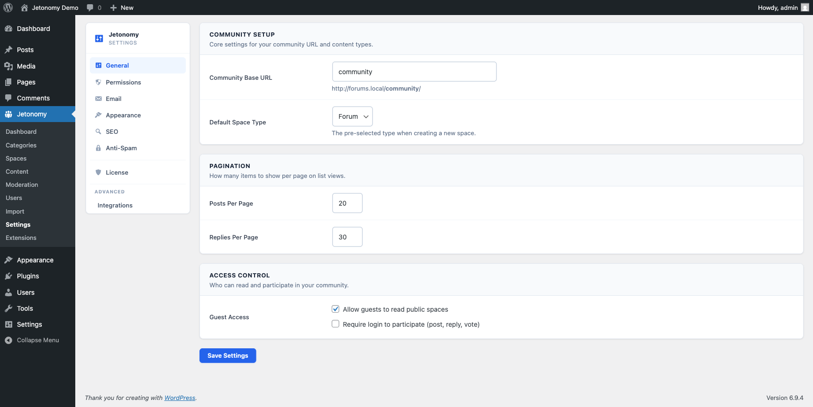

The General settings tab is the first place to go after installation. It controls your community URL, pagination defaults, and who can read or participate.

## What You Will Learn

- How to change your community's base URL slug
- What the default space type setting controls
- How to configure pagination for posts and replies
- How guest access and login requirements work



Go to **Jetonomy → Settings** to access these options. All changes take effect on save.

## Community Base URL

**Setting:** `base_slug`
**Default:** `community`
**Location:** General tab → Community URL section

This is the URL prefix for all Jetonomy pages on your site. With the default value, your community home is at `yoursite.com/community/`. Spaces live at `yoursite.com/community/s/space-name/`, and so on.

You can change this to any URL-safe string, for example `forum`, `hub`, or `discuss`. Jetonomy automatically flushes rewrite rules when you change the base URL and save settings.

> **Warning:** Changing the base URL after your community has content will break all existing links. If you must change it on a live site, set up 301 redirects from the old slug to the new one.

## Default Space Type

**Setting:** `default_space_type`
**Default:** `forum`
**Options:** Forum, Q&A, Ideas, Show & Tell

When you create a new space in the admin, this setting pre-fills the **Type** dropdown. It is a convenience setting only - you can always change the type on any individual space. It does not affect existing spaces.

Choose the type that best matches the primary purpose of your community:

- **Forum** - open discussion, replies sorted by date
- **Q&A** - questions and answers, accepted answers float to top
- **Ideas** - feature requests and votes, status workflow
- **Show & Tell** - short-form cards, optional title, chronological feed

## Posts Per Page

**Setting:** `posts_per_page`
**Default:** `20`
**Location:** General tab → Pagination section

Controls how many posts appear per page in space listings and search results. A lower number is faster on large communities; a higher number reduces clicks for users who prefer scrolling. This value also controls how many additional posts load each time a member clicks **Load More** on a space listing.

> **Tip:** For communities with 10,000+ posts per space, keep this at 20 or lower. Higher values increase page load time and database query time proportionally.

## Replies Per Page

**Setting:** `replies_per_page`
**Default:** `20`
**Location:** General tab → Pagination section

Controls how many replies load per page inside a single post view. This value also controls how many additional replies load each time a member clicks **Load More** in a thread. Pagination starts at the oldest replies and works forward. Members can jump to the last page to see the most recent replies.

## Guest Access

**Setting:** `guest_read`
**Default:** `true` (on)
**Location:** General tab → Access section

When enabled, logged-out visitors can read all public spaces and posts without signing in. They see a prompt to log in when they try to vote, reply, or follow a space.

Turn this off if your community is members-only and you do not want any content visible to search engines or unregistered visitors.

## Require Login to Participate

**Setting:** `require_login`
**Default:** `true` (on)
**Location:** General tab → Access section

When enabled, any action that writes data (posting, replying, voting, following) requires the user to be logged in. Guests are routed to Jetonomy's in-page sign-in form (no wp-login.php bounce) and returned to whatever they were doing once they sign in.

This is always recommended on. Disable it only if you are running a very specific open-participation setup where anonymous contributions make sense.

> **Note:** Even with guest access enabled, anonymous posting is not supported. "Guest access" means read-only browsing for logged-out visitors.

## Require Email Verification

**Setting:** `require_email_verification`
**Default:** off
**Location:** General tab → Access section

When this is on, new members who register through Jetonomy's Login block receive a confirmation email immediately after sign-up. They cannot log in until they click the verification link in that email. Existing members are not affected - this setting applies only to accounts created after you enable it.

A follow-up reminder is sent automatically if the member has not confirmed within the configured window.

**Setting:** `verification_reminder_hours`
**Default:** `24`
**Location:** Stored in `jetonomy_settings['verification_reminder_hours']`

This controls how many hours after registration the reminder email is sent. The reminder runs on an hourly WP-Cron schedule (hook: `jetonomy_verification_reminder`). The email template can be customized on the **Settings → Email** screen under the "Verification reminder" row.

> **Note:** If you use a third-party registration flow (WooCommerce, Restrict Content Pro, LearnDash) instead of Jetonomy's Login block, those plugins handle their own email verification. This setting only applies to registrations that go through the Jetonomy Login block.

## Rebuild Counters

**Location:** Dashboard → Quick Actions, or via WP-CLI / REST API

Jetonomy stores denormalized counters (reply counts per post, post counts per space, member counts per space, vote scores) for performance. These counters are updated in real time on every write, but they can drift from true values after bulk database edits, server failures, or plugin imports.

Use **Rebuild Counters** to recalculate all denormalized values from the canonical tables.

**WP-CLI:**

```bash
wp --path="/path/to/wordpress" jetonomy recount
wp --path="/path/to/wordpress" jetonomy recount --type=posts   # posts only
wp --path="/path/to/wordpress" jetonomy recount --type=spaces  # spaces only
wp --path="/path/to/wordpress" jetonomy recount --type=votes   # votes only
wp --path="/path/to/wordpress" jetonomy recount --type=users   # user profile counters only
```

**REST API (site admin only):**

```
POST /jetonomy/v1/admin/recount
{ "type": "all" }
```

Valid `type` values: `all`, `posts`, `spaces`, `votes`, `users`. Omit or pass `all` to rebuild everything. The response reports how many rows were updated per step. On a large community (100,000+ posts), a full recount may take 10-60 seconds - run it during low-traffic hours.

> **Tip:** After running an import from bbPress, wpForo, or Asgaros, always run a full recount. The importers insert rows directly and skip the counter-update logic.

## Admin Bar Shortcut

All logged-in members see a **Community** menu in the WordPress admin bar. This menu links to the community home, your notification inbox, and your profile.

Members who have the `jetonomy_manage_spaces` or `manage_options` capability also see an admin sub-section with direct links to: Manage Spaces, Add New Space, Categories, Moderation Queue, Posts and Replies, and Settings.

The admin bar menu appears on both the public site and inside wp-admin, so you can jump from any page in the dashboard directly into the community and back.

## Settings Save Confirmations

After you click **Save Changes**, a confirmation banner appears at the top of the settings page. The banner stays visible until you dismiss it - it does not disappear automatically. This ensures you always have a clear signal that your changes were saved.

## What's Next?

Configure trust level thresholds and rate limits to control who can do what in your community.

[Permission Settings →](02-permissions.md)
