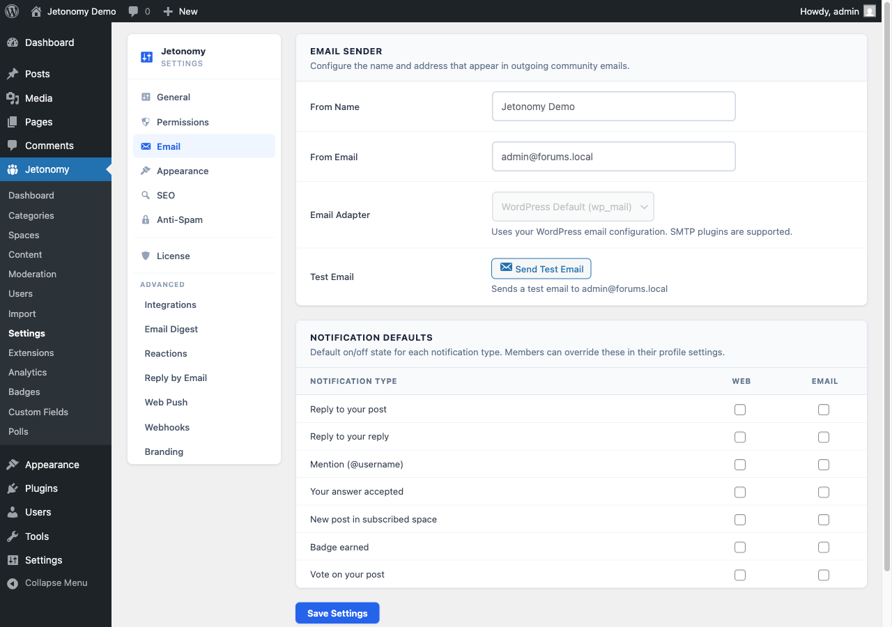

The Email settings tab controls which notification emails Jetonomy sends, what name and address they come from, and how to test your email configuration.

## What You Will Learn

- Which notification types can be toggled on or off
- How to set your community's From name and From address
- How to send a test email to confirm delivery
- How to connect an SMTP plugin for reliable email delivery

Go to **Jetonomy → Settings → Email** to access these settings.

## How Jetonomy Sends Email

Jetonomy uses WordPress's built-in `wp_mail()` function for all outgoing notifications. This means it is immediately compatible with any SMTP plugin you already use - WP Mail SMTP, FluentSMTP, Postman, or any other. No extra configuration in Jetonomy is needed; just configure your SMTP plugin and Jetonomy benefits automatically.

> **Tip:** On production sites, always use an SMTP plugin with a transactional email service (Mailgun, Postmark, SendGrid, SES). The default PHP `mail()` delivery is unreliable and frequently lands in spam.

## From Name

**Setting:** `email_from_name`
**Default:** Your WordPress site name
**Location:** Email tab → Sender section

This is the display name that appears in the **From** field of every Jetonomy notification email. Use your community or product name - something members will recognize immediately in their inbox.

## From Address

**Setting:** `email_from_email`
**Default:** WordPress admin email
**Location:** Email tab → Sender section

This is the email address that appears in the **From** field. Use a dedicated address such as `community@yoursite.com` or `noreply@yoursite.com`.

> **Warning:** The From address must be a verified sender with your email service provider. Using an unverified address causes high bounce rates and spam scoring. If you use Gmail SMTP, the From address must match your Google account.

## Branding the Email

Two optional fields let you brand every notification email with your own logo and footer line. Both live on the Email tab and are empty by default - leave them blank to send plain, text-only emails.

### Email Logo

**Setting:** `email_logo_url`
**Default:** Empty (your site name is shown as text instead)
**Location:** Email tab → Sender section

Paste the full URL to a logo image (for example `https://yoursite.com/logo.png`). The image appears at the top of every notification email. A landscape logo around 200x40px in PNG or SVG works best. If you leave this empty, Jetonomy shows your community name as plain text at the top instead.

> **Tip:** Use an absolute `https://` URL hosted on your own site or media library. Relative paths and `http://` URLs are blocked by many email clients.

### Footer Text

**Setting:** `email_footer_text`
**Default:** Empty (placeholder text: "You received this because you are a member of the community.")
**Location:** Email tab → Footer Text section

A short line shown at the very bottom of every branded notification email - typically a reminder of why the member is receiving it. If you leave it blank, the placeholder line above is used.

## Notification Toggles

**Setting:** `notification_defaults`
**Location:** Email tab → Notification Types section

Each notification type has an independent toggle for both **web** (in-app bell) and **email** delivery. The defaults shown here are the site-wide defaults. Individual members can override their own preferences from their notification settings page.

| Notification Type | Web Default | Email Default |
|---|---|---|
| Reply to your post | On | On |
| Reply to a reply you made | On | Off |
| @mention | On | On |
| Accepted answer (Q&A) | On | On |
| Your idea roadmap status changed | On | On |
| New post in followed space | On | Off |
| Badge earned | On | Off |
| Vote on your post | On | Off |
| Reaction on your post | On | Off |
| Moderator action on your content | On | On |
| Space join request | On | On |
| Your report was reviewed | On | Off |

The values you set here are the starting defaults for new members. Individual members can still override any type from their own notification settings. Use these defaults to keep noisy notification types quiet out of the box without locking members out of re-enabling them.

> **Note:** Vote and badge notifications default to web-only because they can occur frequently. Email for every vote would quickly train members to ignore your community emails entirely.

## Email Templates

**Option:** `jetonomy_email_templates`
**Location:** Email tab → Email Templates card

Below the notification toggles is a table with one row per notification type, where you can rewrite the subject line and the body intro Jetonomy sends. Leave a row empty and it uses the built-in default, so you only need to fill in the ones you actually want to change.

The twelve types are: welcome, reply to your post, reply to your reply, mention, accepted answer, idea status changed, new post in a subscription, badge earned, vote on your post, moderation notice, join request, and verification reminder.

### Placeholders

Four placeholders are substituted when the email is sent:

| Placeholder | Becomes |
|---|---|
| `{site}` | Your community title |
| `{user}` | The recipient's display name |
| `{message}` | The generated body of the notification - who did what, and to which topic |
| `{url}` | The link to the relevant topic, reply or screen |

`{message}` is the important one. It carries the actual content of the notification, so a body that omits it produces an email that says nothing useful. If you are rewriting a body, keep `{message}` somewhere in it and add your wording around it.

The default subject is `[{site}] {message}` and the default body is built around `{message}` for exactly this reason.

### Preview, test and reset

Each row has three buttons:

- **Preview** renders the email with sample data, so you can see the result without sending anything.
- **Send test** emails the rendered version to your admin address. Use this after changing a subject, since subject lines are where a stray placeholder is most visible.
- **Reset** discards your version of that row and returns it to the built-in default. It affects that row only.

### A note on tone

These emails arrive in inboxes alongside everything else your members receive. The defaults are deliberately plain - they say what happened and link to it. If you rewrite them, resist adding marketing language: a notification that reads like a newsletter gets filtered like one, and the deliverability cost lands on your genuinely important emails too.

## Test Email

**Location:** Email tab → bottom of page → **Send Test Email** button

Click **Send Test Email** to send a test message to the WordPress admin email address. The test email confirms that `wp_mail()` is working and that your From name and address are applying correctly.

If the test email does not arrive within a few minutes, check:

1. Your SMTP plugin's log for send errors
2. Your spam folder
3. That the From address is verified with your email provider

## Email and Jetonomy Pro

Jetonomy Pro adds two additional email capabilities:

- **Email Digest** - daily and weekly summary emails that bundle multiple notifications into one. Members set their preference per notification type.
- **ESP Adapters** - native integrations for SendGrid, Mailgun, Amazon SES, and Postmark that bypass `wp_mail()` for higher throughput and detailed delivery analytics.

Both are managed via **Jetonomy → Extensions** after installing Jetonomy Pro.

## What's Next?

Control the visual appearance of your community - accent color, font inheritance, layout density, and custom CSS.

[Appearance Settings →](04-appearance.md)
