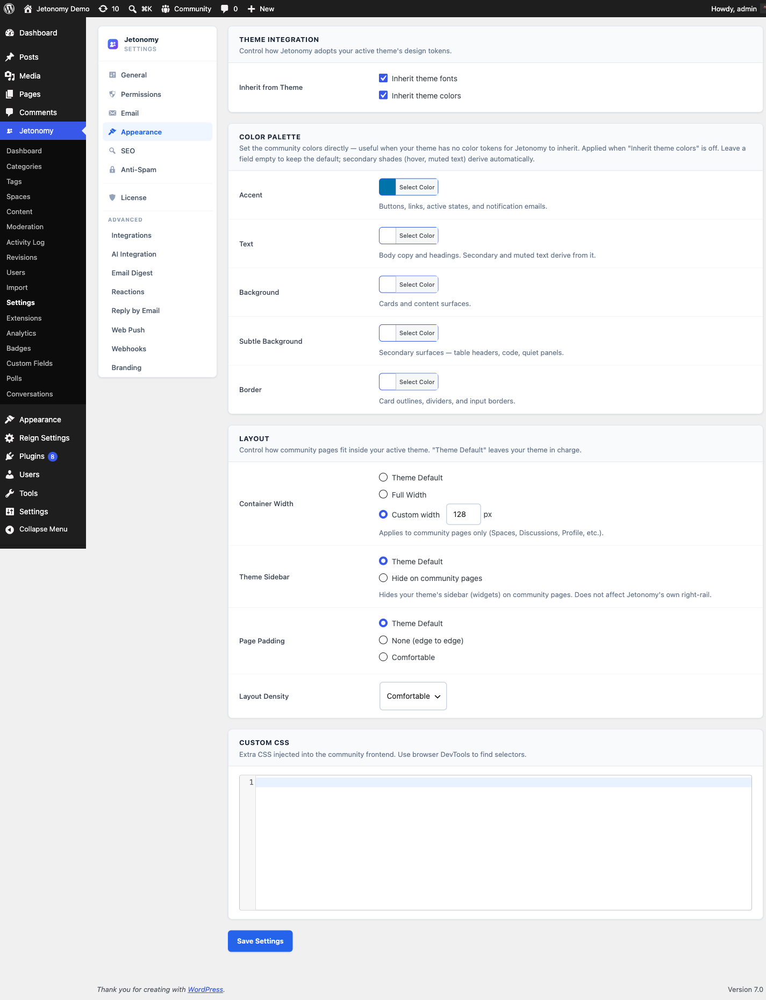

The Appearance settings tab gives you direct control over the visual style of your community - from a single accent color override to a full custom CSS field.



## What You Will Learn

- How to set a custom accent color
- What the font and color inheritance toggles do
- How layout density affects the community UI
- How to use the custom CSS field safely

Go to **Jetonomy → Settings → Appearance** to access these settings.

## How Jetonomy's Visual System Works

Jetonomy uses CSS custom properties (`--jt-*` tokens) throughout its stylesheet. Every color, font, radius, and spacing value references a token. By default, those tokens inherit from your active theme's `theme.json` values automatically.

The Appearance tab gives you a set of override controls on top of that inheritance layer. You can use them without writing any CSS.

## Accent Color

**Setting:** `accent_color`
**Default:** Inherited from theme (`--wp--preset--color--primary`)
**Location:** Appearance tab → Colors section

The accent color drives buttons, links, vote arrows, trust-level highlights, and other interactive elements. Leave this blank to inherit from your theme. Set a specific hex value to override the theme's primary color just for Jetonomy.

This value is injected as `--jt-accent` on the `.jt-app` element at runtime, so it overrides the theme-inherited value.

> **Tip:** Use a color that has at least a 4.5:1 contrast ratio against white (WCAG AA). The community UI places accent colors on white backgrounds frequently.

## Inherit Fonts from Theme

**Setting:** `inherit_fonts`
**Default:** On
**Location:** Appearance tab → Typography section

When on, Jetonomy uses `--jt-font: inherit` - the community adopts whatever font your theme sets on the `body` element. This is the correct setting for most sites.

Turn this off only if you want Jetonomy to use a specific font independent of your theme. In that case, define `--jt-font` in the Custom CSS field.

## Inherit Colors from Theme

**Setting:** `inherit_colors`
**Default:** On
**Location:** Appearance tab → Colors section

When on, the `--jt-accent` token pulls from `--wp--preset--color--primary` in your theme.json. This means the accent color stays in sync with theme updates automatically.

Turn this off if you have set a custom accent color above and do not want theme updates to override it.

## Layout Density

**Setting:** `layout_density`
**Default:** `comfortable`
**Options:** Comfortable, Compact
**Location:** Appearance tab → Layout section

**Comfortable** - Standard spacing between post cards, reply cards, and interface elements. Best for general communities and long-form discussion.

**Compact** - Reduced padding and tighter spacing. Fits more content on screen at once. Best for high-volume spaces where members scan many posts quickly.

When you change this setting, Jetonomy adds `data-jt-density="compact"` (or `"comfortable"`) to the `.jt-app` wrapper element. CSS rules keyed to this attribute apply the appropriate spacing.

## Custom CSS

**Setting:** `custom_css`
**Default:** Empty
**Location:** Appearance tab → Custom CSS section

The Custom CSS field accepts any valid CSS. Jetonomy outputs this CSS as an inline style block at the end of the `<head>` on all community pages, scoped after the main `jetonomy.css` stylesheet.

Use this field to override `--jt-*` tokens, adjust component styles, or add community-specific visual tweaks:

```css
/* Override accent color and border radius */
.jt-app {
    --jt-accent: #7c3aed;
    --jt-radius: 12px;
}

/* Increase heading size in post titles */
.jt-post-title {
    font-size: 1.25rem;
}
```

> **Note:** Custom CSS is output as-is - no minification, no scoping, no sandboxing. Write only CSS you control. If you enter invalid CSS here, it may break parts of the community UI.

> **Tip:** For larger CSS customizations, consider using a child theme's `style.css` or a dedicated CSS plugin instead of this field. The Custom CSS field is best for quick, targeted overrides.

## What's Next?

Configure how Jetonomy appears in search engines - XML sitemaps, schema markup, and meta title patterns.

[SEO Settings →](05-seo.md)
