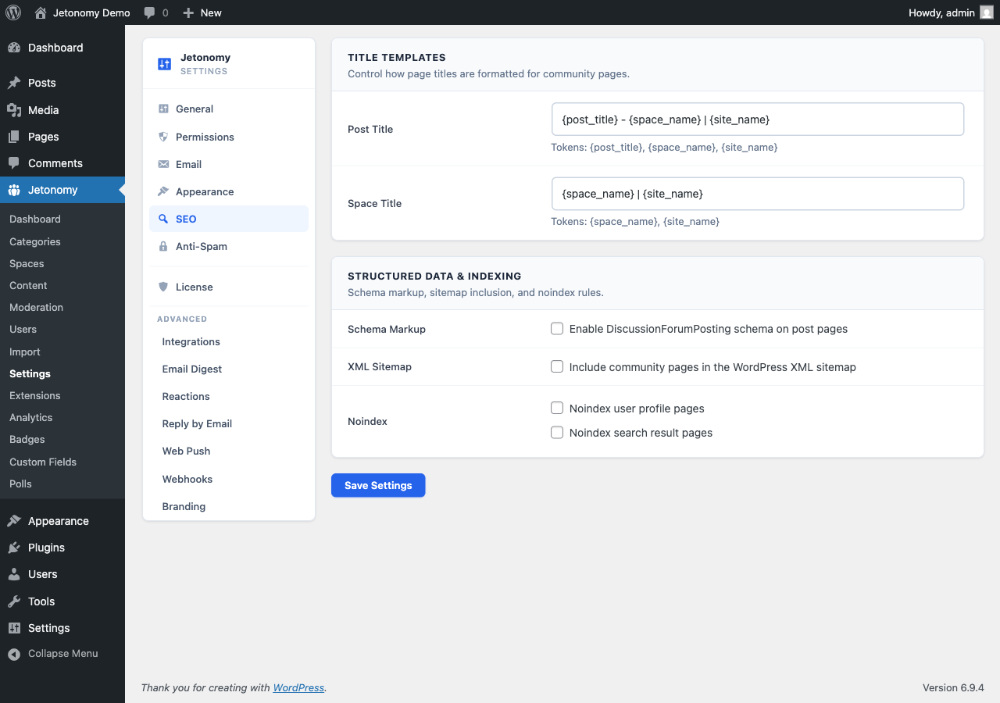

The SEO settings tab controls how Jetonomy pages appear in search engines - XML sitemaps, structured data, meta title patterns, and robots directives for specific page types.

## What You Will Learn

- How Jetonomy generates SEO-friendly URLs for community pages
- How to enable or disable the XML sitemap
- How schema markup works for forum content
- How to configure meta title patterns
- How to exclude certain page types from search engine indexing

Go to **Jetonomy → Settings → SEO** to access these settings.

## How Jetonomy Generates URLs

Every Jetonomy page has a clean, human-readable URL structured around your community base slug:

| Page Type | URL Pattern |
|---|---|
| Community home | `/community/` |
| Category | `/community/category/slug/` |
| Space | `/community/s/slug/` |
| Post | `/community/s/space-slug/t/post-slug/` |
| User profile | `/community/u/username/` |
| Tag | `/community/tag/slug/` |
| Search | `/community/search/` |

Post slugs are auto-generated from the post title, truncated at 60 characters, and deduplicated with a numeric suffix if needed. All URLs use standard WordPress rewrite rules and are compatible with all SEO plugins.

## XML Sitemap

**Setting:** `seo_sitemap`
**Default:** On
**Location:** SEO tab → Sitemap section

When enabled, Jetonomy registers a custom sitemap provider with WordPress's built-in sitemap API. Community pages appear at `/wp-sitemap.xml` alongside your regular WordPress content.

The sitemap includes:
- All public spaces
- All public posts (paginated if over 2,000)
- User profile pages

Private, hidden, and archived spaces are excluded. Draft and scheduled posts are excluded.

> **Tip:** Check **Settings → Reading → Search engine visibility** is not set to "Discourage search engines" or your sitemap will be disregarded.

### Sitemap Link

**Location:** SEO tab → Sitemap section

Right next to the toggle is a button that surfaces the live sitemap URL for your install (typically `https://example.com/wp-sitemap.xml`). Copy the URL straight from the admin and submit it to:

- [Google Search Console](https://search.google.com/search-console) - the standard sitemap submission flow under Index → Sitemaps
- [Bing Webmaster Tools](https://www.bing.com/webmasters) - submit under Sitemaps in the left nav

You only need to submit the sitemap once per search engine. Google and Bing both recrawl the file automatically after the first submission, so new posts and spaces appear in the index without any further action.

## Schema Markup

**Setting:** `seo_schema`
**Default:** On
**Location:** SEO tab → Structured Data section

When enabled, Jetonomy outputs JSON-LD structured data on community pages. This helps search engines understand your content and can improve how your pages appear in search results.

| Page Type | Schema Type |
|---|---|
| Community home | `WebSite` + `BreadcrumbList` |
| Space | `DiscussionForumPosting` (as container) |
| Single post | `DiscussionForumPosting` |
| Post with replies | `DiscussionForumPosting` + `Comment` |
| User profile | `Person` |

The `DiscussionForumPosting` type is the W3C-recognized schema for forum content. Google uses it to display rich results for Q&A content in particular.

## Meta Title Patterns

**Settings:** `seo_post_title`, `seo_space_title`
**Location:** SEO tab → Title Patterns section

These patterns control the `<title>` tag on Jetonomy pages. Use the available tokens to build the pattern you want.

**Available tokens:**

| Token | Output |
|---|---|
| `{post_title}` | The post title |
| `{space_name}` | The space name |
| `{site_name}` | Your WordPress site name |

**Default post title pattern:** `{post_title} - {space_name} | {site_name}`

**Default space title pattern:** `{space_name} | {site_name}`

> **Tip:** Keep titles under 60 characters to avoid truncation in search results. The `{site_name}` suffix is good for brand recognition but costs characters. For long space names, consider omitting `{site_name}`.

## Noindex Controls

**Settings:** `seo_noindex_profiles`, `seo_noindex_search`
**Default:** On for both profiles and search
**Location:** SEO tab → Robots section

**Noindex user profiles** - When enabled, Jetonomy adds `<meta name="robots" content="noindex">` to all `/community/u/*/` pages. Enable this if you prefer profiles not to appear in search results (common for privacy-sensitive communities).

**Noindex search results** - When enabled, the `/community/search/` page is excluded from indexing. This is on by default because search results pages provide minimal SEO value and can create duplicate-content signals.

## Open Graph and Twitter Card Tags

Jetonomy outputs Open Graph and Twitter Card meta tags automatically on all public community pages. No setting is needed. These tags control how your posts appear when shared on social media:

- `og:title` - the post or space title
- `og:description` - the post excerpt (first 160 characters of body text)
- `og:type` - `article` for posts, `website` for other pages
- `og:url` - the canonical URL
- `twitter:card` - `summary` (or `summary_large_image` if a post has an image attachment)

> **Note:** If you use an SEO plugin like Yoast SEO, RankMath, or The SEO Framework, its OG tags may override Jetonomy's. This is fine - SEO plugin output takes priority via standard WordPress `wp_head` hook priority ordering.

### Twitter / X Handle

**Setting:** `seo_twitter_handle`
**Default:** Empty
**Location:** SEO tab → Twitter handle

Enter your community's Twitter or X handle (with or without the leading `@`). When set, Jetonomy emits `twitter:site` and `twitter:creator` meta tags on every community page that does not already declare a per-page override. This gives X / Twitter a verified attribution to display alongside link previews and unlocks richer card layouts.

Leave this empty if the community has no Twitter / X presence - Jetonomy simply omits the tags instead of emitting empty ones.

### Default Share Image

**Setting:** `seo_default_og_image`
**Default:** Empty
**Location:** SEO tab → Default share image

Paste the absolute URL of an image to use as the fallback `og:image` whenever a specific post does not have an image of its own. This is a plain URL field, not a media-library picker. Posts that already include their own image continue to use that image - this setting only kicks in when there is nothing else to show. When left empty, Jetonomy falls back to the WordPress site logo / icon.

**Recommended specs:**

| Property | Value |
|---|---|
| Dimensions | 1200 x 630 px |
| Format | PNG or JPG |
| File size | Under 5 MB |
| Aspect ratio | 1.91:1 |

Twitter / X, Facebook, LinkedIn, and Slack all read this image when generating link previews, so picking a branded fallback (logo + community name on a clean background) keeps shared links recognizable.

## Social Embeds (Instagram & Facebook)

**Settings:** `fb_app_id`, `fb_app_secret`
**Location:** SEO tab → Social Embeds section

When members paste a link, Jetonomy turns it into a rich embed. YouTube, Vimeo, TikTok, Twitter/X, Spotify, SoundCloud, and TED Talks embed automatically with no setup required.

Instagram and Facebook are the exception: Meta deprecated anonymous oEmbed access in October 2020, so those two providers require a free Meta Developer App.

- **Facebook App ID** (`fb_app_id`) - the numeric App ID from your Meta Developer dashboard.
- **Facebook App Secret** (`fb_app_secret`) - the App Secret. It is stored in `wp_options` and never exposed to the frontend.

Leave both fields empty if you do not need Instagram or Facebook embeds - every other provider keeps working without them.

## What's Next?

Set up anti-spam protection to keep your community clean without frustrating legitimate members.

[Anti-Spam Settings →](06-anti-spam.md)
