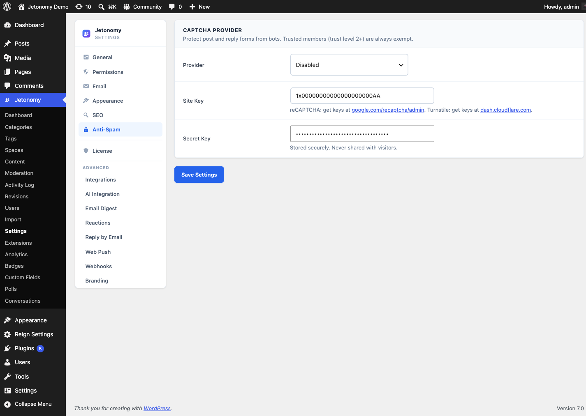

The Anti-Spam tab lets you add invisible bot protection to post and reply submission - without disrupting the experience for legitimate members.

## What You Will Learn

- Which anti-spam providers Jetonomy supports
- How to add your API keys and enable protection
- How the score threshold works for reCAPTCHA v3
- Which members are automatically exempt from checks

Go to **Jetonomy → Settings → Anti-Spam** to access these settings.

## How It Works

Anti-spam checks run server-side before a post or reply is saved. When a submission fails the check, Jetonomy blocks the save and returns an error to the user. The check is invisible to legitimate members - no checkbox to tick, no image to identify.

Members at Trust Level 2 or above are exempt from all anti-spam checks. Admins are always exempt. This ensures your most active, trusted members never encounter friction.

## Choosing a Provider

**Setting:** `captcha_provider`
**Default:** None (`none`)
**Options:** None (`none`), Google reCAPTCHA v3 (`recaptcha_v3`), Cloudflare Turnstile (`turnstile`)

| Provider | How It Works | User Visibility |
|---|---|---|
| None | No spam protection | — |
| Google reCAPTCHA v3 | Score-based, no user interaction | Invisible (small badge) |
| Cloudflare Turnstile | Smart challenge, no image puzzle | Invisible (small badge) |

**Google reCAPTCHA v3** assigns a risk score (0.0 to 1.0) to each submission. You set a threshold - submissions below it are blocked.

**Cloudflare Turnstile** is GDPR-friendlier than reCAPTCHA and does not show a challenge unless it detects suspicious behavior. It is a good default for EU communities.

> **Tip:** If you are seeing bot spam despite having anti-spam enabled, also check your Trust Level 0 rate limits in the Permissions tab. Combining low rate limits with Turnstile stops most automated spam without any user friction.

## Google reCAPTCHA v3

1. Go to [google.com/recaptcha/admin](https://www.google.com/recaptcha/admin) and create a new site.
2. Select **reCAPTCHA v3** as the type.
3. Add your domain to the allowed domains list.
4. Copy the **Site Key** and **Secret Key**.
5. Paste them into the corresponding fields in **Jetonomy → Settings → Anti-Spam**.
6. Set the **Score Threshold** (see below).
7. Save settings.

## Score Threshold (reCAPTCHA v3 Only)

**Setting:** `captcha_score_threshold`
**Default:** `0.5`
**Range:** 0.1 to 0.9

Google's reCAPTCHA v3 returns a score between 0.0 (likely bot) and 1.0 (likely human). Jetonomy blocks any submission with a score below your threshold.

| Threshold | Effect |
|---|---|
| 0.3 | Block only very confident bots. May let some spam through. |
| 0.5 | Balanced default. Blocks most bots, rarely affects humans. |
| 0.7 | Strict. May occasionally block mobile users or VPN users. |

Start at 0.5. If you see false positives (legitimate members getting blocked), lower to 0.4. If spam is still getting through, raise to 0.6.

## Cloudflare Turnstile

1. Go to [dash.cloudflare.com](https://dash.cloudflare.com) → **Turnstile** and add a new site.
2. Select **Invisible** as the widget mode.
3. Add your domain to the allowed hostnames list.
4. Copy the **Site Key** and **Secret Key**.
5. Paste them into **Jetonomy → Settings → Anti-Spam**.
6. Save settings.

There is no score threshold for Turnstile - Cloudflare handles the risk scoring internally. A submission either passes or fails.

> **Note:** Turnstile requires your domain to be exactly correct in the Cloudflare dashboard. `www.yoursite.com` and `yoursite.com` are treated as different hostnames.

## Trust Level Exemptions

Members at **Trust Level 2 or above** are never shown a challenge and their submissions never go through the anti-spam check. The check is skipped entirely on the server side.

This is intentional. Trust Level 2 requires consistent participation over time - members who earn it are clearly not bots.

**WordPress admins** (`manage_options` capability) are also always exempt, regardless of trust level.

## Testing Your Setup

1. Log out of WordPress completely.
2. Go to any space on your community.
3. Try to create a post or reply.
4. If protection is working, the submission should complete (legitimate human request) and no error should appear.

To test blocking, lower the reCAPTCHA threshold to 0.9 temporarily and try submitting. If the error message appears, your integration is working correctly. Reset to 0.5 afterward.

## What's Next?

Migrate your existing community data from bbPress or wpForo into Jetonomy.

[Importing from bbPress →](../migration/01-bbpress-import.md)
