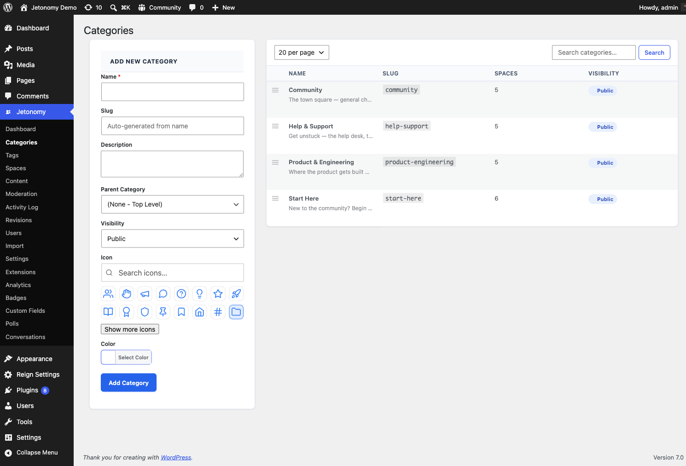

Categories let you group related spaces under a shared label so members can browse a subset of your community without seeing everything at once.

> This is the admin reference for the Categories screen. For how categories fit alongside spaces in your community structure, see [Categories](../spaces-and-categories/00-categories.md) in the Spaces & Categories guide.

## What You Will Learn

- How to create, edit, and delete categories
- How category visibility works
- How to reorder categories with drag and drop
- How icons and colors work

Go to **Jetonomy → Categories** to access this screen.

## Required Capability

The Categories admin page requires `jetonomy_manage_settings`, which is administrator-only by default. Both `jetonomy_manage_settings` and `jetonomy_manage_spaces` are granted only to administrators - Editors do not receive either capability, so they cannot open this page.

## Page Layout

The Categories screen is split into two panels side by side:

- **Left - Add New Category form** for creating a new category
- **Right - Categories table** listing existing categories and their children

## Creating a Category

Fill in the Add New Category form and click **Add Category**.

| Field | Required | Notes |
|---|---|---|
| Name | Yes | Displayed in navigation and on the category page |
| Slug | No | Auto-generated from the name if left blank. Used in URLs. |
| Description | No | Optional text shown on the category listing page |
| Parent Category | No | Nest this category under an existing one. Two levels max. |
| Visibility | No | Controls who can see this category (see Visibility section below) |
| Icon | No | Choose from the Lucide icon picker |
| Color | No | Color swatch displayed next to the category name in navigation |

### Visibility Options

| Option | Who can see the category |
|---|---|
| Public | All visitors (including logged-out) when guest access is on |
| Private | Logged-in members only |
| Hidden | Not shown in navigation or listings; direct URL still works |

The category's visibility does not override the visibility of individual spaces within it. A public category can contain private spaces.

## Editing a Category

Click **Edit** in the row actions under any category name. An **Edit Category** modal opens with the same fields as the creation form. Make your changes and click **Update Category**.

## Deleting a Category

Click **Delete** in the row actions. A browser confirmation prompt appears before the delete runs.

> **Warning:** Deleting a category does not delete the spaces inside it. Spaces that belonged to the deleted category lose their category assignment and move to "uncategorized." There is no undo - confirm you have reassigned or are okay losing the grouping before deleting.

## Reordering Categories

Drag the handle icon at the far left of any row to reorder categories. The order is saved automatically when you drop the row. Child categories follow their parent when the parent moves.

## Child Categories

Set **Parent Category** when creating or editing a category to nest it under an existing top-level category. The table renders children indented below their parent. Two nesting levels are supported.

## Search

Use the search box in the table toolbar to filter categories by name. Clear the search to see all categories again. The search does not affect the Add New Category form.

## Rows Per Page

The dropdown in the table toolbar controls how many categories appear per page (20, 50, or 100). The selection submits the form immediately.

## What's Next?

Enable or disable Jetonomy Pro extensions if you have the Pro plugin active.

[Extensions →](13-extensions.md)
