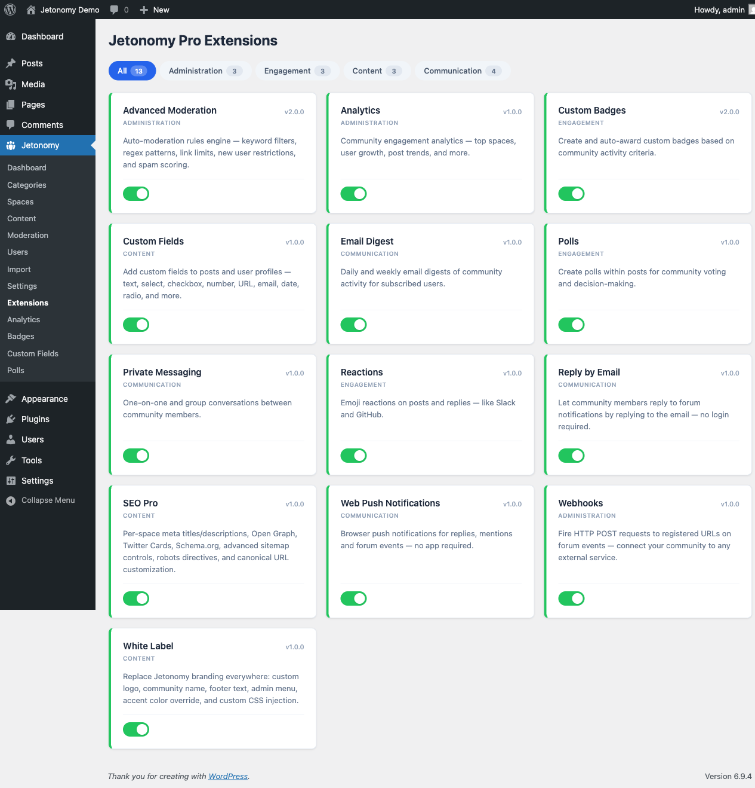

The Extensions screen is your control panel for turning individual Jetonomy Pro features on or off. It appears in the Jetonomy menu only when Jetonomy Pro is active.

## What You Will Learn

- Where the Extensions screen lives and who can access it
- How to enable or disable an extension
- What happens to data when you disable an extension

Go to **Jetonomy → Extensions** to access this screen. This menu item is added by Jetonomy Pro and is not visible on free-only installs.

## Required Capability

The Extensions screen is gated by `jetonomy_manage_settings`, which is administrator-only by default. Only WordPress Administrators can open the screen and enable or disable extensions.

## The Extension Grid

Extensions are displayed as cards in a grid. Each card shows:

- Extension name and category tag
- Version number
- Short description of what the extension does
- Toggle switch (on = enabled, off = disabled)

Active extensions have a highlighted card border. Inactive extensions appear muted.

## Filtering by Category

Use the filter buttons above the grid to show only extensions in a specific category. Available categories include Communication, Engagement, Administration, Moderation, Gamification, Content, Integration, Branding, SEO, Privacy, and AI.

Click **All** to return to the full list.

## Enabling an Extension

Click the toggle switch on the card. The page reloads and the extension is now active. On first enable, the extension's `activate()` method runs - this creates any database tables the extension needs and schedules any cron hooks.

## Disabling an Extension

Click the toggle switch on an active card. The page reloads and the extension is now off. The extension's `deactivate()` method runs - this removes scheduled cron hooks and deregisters rewrite rules.

> **Note:** Disabling an extension does not delete its data. Database tables and stored options are preserved. Re-enabling the extension restores full functionality with all existing data intact.

## Available Extensions

| Extension | Category | What It Adds |
|---|---|---|
| Private Messaging | Communication | Direct and group message threads at `/community/messages/` |
| Analytics | Administration | Engagement graphs, top spaces, top contributors |
| Emoji Reactions | Engagement | Per-post and per-reply emoji reaction picker |
| Polls | Engagement | Inline polls inside posts |
| Custom Badges | Gamification | Award and display custom achievement badges |
| Custom Fields | Content | Add custom profile and post fields |
| Webhooks | Integration | Outgoing webhooks on community events |
| Advanced Moderation | Moderation | Keyword rules, regex patterns, auto-action on matched content |
| White Label | Branding | Replace Jetonomy branding with your own |
| Email Digest | Communication | Daily and weekly summary emails for members |
| Web Push | Communication | Browser push notifications |
| SEO Pro | SEO | Schema.org markup, sitemaps, canonical handling |
| Reply By Email | Communication | Members reply to threads by replying to notification emails |
| AI Integration | AI | Spam detection, post summarization, semantic search, content suggestions |
| Site Announcements | Moderation | Pin a post to the top of every space for site-wide updates |
| Anonymous Posting | Privacy | Let members post and reply without showing their name, with an audited admin-only reveal |
| File Attachments | Content | Attach images, PDFs, and documents to topics and replies |

> **Note:** As of 1.8.0, attachments already on a post (from an import, the mobile app, or the REST API) display in the free plugin whether or not this extension is enabled. Enabling File Attachments here adds the composer, the lightbox, the inline PDF viewer, and configurable size/type limits - and keeps working if you disable the extension later, since the underlying files are never hidden.

For detailed setup instructions for each extension, see the [Pro Features documentation](../pro-features/00-getting-started-pro.md).

## What's Next?

For the full feature documentation for each Pro extension, see the Pro Features section.

[Pro Features →](../pro-features/00-getting-started-pro.md)
