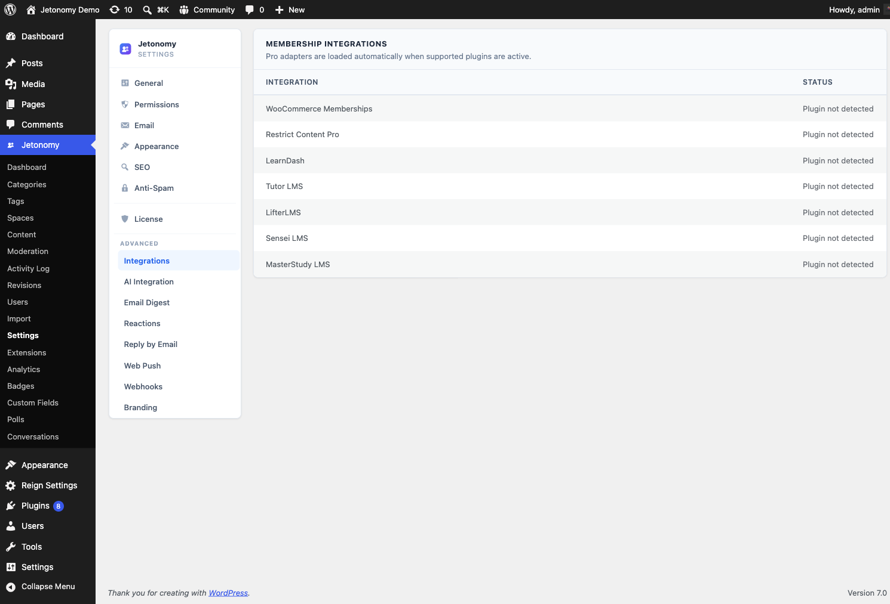

The Integrations tab connects Jetonomy to companion plugins and keeps Jetonomy and BuddyPress group activity in sync. The tab is always available under **Jetonomy → Settings**; the BuddyPress sync card described on this page appears inside it only when BuddyPress with the Groups component is active.

## What You Will Learn

- That the Integrations tab is always available, and when the BuddyPress card appears inside it
- What the two BuddyPress sync toggles do
- The dependency between the two toggles

Go to **Jetonomy → Settings → Integrations** to access these settings. The tab itself is always present. If you do not see the two BuddyPress toggles below, BuddyPress with the Groups component is not active - the BuddyPress card stays hidden until it is, while the rest of the Integrations tab (companion plugins) shows on every install.

## Broadcast topics to group activity

**Setting:** `jetonomy_bp_broadcast`
**Default:** On
**Location:** Integrations tab → BuddyPress card

When on, every new Jetonomy topic created in a space that is paired with a BuddyPress group is posted into that group's activity stream. Members browsing the group see the new discussion in their activity feed without leaving BuddyPress.

Turn it off if you want Jetonomy discussions to stay inside the community and not appear in group activity.

## Round-trip activity comments

**Setting:** `jetonomy_bp_comment_bridge`
**Default:** On
**Location:** Integrations tab → BuddyPress card

When on, comments members add to a broadcast activity item in BuddyPress are mirrored back into Jetonomy as replies on the original topic - so a conversation that starts in either place stays in sync in both.

> **Note:** This toggle depends on **Broadcast topics to group activity** being enabled. If broadcast is off, there are no broadcast items for comments to round-trip, and this setting has no effect.

## What's Next?

For step-by-step setup of the BuddyPress integration (pairing spaces with groups, member sync), see the integration guide.

[BuddyPress Integration →](../integrations/13-buddypress.md)
