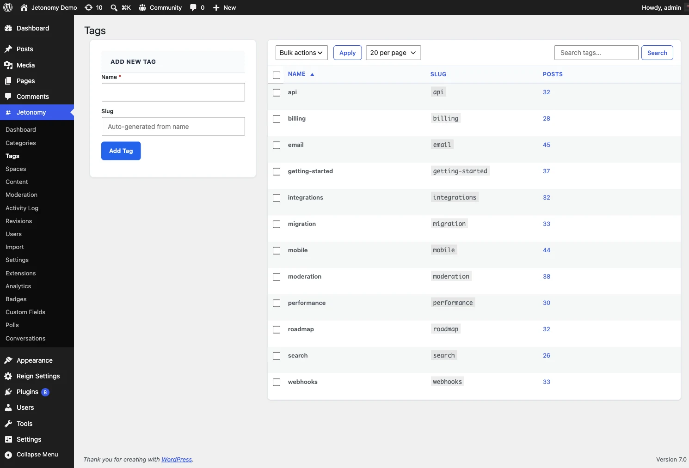

The Tags admin screen manages the global tag namespace members use to connect related discussions across every space. This is the admin reference for that screen; for how tags work on the front end - adding them to a topic, tag pages, the Popular Tags sidebar - see [Tags](../search-and-discovery/02-tags.md) in the Search & Discovery guide.

## Where to Find It

Go to **Jetonomy → Tags** in your WordPress admin. This screen requires the `jetonomy_manage_settings` capability - administrators by default, and any other role you grant it to on the [Role Capability Mapping](18-role-capabilities.md) grid.

## What It Lists

A paginated table of every tag in your community - name, slug, and how many posts carry it - with a search box and a per-page picker. Pagination is server-side, so the screen stays fast even with thousands of tags.

## What You Can Do

| Action | What it does |
|--------|-------------|
| Add New Tag | Create a tag directly from the admin (name, optional slug) without waiting for a member to use it in a post first |
| Edit | Rename a tag or change its slug. The change applies everywhere the tag is used, in every space |
| Delete | Remove a single tag. You can force-delete a tag even while posts are still attached to it |
| Bulk Delete | Tick multiple tags, choose **Delete** from the bulk-action dropdown, and click **Apply** to clear several at once |

**There is no merge action.** To combine a duplicate or misspelled tag (for example "stripe" and "Stripe") into one, re-tag the affected posts to the tag you want to keep, then delete the stray one - deleting a tag detaches it from every post rather than deleting the posts themselves.

Because the tag namespace is global, an edit or delete here takes effect across your entire community at once, not just one space.

## What's Next?

Set up your owner GDPR and personal-data runbook.

[Privacy & GDPR →](20-privacy-and-gdpr.md)
