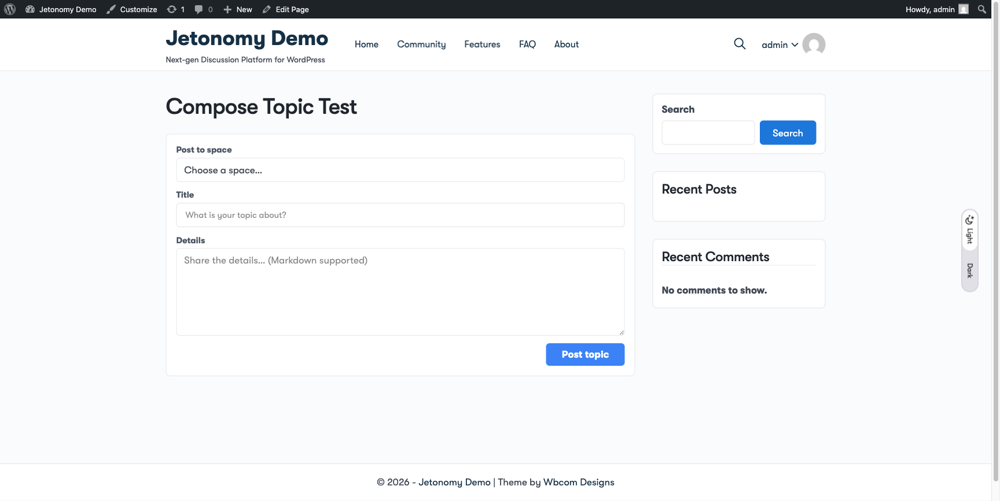
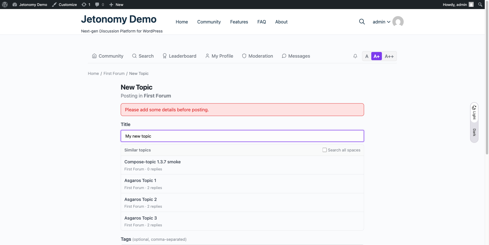
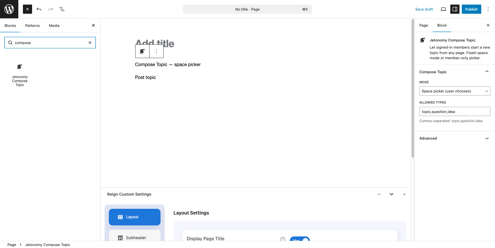

Jetonomy includes seven shortcodes, four classic widgets, and eight Gutenberg blocks so you can embed community content anywhere on your WordPress site — sidebars, pages, posts, or block-based layouts.

## What You Will Learn

- How to use the seven built-in shortcodes and their attributes
- How to add the four classic widgets to sidebar areas
- How to insert the eight Gutenberg blocks in the block editor
- How shortcodes and blocks share the same rendering logic

## At a Glance

| Type | Slug | Purpose | Since |
|------|------|---------|-------|
| Shortcode | `[jetonomy_recent_posts]` | Recent posts feed | 1.0 |
| Shortcode | `[jetonomy_trending_posts]` | Hot-scored trending posts | 1.3.0 |
| Shortcode | `[jetonomy_spaces]` | Space directory grid | 1.0 |
| Shortcode | `[jetonomy_leaderboard]` | Top members by reputation | 1.0 |
| Shortcode | `[jetonomy_user_profile]` | Single user profile card | 1.2 |
| Shortcode | `[jetonomy_space_members]` | Members of one space | 1.2 |
| Shortcode | `[jetonomy_compose_topic]` | **New in 1.3.7** — inline topic composer (fixed space or member picker) | 1.3.7 |
| Block | `jetonomy/forum-feed` | Live post feed | 1.3.0 |
| Block | `jetonomy/trending` | Trending topics with time-decayed hot score | 1.3.6 |
| Block | `jetonomy/space-list` | Space grid | 1.3.0 |
| Block | `jetonomy/leaderboard` | Top members | 1.3.0 |
| Block | `jetonomy/navigation` | Permission-aware category + space tree | 1.3.5 |
| Block | `jetonomy/user-panel` | Logged-in sidebar profile card | 1.3.5 |
| Block | `jetonomy/login` | Inline login/register panel | 1.3.5 |
| Block | `jetonomy/compose-topic` | **New in 1.3.7** — topic composer embeddable anywhere | 1.3.7 |

## Shortcodes

All shortcodes are registered by `Jetonomy\Shortcodes::register()` and are available on any page or post.

**Self-styling on any page** *(1.4.0+)*: every shortcode auto-enqueues `assets/css/blocks.css` at render time and ships its own `--jtb-*` token block, so a bare `[jetonomy_recent_posts]` paste on a regular WordPress page renders fully styled — no need to put it inside a Forum Feed block container. Works in classic editor, page builders (Elementor, Divi, Bricks, WPBakery), widget areas, and template parts.

---

### `[jetonomy_recent_posts]`

Displays a list of the most recent published posts across your community or within a specific space.

**Attributes**

| Attribute | Type | Default | Description |
|-----------|------|---------|-------------|
| `count` | int | `5` | Number of posts to display |
| `space_id` | int | `0` | Restrict to a space. `0` = all spaces |
| `sort` | string | `latest` | `latest` or `votes` |

```
[jetonomy_recent_posts count="5" space_id="3" sort="votes"]
```

Each post card shows the title, author name, space name, time ago, vote score, and reply count.

---

### `[jetonomy_trending_posts]`

Displays a ranked list of "hot" posts using a time-decayed score of recent votes + replies.

**Attributes**

| Attribute | Type | Default | Description |
|-----------|------|---------|-------------|
| `count` | int | `5` | Number of posts to display |
| `space_id` | int | `0` | Restrict to a space. `0` = all spaces |
| `window` | int | `7` | Days of history used for the hot score |

```
[jetonomy_trending_posts count="10" window="14"]
```

---

### `[jetonomy_spaces]`

Displays a list of public, active spaces, ordered by post count.

**Attributes**

| Attribute | Type | Default | Description |
|-----------|------|---------|-------------|
| `count` | int | `6` | Number of spaces to display |
| `category_id` | int | `0` | Filter by category. `0` = all categories |

```
[jetonomy_spaces count="6" category_id="2"]
```

Each space card shows the title, a short description excerpt, and the post count.

---

### `[jetonomy_leaderboard]`

Displays a ranked list of the top community members by reputation score.

**Attributes**

| Attribute | Type | Default | Description |
|-----------|------|---------|-------------|
| `count` | int | `10` | Number of members to display |

```
[jetonomy_leaderboard count="10"]
```

---

### `[jetonomy_user_profile]`

Displays a compact profile card for a specific user or the currently logged-in user.

**Attributes**

| Attribute | Type | Default | Description |
|-----------|------|---------|-------------|
| `user_id` | int | `0` | Target user. `0` = current logged-in user |

```
[jetonomy_user_profile user_id="0"]
```

The card shows the display name, trust level badge, bio excerpt, reputation score, and post count.

---

### `[jetonomy_space_members]`

Displays a list of members for a specific space, ordered by reputation.

**Attributes**

| Attribute | Type | Default | Description |
|-----------|------|---------|-------------|
| `space_id` | int | — | **Required.** ID of the space |
| `count` | int | `10` | Number of members to display |

```
[jetonomy_space_members space_id="5" count="20"]
```

---

### `[jetonomy_compose_topic]` *(new in 1.3.7)*

Lets signed-in members start a new topic from **any** WordPress page, post, or page-builder canvas. Two modes: lock to one space, or show a picker of spaces the current user is a member of.

**Attributes**

| Attribute | Type | Default | Description |
|-----------|------|---------|-------------|
| `mode` | string | `picker` | `picker` (show a space select) or `fixed` (post to one space) |
| `space_id` | int | `0` | Space ID to post into. Only used when `mode="fixed"`. Invalid IDs degrade to picker at render time. |
| `types` | CSV | `topic,question,idea` | Allowed post types for this embed |

```
[jetonomy_compose_topic mode="picker"]
[jetonomy_compose_topic mode="fixed" space_id="5"]
```



**Behavior**

- **Logged-out viewers** see a "Sign in to start a new topic" CTA that redirects back to the current URL after login — no form exposure, no wasted scroll.
- **Picker mode** queries `Permission_Engine::can($uid, 'create_posts', $space_id)` against every space the user is a member of. Only spaces where they actually have posting rights appear.
- **Fixed mode** hides the picker entirely. If the hardcoded `space_id` is missing or the user cannot post in it, the embed silently degrades to picker mode rather than breaking.
- Assets (`blocks.css` + the Interactivity API bundle) enqueue on-demand at render time so pages that don't use the shortcode carry no overhead. Works inside page builders that render shortcodes outside `the_content` (Elementor, Divi, Bricks, WPBakery).

Companion REST endpoint: `GET /jetonomy/v1/spaces?postable_by_me=1` returns the user's postable spaces.

When the title is filled but the body is empty, an inline error banner appears above the title — no silent failures, no lost input:



---

## Classic Widgets

Jetonomy registers four classic widgets for use in any theme widget area. Each widget is configured through the standard WordPress widget admin screen or the Customizer.

### Recent Posts Widget

Displays recent forum posts in any sidebar or widget area.

**Settings:** Title, Count, Space (optional filter), Sort order

### Leaderboard Widget

Displays top community contributors ranked by reputation.

**Settings:** Title, Count

### Active Spaces Widget

Displays the most active spaces by post count.

**Settings:** Title, Count

### User Stats Widget

Displays the currently logged-in user's stats: reputation, post count, reply count, and trust level.

**Settings:** Title (no other configuration — always reflects the current user)

---

## Gutenberg Blocks

Jetonomy registers eight server-side rendered blocks. Each block uses a `render_callback` that delegates to the matching shortcode (for most) or a dedicated render component (for Navigation, User Panel, and Login). Output is consistent wherever they appear.

All blocks live in the **Widgets** category of the block inserter and answer to the search term `jet`.

### Editor experience *(1.4.0+)*

In the block editor every Jetonomy block paints a framed **preview card** with a "JETONOMY" pill badge, the block title, and an attribute-aware hint that reflects the current settings (for example `Filtered to space #3`, `7 day window`, `All public spaces`). The preview is a static mock — no REST calls — so dropping a block on a page is instant and safe.

Each block exposes its settings through Inspector controls in the right sidebar, sized at the WordPress 6.7+ default (40px) with no deprecated bottom margins. The controls map one-to-one to the block attributes documented per block below.

### `jetonomy/forum-feed`

Renders a live post feed from a selected space or all spaces.

**Block Attributes**

| Attribute | Type | Default | Description |
|-----------|------|---------|-------------|
| `count` | number | `5` | Posts to show |
| `spaceId` | number | `0` | Space ID (0 = all spaces) |
| `sort` | string | `latest` | `latest` or `votes` |
| `showHeader` | boolean | `false` | Render a space header above the feed |
| `title` | string | `''` | Custom title when `showHeader` is on |

### `jetonomy/trending` *(1.3.6+)*

Renders a ranked list of hot topics using a time-decayed score of recent engagement. Same `render_callback` plumbing as `[jetonomy_trending_posts]`.

**Block Attributes**

| Attribute | Type | Default | Description |
|-----------|------|---------|-------------|
| `count` | number | `5` | Posts to show |
| `spaceId` | number | `0` | Restrict to a space (0 = all) |
| `window` | number | `7` | Days of history for the hot score |
| `showHeader` | boolean | `true` | Render a "Trending" header |
| `title` | string | `''` | Custom title |

### `jetonomy/space-list`

Renders a list of community spaces. Supports category filtering.

**Block Attributes**

| Attribute | Type | Default | Description |
|-----------|------|---------|-------------|
| `count` | number | `6` | Spaces to show |
| `categoryId` | number | `0` | Filter by category (0 = all) |

### `jetonomy/leaderboard`

Renders a leaderboard of top community members by reputation.

**Block Attributes**

| Attribute | Type | Default | Description |
|-----------|------|---------|-------------|
| `count` | number | `10` | Members to show |

---

### `jetonomy/navigation` *(1.3.5+)*

Renders the Category → Space tree as permission-aware sidebar navigation. Designed for the community sidebar of any block theme or widget area.

**Why this block exists**

Most community themes render the space list with a hand-maintained nav menu. That list rots the moment you add a space, and it leaks private spaces to anonymous viewers. This block queries the live category/space tree on every render and honors Jetonomy's permission layer, so private spaces stay hidden from viewers who do not have access.

**Block Attributes**

| Attribute | Type | Default | Description |
|-----------|------|---------|-------------|
| `showCategoryHeadings` | boolean | `true` | Group spaces by parent category |
| `collapsible` | boolean | `false` | Collapsible category headings |
| `showPostCount` | boolean | `false` | Show topic count next to each space |
| `hideEmptyCategories` | boolean | `true` | Hide categories that have no visible spaces |
| `title` | string | `''` | Optional wrapper title |

Scales to sites with thousands of spaces — the rendered tree uses Jetonomy's cached category/space index, not a per-request DB scan.

---

### `jetonomy/user-panel` *(1.3.5+)*

Renders a compact profile card for logged-in viewers — avatar, display name, notifications count, quick links to Profile / Notifications / Messages / Edit Profile / Logout. Empty for logged-out viewers so the sidebar layout doesn't shift.

**Block Attributes**

| Attribute | Type | Default | Description |
|-----------|------|---------|-------------|
| `title` | string | `''` | Optional wrapper title above the card |

Auto-injects at the top of the community sidebar for logged-in viewers so admins don't need to add it by hand (disable with `add_filter( 'jetonomy_sidebar_auth_card', '__return_false' )`).

---

### `jetonomy/login` *(1.3.5+)*

Renders an inline login and register panel for the community sidebar. Logged-out viewers see Login and Register tabs without leaving the page. Logged-in viewers get nothing rendered — no layout shift when state changes.

**Block Attributes**

| Attribute | Type | Default | Description |
|-----------|------|---------|-------------|
| `title` | string | `''` | Header above the tabs |
| `showRegister` | boolean | `true` | Show the Register tab alongside Login (honours `users_can_register`) |

**Security**

- Both forms are nonce-protected (`wp_ajax_jetonomy_quick_login` / `wp_ajax_jetonomy_quick_register`)
- Failed login attempts are rate-limited via `Jetonomy\Security\Rate_Limiter` (5 attempts / 15 minutes per IP)
- Registration respects whatever `users_can_register` is set to in your WP admin and any anti-spam adapter you have active (Akismet, AI spam detection)

---

### `jetonomy/compose-topic` *(new in 1.3.7)*

Gutenberg equivalent of `[jetonomy_compose_topic]`. Drop it on any page, post, or template part and signed-in members can start a topic without leaving the page.

**Block Attributes**

| Attribute | Type | Default | Description |
|-----------|------|---------|-------------|
| `mode` | string | `picker` | `picker` or `fixed` |
| `spaceId` | number | `0` | Space ID (fixed mode only) |
| `types` | string | `topic,question,idea` | Allowed post types |

**Editor experience**



- The block editor shows a **static preview** (no live REST calls) — safe to drop into any page without hitting the server.
- Inspector controls: Mode select (picker / fixed), Space ID (visible only when Mode is fixed), Allowed types (comma-separated).
- Falls back to picker mode at render time if the fixed `spaceId` doesn't resolve to a space the viewer can post in — so themes/pages that were built before a space was deleted keep working instead of 500'ing.

**Rendering**

- Server render delegates to `[jetonomy_compose_topic]`, so the block + shortcode output are pixel-identical.
- Styles come from `assets/css/blocks.css` — self-contained, inherits theme tokens through `--wp--preset--*` fallbacks so it looks correct outside Jetonomy templates.
- Built-in mobile breakpoint at 640px — submit button spans the column width, actions stack vertically.

---

## CSS Classes for Styling

All shortcode and block output uses the `jt-shortcode` CSS class prefix so you can style them in your theme without affecting core community pages:

| Class | Element |
|-------|---------|
| `.jt-shortcode` | Wrapper on all shortcode output |
| `.jt-shortcode-recent-posts` | Recent posts container |
| `.jt-shortcode-post` | Individual post card |
| `.jt-shortcode-post-title` | Post title link |
| `.jt-shortcode-post-meta` | Author, space, and time line |
| `.jt-shortcode-post-stats` | Vote and reply counts |
| `.jt-shortcode-spaces` | Spaces container |
| `.jt-shortcode-space` | Individual space card |
| `.jt-shortcode-space-desc` | Space description excerpt |
| `.jt-shortcode-space-stats` | Space post-count line |
| `.jt-shortcode-trending-post` | Trending post row |
| `.jt-shortcode-trending-rank` | Trending rank badge (1, 2, 3 …) |
| `.jt-shortcode-trending-body` | Trending row body (title + meta + stats) |
| `.jt-shortcode-leaderboard` | Leaderboard container |
| `.jt-shortcode-rep` | Reputation pill in leaderboard / member rows |
| `.jt-shortcode-profile-card` | User profile card |
| `.jt-shortcode-profile-stats` | Reputation + post-count line on profile card |
| `.jt-shortcode-members` | Members list container |
| `.jt-shortcode-member` | Individual member row |
| `.jt-shortcode-empty` | Empty state message |
| `.jt-compose-topic-embed` | Compose-topic shortcode/block wrapper |
| `.jt-compose-topic-embed.jt-compose-topic-login` | Logged-out sign-in CTA variant |
| `.jt-compose-topic-field` | Label + input group |
| `.jt-compose-topic-space` | Space picker `<select>` |
| `.jt-compose-topic-title` | Title `<input>` |
| `.jt-compose-topic-body` | Details `<textarea>` |
| `.jt-compose-topic-submit` | Post topic button |
| `.jt-compose-topic-error` | Inline error banner (shown via `state.submitError`) |
| `.jt-compose-topic-posting-to` | "Posting in …" line in fixed mode |

---

## Building Companion Shortcodes or Blocks

If you are building a companion plugin that needs to query Jetonomy data, guard your code with a class existence check:

```php
if ( ! defined( 'JETONOMY_VERSION' ) ) {
    return;
}
```

Use the model classes for server-side rendering or the REST API for client-side fetches. See the [REST API Reference](./01-rest-api.md) for available endpoints.

---

## What's Next?

- [REST API Reference](./01-rest-api.md) — Fetch community data from any context
- [Template Overrides](./03-template-overrides.md) — Customize community page layouts
- [Adapter System](./05-adapters.md) — Extend search, email, and real-time integrations
