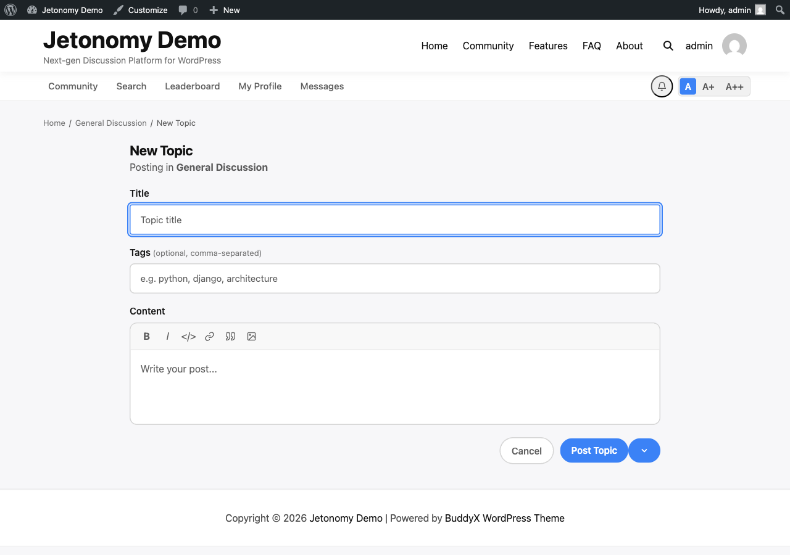

Not every post is ready to publish the moment you start writing it. Drafts let you save work-in-progress posts and come back to them later. Scheduled posts let you write now and publish at a specific date and time automatically.

## What You Will Learn

- How to save a post as a draft
- Where to find and manage your drafts
- How to schedule a post for future publication
- How the draft/schedule split-button UI works
- How scheduled posts are published and what happens if the window is missed

## Saving a Draft

When you are composing a new topic and want to save your progress without publishing:

1. Write your title and content as usual.
2. Click the **arrow** next to the main **Post** button to expand the split-button menu.
3. Select **Save as Draft**.

Your draft is saved immediately and you are returned to the space listing. No notification is sent to other members. The topic does not appear in the space listing.

> **Tip:** Press **Ctrl+Enter** (Windows/Linux) or **Cmd+Enter** (Mac) to trigger the composer's primary action without reaching for the mouse. This clicks the split-button's current primary button - for a new post that submits it; while editing a draft it runs whichever action the button currently shows.

## Finding Your Drafts

Two ways to get there, both show the same list:

- The **Drafts** tab on your profile at `/community/u/your-username/`
- A dedicated standalone page at `/community/drafts/` *(new in 1.4.1)*

Your drafts are listed in order of last-modified time, most recent first. The standalone page requires sign-in and is excluded from search engines, so unfinished work never leaks. Each draft shows:

- The post title (or "Untitled Draft" if you have not written a title yet)
- The space it is intended for
- When you last saved it

Click any draft to reopen the full composer with your saved content. Make your changes, then publish or save again.

Drafts are private. Only you and site admins can see your drafts.

## Drafts and Post Counts

Draft posts do not count toward any community statistics until they are published:

- They do not increment the space's post count.
- They do not appear in the space listing.
- They do not appear in search results.
- They do not appear on your public profile's Posts tab.

The moment a draft is published, either manually or via scheduled publishing, all of the above update immediately.

## Scheduling a Post

You can schedule a post to publish automatically at a specific future date and time:

1. Write your title and content.
2. Click the **arrow** next to the **Post** button to expand the split-button menu.
3. Select **Schedule**.
4. A date and time picker appears. Choose when you want the post to go live.
5. Click **Schedule Post**.

The post is saved with a Scheduled status. It does not appear publicly until the scheduled time.

Scheduled posts appear in your **Drafts** tab with a "Scheduled" label and the publish date/time displayed. You can click into a scheduled post to edit the content or change the publish time at any point before it goes live.

To cancel a scheduled post and convert it back to a draft, open it and click **Unschedule**.

## How Scheduled Publishing Works

Jetonomy publishes scheduled posts through Action Scheduler - the same background queue that powers WooCommerce - which runs its own queue runner rather than relying purely on page views. The check runs every hour. (WP-Cron remains a legacy fallback for older installs.)

This means a post scheduled for 9:00 AM may publish at any point during the following hour rather than exactly on the minute.

If a post's scheduled time is missed (for example, because the queue did not run during a low-traffic period), Jetonomy will publish it on the next run. It never silently drops a scheduled post.

## The Split-Button UI

The publish button in the post composer is a split button:

- **Left side:** The primary action (defaults to **Post Now** for new posts, **Update** for existing drafts).
- **Right side (arrow):** Opens the options menu with Save as Draft, Schedule, and any other contextual actions.

The left side updates based on context. When you are editing a draft, the left side shows **Publish Now** and the right side shows options to reschedule or keep as draft.

## What's Next?

Learn the full set of moderation tools available to space moderators: moving, merging, splitting, pinning, closing, and deleting topics.

[Topic Management →](06-topic-management.md)
