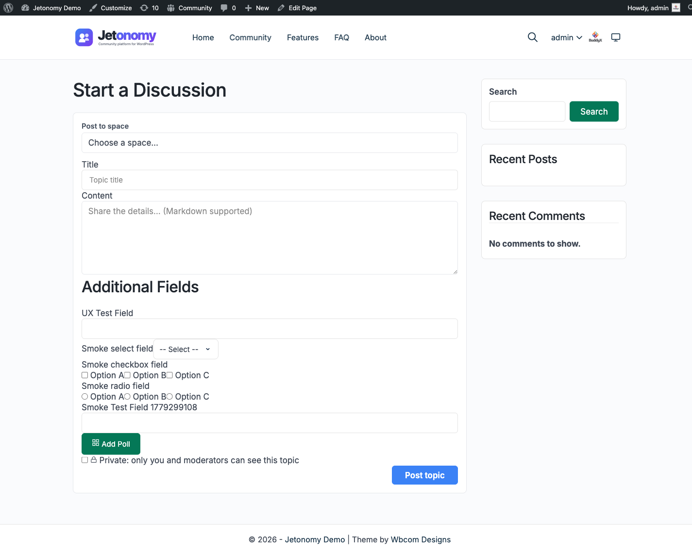

Members normally start a topic from inside a space. But you can also drop a "start a topic" box onto any WordPress page, post, or landing page - so a visitor can begin a discussion without first navigating into the community. Jetonomy gives you two ways to do this, and both produce the same box: a **Gutenberg block** and a **shortcode**.



## What You Will Learn

- Where the embedded composer is useful
- How to add it with the Compose Topic block (Gutenberg)
- How to add it with the `[jetonomy_compose_topic]` shortcode (Classic editor and page builders)
- The difference between "picker" mode and "fixed" mode
- What logged-out visitors see

## When to Use It

The embedded composer is handy when you want members to start a discussion from outside the community pages, for example:

- A "Ask the community" box on your homepage or a landing page
- A support page that drops members straight into your Support space
- A product page that invites feedback into an Ideas space

## Adding It with the Block (Gutenberg)

1. Edit any page or post in the WordPress block editor.
2. Click the **+** (Add block) button.
3. Search for **Jetonomy Compose Topic** and insert it.
4. In the block sidebar, choose how the box behaves (see [Picker vs Fixed Mode](#picker-vs-fixed-mode) below).
5. Publish or update the page.

## Adding It with the Shortcode

If you use the Classic editor, a widget, or a page builder (Elementor, Divi, Bricks, WPBakery), use the shortcode instead. It produces an identical box.

```
[jetonomy_compose_topic mode="picker"]
[jetonomy_compose_topic mode="fixed" space_id="5"]
```

The block and the shortcode are interchangeable - either surface works and they render the same composer, so pick whichever fits your editor.

## Picker vs Fixed Mode

The composer has two modes, set with the **mode** attribute (block sidebar control or shortcode attribute):

| Mode | What it does |
|---|---|
| **Picker** (default) | Shows a space dropdown so the member chooses which space their topic lands in. Only spaces where the member is allowed to post appear in the list. |
| **Fixed** | Locks the box to one space - no dropdown. Use this on a page that is clearly about a single topic area (e.g. a Support page that always posts into the Support space). Set the space with **space_id** (the **Space ID to post into** control in the block). |

If you choose Fixed mode but the space is missing or the member cannot post in it, the box quietly falls back to Picker mode rather than showing an error.

### Limiting the Post Types

The **types** attribute controls which kinds of topic the box can create. By default it allows `topic,question,idea`. Remove any you do not want to offer on that page. (The actual post type a member ends up creating still follows the space type - see [Creating Topics](01-creating-topics.md#post-type-is-derived-automatically).)

## What Logged-Out Visitors See

If a visitor is not signed in, the box does not show a form. Instead it shows a **"Sign in to start a new topic"** prompt that returns them to the same page after they log in. There is no exposed form for signed-out visitors, so you can safely place the composer on a public page.

## Related

- [Creating Topics](01-creating-topics.md) - the full new-post composer, field by field
- [Search & Filters](../search-and-discovery/01-search-filters.md) - help members find existing discussions before they start a new one
- For the full attribute reference and developer details, see [Shortcodes, Widgets & Blocks](../developer-guide/04-shortcodes-widgets-blocks.md)
