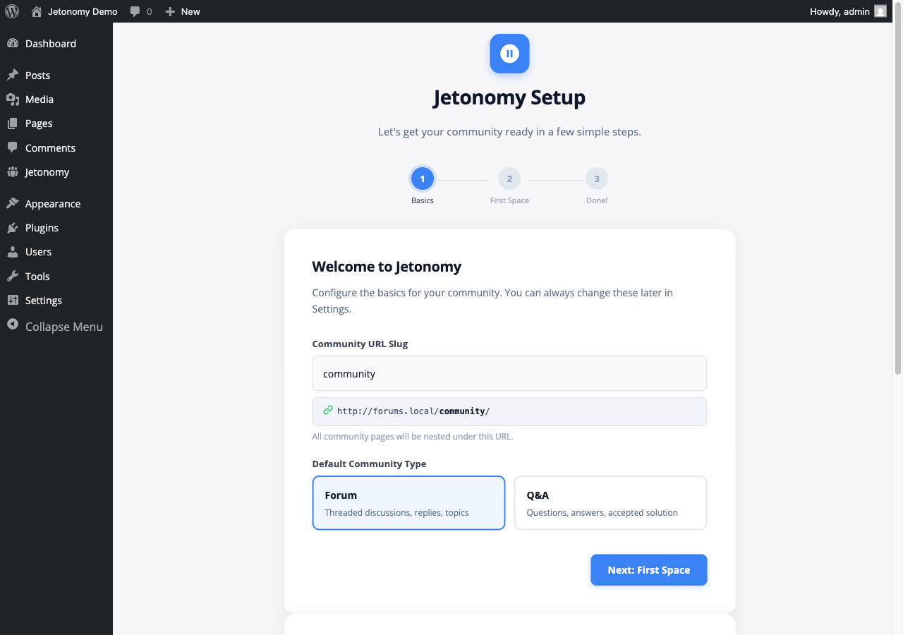

Get Jetonomy running on your WordPress site in under five minutes. This guide covers system requirements, how to install, and what happens the moment you activate.



## What You Will Learn

- Whether your server meets the requirements
- Three ways to install Jetonomy
- What Jetonomy sets up automatically on first activation

> **See it running first** - [community.wbcomdesigns.com](https://community.wbcomdesigns.com/) is Wbcom's own support community, running Jetonomy in production. Browse the spaces, read the threads, and see how topics, replies, voting, trust levels, and moderation feel on a live site before you install. Public registration is open, so you can sign up and ask a question there if you have one.

## Requirements

Jetonomy requires a modern WordPress stack. Check these before installing.

| Requirement | Minimum |
|-------------|---------|
| WordPress | 6.7 or higher |
| PHP | 8.1 or higher |
| MySQL | 5.7 or higher (or MariaDB 10.4+) |
| Browser | Any modern browser (Chrome, Firefox, Safari, Edge) |

Jetonomy works with any WordPress theme. For the best visual result with zero extra configuration, use **BuddyX**.

> **Note:** Jetonomy does not use WordPress custom post types. It stores all community data in its own optimized database tables (`wp_jt_*`). This is intentional - it gives your community the query performance and scalability that CPT-based plugins cannot match.

## Installation

### Method 1: WordPress Admin (Recommended)

1. Go to **Plugins → Add New Plugin** in your WordPress admin.
2. Search for **Jetonomy**.
3. Click **Install Now**, then **Activate**.

### Method 2: Upload a ZIP File

1. Download the Jetonomy ZIP from [jetonomy.com](https://jetonomy.com) or [wordpress.org](https://wordpress.org/plugins/jetonomy/).
2. Go to **Plugins → Add New Plugin → Upload Plugin**.
3. Choose the ZIP file and click **Install Now**, then **Activate**.

### Method 3: WP-CLI

```bash
wp plugin install jetonomy --activate
```

## What Happens on Activation

Jetonomy sets everything up automatically the first time you activate it. You do not need to run any SQL or configure anything manually.

**Database tables created (24 total):**

Jetonomy creates 24 custom tables under the `wp_jt_` prefix, one for each data entity: categories, spaces, posts, replies, votes, user profiles, notifications, subscriptions, tags, moderation flags, revisions, invite links, bookmarks, and more.

**WordPress capabilities registered:**

Jetonomy registers 20 custom capabilities (`jetonomy_read`, `jetonomy_create_posts`, `jetonomy_moderate`, and others) and maps them to your existing WordPress roles automatically.

**Permalink rules flushed:**

Your community URLs (e.g. `yoursite.com/community/`) are registered and rewrite rules are flushed immediately. No manual permalink reset needed.

> **URL Note:** Throughout this documentation, `/community/` is used as the default base URL. You can change this to any slug (e.g. `/forum/`, `/discuss/`, `/hub/`) in **Jetonomy → Settings → General → Community Base URL**. All community URLs automatically update when you change the base slug.

**Cron jobs scheduled:**

Two background jobs are scheduled via WP-Cron:

- **Trust level evaluation** - runs every 12 hours to promote members who have earned higher trust levels.
- **Notification digests** - runs daily and weekly (Jetonomy Pro).

After activation, you will see a blue notice at the top of your dashboard:

> **Your community is almost ready.** Run the setup wizard to get started.

Click that notice to launch the setup wizard and go live.

> **Tip:** If you are migrating from bbPress, wpForo, or Asgaros Forum, activate Jetonomy first to complete setup, then use the importer at **Jetonomy → Import**. Your existing data is never touched until you explicitly start an import.

## WordPress Multisite

Jetonomy is multisite-compatible. When you network-activate the plugin from **Network Admin → Plugins**, Jetonomy automatically creates all required `wp_jt_*` database tables on every existing subsite in the network.

New subsites created after network activation are also provisioned automatically. The moment WordPress adds a new subsite to the network, Jetonomy detects it and creates the required tables before any community activity can occur.

> **Note:** Each subsite has its own independent set of `wp_{blog_id}_jt_*` tables and its own community data. Spaces, posts, and members are not shared across subsites.

If you prefer per-site activation rather than network activation, install and activate Jetonomy on each subsite individually. Both approaches work correctly.

## Uninstalling

If you deactivate Jetonomy, your data is preserved. Only a full uninstall (delete) removes the `wp_jt_*` tables, all plugin options, and all registered capabilities, giving you a clean removal with no database debris. Jetonomy Pro behaves the same way: uninstalling it removes every `wp_jt_pro_*` table, its options and user meta, and its scheduled tasks (fully covered as of 1.5.0).

## What's Next?

Run the three-step setup wizard to choose your community URL, create your first space, and go live.

[Run the Setup Wizard →](02-setup-wizard.md)
