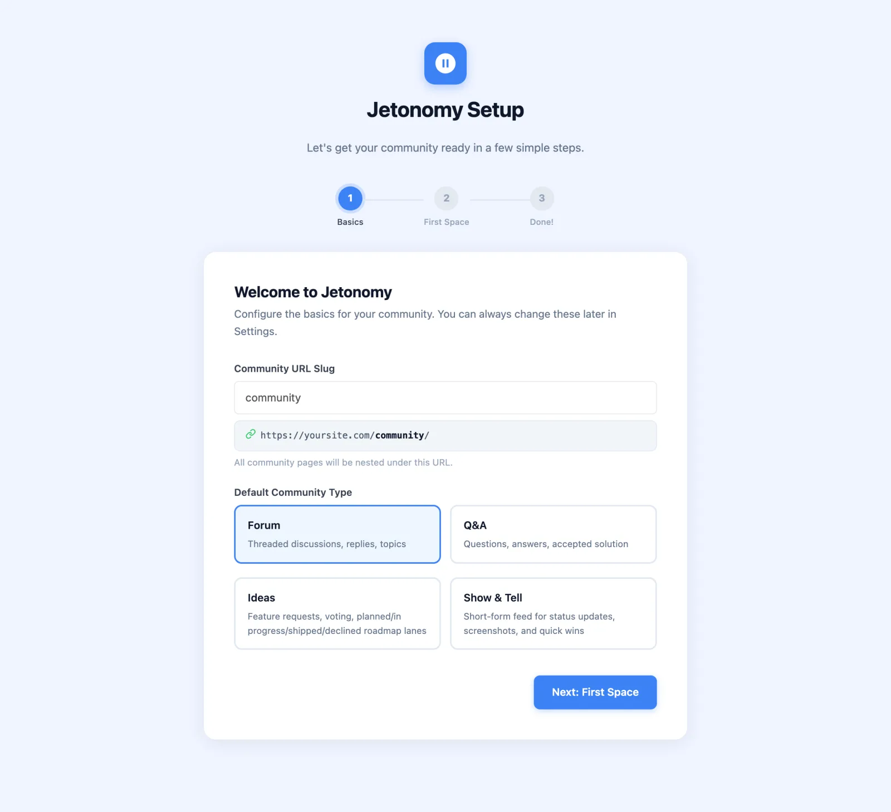
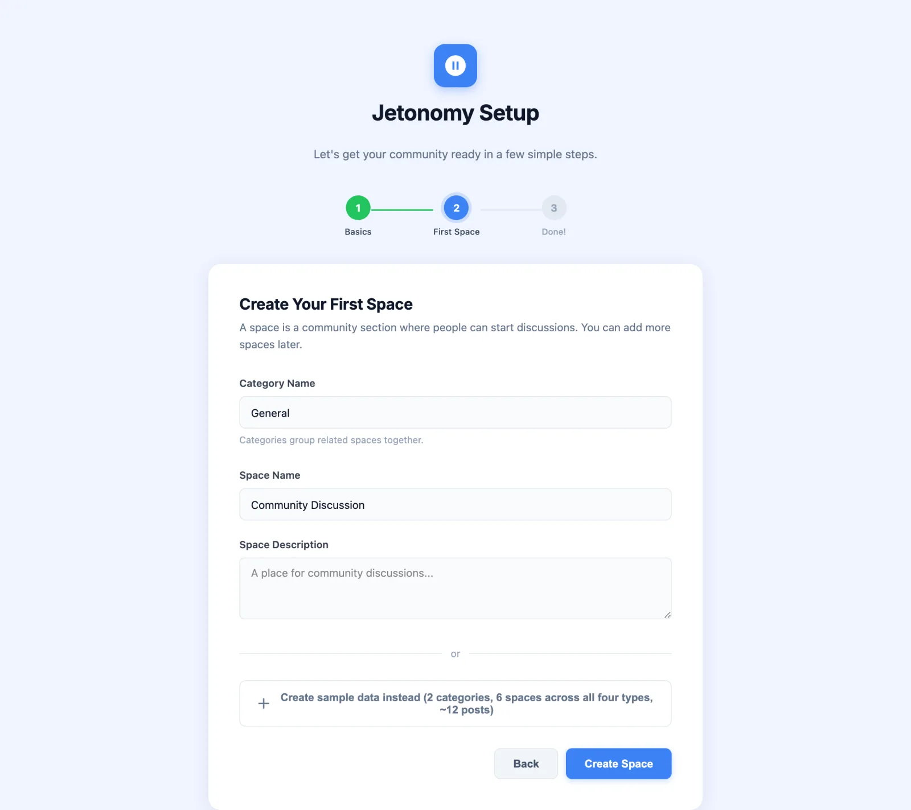

# Setup Wizard

After you activate Jetonomy, a three-step wizard walks you through the only decisions you need to make before your community goes live. The whole process takes about two minutes.

## What You Will Learn

- How to set your community URL slug
- How to choose between creating your first space manually or loading demo data
- What the wizard does, and what you can always change later

## Opening the Wizard

The wizard opens automatically the first time you activate Jetonomy. To open it again, go to **Jetonomy → Dashboard** and click **Run Setup Wizard** in the welcome notice.

That notice only shows until setup is complete and your community has no content. The wizard is its own page (`admin.php?page=jetonomy-setup`), not an overlay.

## Step 1: Community URL

Choose the slug where your community will live on your site.

The default is `community`, which gives you `yoursite.com/community/`. You can change this to anything that fits your site: `forum`, `hub`, `members`, `discuss`, or your brand name.

| Example slug | Resulting URL |
|---|---|
| `community` | `yoursite.com/community/` |
| `forum` | `yoursite.com/forum/` |
| `hub` | `yoursite.com/hub/` |

**Default Community Type:** Also on this screen, choose the default type for new spaces you create. Your options are:

- **Forum** - threaded discussions, replies, topics
- **Q&A** - questions, answers, accepted solution
- **Ideas** - feature requests, voting, planned, in progress, shipped and declined roadmap lanes
- **Show & Tell** - short-form feed for status updates, screenshots, and quick wins (called **Feed** elsewhere in Jetonomy)

You can create spaces of any type regardless of what you choose here. This setting just controls the type that is preselected when you click **Add New** on **Jetonomy → Spaces** later.

> **Tip:** You can change your community URL slug later in **Jetonomy → Settings → General**. Jetonomy automatically flushes permalink rules when you save.

> **Make the community your homepage:** Under **Jetonomy → Settings → General → Community Setup**, enable **Show the community home on the site front page** to serve the community home at your site root. This takes precedence over the WordPress "Your homepage displays" setting, and all other community URLs, posts, and feeds keep working unchanged.

## Step 2: First Space

This step gets real content into your community so it is ready to share the moment you finish. Choose the path that fits where you are right now.

### Path A: Create Your First Space

Choose this if you are setting up a production site and want to start with your own content.

1. Enter a **Category Name** (the default is "General"). Categories group related spaces together.
2. Enter a **Space Name** (the default is "Community Discussion") and an optional **Space Description**.
3. The space uses the default type you picked in Step 1. You can change a space's type any time under **Jetonomy → Spaces → Edit**.
4. Click **Create Space**.

Your space is created as Public with an Open join policy, and it is visible immediately after you finish the wizard.

### Path B: Load Sample Data

Choose this if you want to try Jetonomy's features before committing to a structure. Click the **Create sample data instead** button under the form instead of **Create Space**.

Jetonomy imports a demo community into your site:

- **Categories** to group the spaces
- **Spaces across all four types** - Forum, Q&A, Ideas, and Feed - so you can see how each type behaves
- **Demo users** with realistic avatars, trust level badges, and posting history
- **Sample posts and replies** - enough content to see voting, accepted answers, tags, and notifications working in context

This lets you experience the full community interface as a regular member would see it, without writing any content yourself.

When you are ready to go live, go to **Jetonomy → Dashboard** and click **Remove All Demo Data** on the **Demo Data Active** card. Every demo post, reply, space, category, and user record is deleted in a single operation. Any real content you added alongside the demo data is preserved. If you skipped the sample data, the same card has an import button so you can add it later.

> **Note:** Demo data is tracked internally via a `jetonomy_demo_data` record. Removal is precise and does not affect any content you created yourself.

## Step 3: Done

The final screen confirms your community is live and gives you two quick links:

- **Visit Community** - opens `yoursite.com/community/` in a new tab so you can see the frontend immediately.
- **Go to Dashboard** - takes you to **Jetonomy → Dashboard** where you can manage spaces, moderate content, and configure settings.

Everything you configured in the wizard can be changed later:

| Setting | Where to change it |
|---|---|
| Community URL slug | Jetonomy → Settings → General |
| Default space type | Jetonomy → Settings → General (Community Setup) |
| Space name, type, join policy | Jetonomy → Spaces → Edit |
| Email notifications | Jetonomy → Settings → Email (Notification Defaults) |

## What's Next?

Your community is live. Now learn what to do in the first hour: create categories, set up your real spaces, and invite your first members.

[Your First Community →](03-first-community.md)
