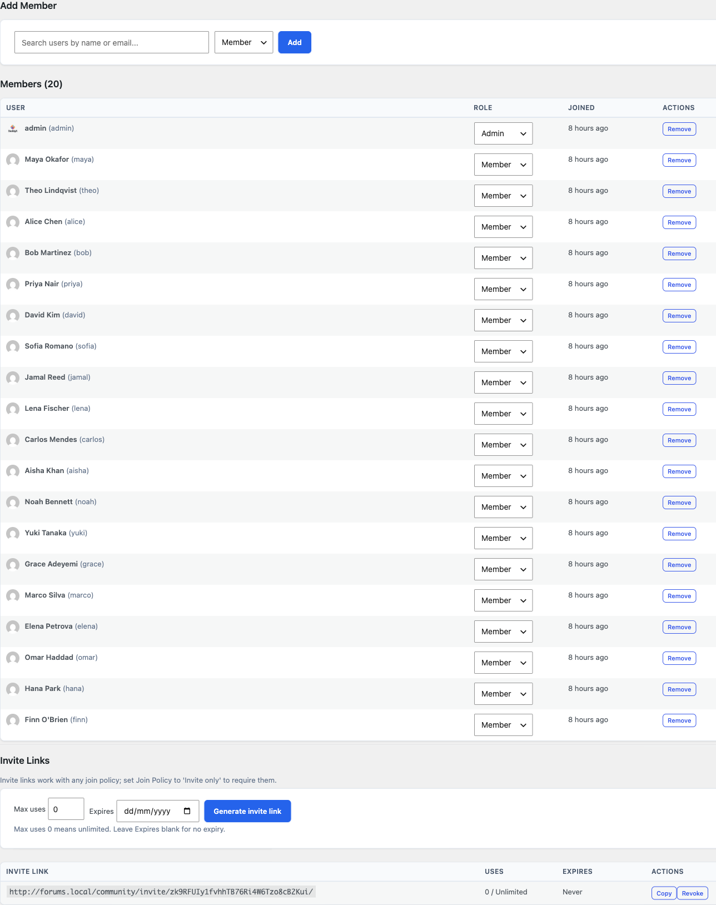

# Your First Community

Your community is installed and the wizard is complete. This guide walks you through what to do next, from organizing your spaces to inviting your first members, so your community is genuinely ready for people on day one.

## What You Will Learn

- How to organize spaces with categories
- How to create your first real space and choose the right type
- How to invite members with a shareable link
- How to customize the look and feel
- How to import from bbPress or wpForo if you are migrating
- What the community frontend looks like for your members

## Create Categories to Organize Your Spaces

Categories are the top-level groupings in your community. Every space belongs to a category. Before you create more spaces, take a moment to plan your category structure - it is much easier to do now than to reorganize later.

To create a category:

1. Go to **Jetonomy → Categories**.
2. Enter a name and optional description in the form on the left.
3. Click **Add Category**.

Your category appears in the table on the right. Drag rows to reorder them. The order here is the order your members see on the community home page.

> **Tip:** Start with two to four broad categories. You can always add more later. Common patterns: "Support / General / Announcements" for a product community, or "Ideas / Questions / Showcase" for a creator community.

## Create Your First Real Space

A space is where discussions happen. Each space has a type that shapes how members interact with content.

### Choosing a Space Type

| Type | Best for | Key feature |
|---|---|---|
| **Forum** | General discussion, announcements, support | Threaded replies, newest/popular sort |
| **Q&A** | Technical help, knowledge bases | Votable answers, accepted answer highlight |
| **Ideas** | Feature requests, roadmaps | Status lanes (Planned, In Progress, Shipped, Declined) with roadmap view |
| **Feed** | Status updates, introductions, sharing work | Card feed with optional title and votes |

To create a space, you can use either the wp-admin form or the front-end Create Space page. Both produce the same result.

**From wp-admin:**

1. Go to **Jetonomy → Spaces → Add Space**.
2. Enter a name and optional description.
3. Pick an icon from the visual Lucide picker (16 defaults plus a search field).
4. Choose the space type.
5. Set visibility: **Public** (anyone can see it), **Private** (members only see content), or **Hidden** (not listed, invite only).
6. Set the join policy: **Open**, **Request to join**, or **Invite only**.
7. Click **Save Space**.

**From the front end** (so non-admin owners can create spaces too): visit `/community/new-space/` while signed in. The form is identical and is available to any role you've enabled under **Jetonomy → Settings → General**, in the **Front-end space creation** field.

Your space is immediately available on the community frontend under its category.

## Invite Members

You do not need to wait for members to discover your community organically. Jetonomy gives you a direct invite link you can share anywhere.

### Generate an Invite Link

1. Go to **Jetonomy → Spaces** and click on your space.
2. Click **Members** in the space navigation.
3. Click **Generate Invite Link**.
4. Set an expiry date, or leave it open with no expiry.
5. Copy the link and share it via email, Slack, social media, or anywhere else.

When someone visits the link, they are added to the space immediately after logging in or creating a WordPress account.

> **Note:** Invite links work for any WordPress user registration flow you have configured. If you allow open registration, new members can sign up and join in one step.

### Existing WordPress Users

Anyone who already has an account on your WordPress site can visit `yoursite.com/community/` and join public spaces by clicking **Join Space**. Their existing avatar, display name, and email are used automatically.

## Customize the Appearance

Jetonomy inherits your theme's fonts, colors, and border radius automatically via WordPress theme tokens. If you are using BuddyX, this integration is immediate. Jetonomy reads BuddyX's design tokens and matches your brand without any manual work.

To adjust further:

- Go to **Jetonomy → Settings** and open the **General** and **Advanced** tabs.
- To override specific templates, create a `jetonomy/` folder inside your active theme directory and drop in any template file from `wp-content/plugins/jetonomy/templates/`. Jetonomy always checks your theme folder first.

> **Tip:** You do not need to copy all templates. Only override the ones you want to change. Unmodified templates are served directly from the plugin.

## Importing from bbPress, wpForo, or Asgaros

If you are migrating an existing community, Jetonomy includes a built-in importer for three sources.

1. Go to **Jetonomy → Import**.
2. Select your source plugin: **bbPress**, **wpForo**, or **Asgaros Forum**.
3. Jetonomy auto-detects your existing data and shows a summary, for example: "Found: 12 forums, 3,847 topics, 28,419 replies."
4. Run a **Dry Run** first to check for any mapping issues.
5. Click **Start Import** when you are ready.

Imports run in background batches. You can close your browser and come back. The import continues via WP-Cron and resumes from where it left off if interrupted.

**What gets migrated:**

| Source | Jetonomy |
|---|---|
| Forums | Categories + Spaces |
| Topics | Posts |
| Replies | Replies |
| Users | WordPress users + Jetonomy profiles |
| Inline images and attachments (1.8.0+) | Media library + Jetonomy attachments |

## The Community Frontend: A Quick Tour

Once you have content, here is what your members will see.

### Community Home (`/community/`)

The home page lists all categories with their spaces. Each space card shows the post count, member count, and a recent activity indicator. Members can sort by activity or browse by category.

### Space Listing (`/community/s/space-slug/`)

Inside a space, members see a topic list with vote scores, reply counts, author avatars, tags, and time. They can filter by **Latest**, **Popular**, or **Unanswered**. A **New Post** button appears in the top right for members who have permission to post.

### Single Topic (`/community/s/space-slug/t/topic-slug/`)

The topic view shows the full post, vote buttons, and all replies. Replies are threaded up to three levels deep. For busy topics with many replies, Jetonomy loads the first 10 and last 10 replies by default, with a gap-loader button in between to fetch more. This keeps page load fast regardless of reply count.

In Q&A spaces, the accepted answer is pinned to the top and highlighted with a green checkmark.

### Sidebar

The community sidebar (where the theme layout places it) shows active members, trending tags, and recent activity. The exact sidebar layout depends on your theme.

> **Note:** All community pages are server-side rendered. There are no JavaScript-only pages, so every URL is indexable by search engines out of the box.

## What's Next?

Now that your community is live and populated, learn how to organize it further with spaces and categories, including visibility rules and per-space permissions.

[Spaces and Categories →](../spaces-and-categories/01-creating-spaces.md)
