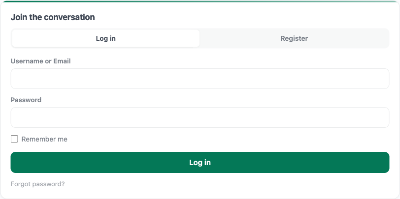
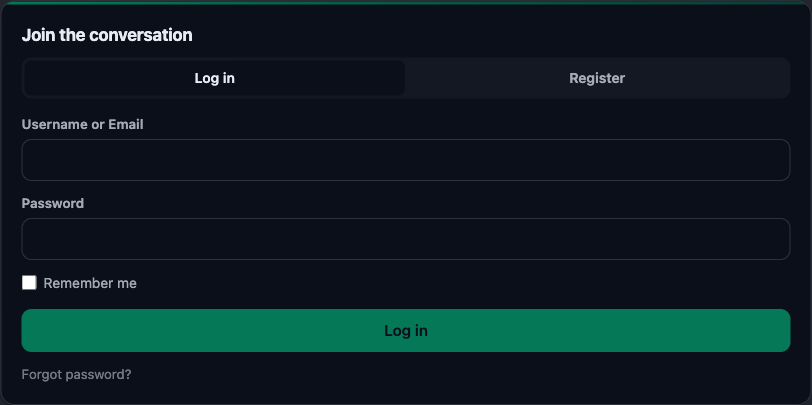

# In-Page Authentication

Jetonomy can handle Login, Register, and Forgot Password right inside your community pages, with forms that match your theme instead of bouncing members to the generic WordPress login screen. It does this through its own `/auth/*` REST endpoints, so signing in to upvote a post or reply to a thread happens in place, without a jarring redirect to `wp-login.php` and back. This is an optional enhancement you can set up at any time after launch.

## What You Will Learn

- Where the in-page auth forms appear and how they behave
- Why the Login block improves member experience over a bare login screen
- How captcha protection now covers signup, not just posting
- How signed-out interactions and Private community mode route visitors
- How to customize the auth surface with theme tokens

## Where the Forms Appear



In-page auth is delivered by the **Login block** (`wp:jetonomy/login`). Place the block on any page or template, and it renders Login, Register, and Lost Password tabs inline, styled to match your community. The forms submit to Jetonomy's own `/auth/*` REST endpoints, so a visitor signs in or registers without ever leaving the page the block is on.

Use it wherever a sign-in surface makes sense:

- A dedicated member-login page you build with the block
- A sidebar or footer widget area
- A landing page that gates content behind membership

### Signed-Out Interactions

When a signed-out visitor tries to do something that requires an account - upvoting a post, starting a reply, following a space, subscribing to a tag, or bookmarking - Jetonomy sends them to the WordPress login screen (`wp_login_url`) with a `redirect_to` parameter back to the page they were on. After they sign in, they land back where they started.

For a fully in-page experience, point those visitors at a page that hosts the Login block instead of relying on the default `wp-login.php` redirect.

## Why This Matters

The old `wp-login.php` flow worked, but it had three real problems:

1. **Visual jarring.** The WordPress login screen does not look like your community. Visitors went from your themed pages to a generic blue-and-white form and back. The break in visual continuity made the community feel less polished.
2. **Lost context.** Visitors who clicked "Reply" had to sign in, then find their way back to the thread. WordPress's redirect handling did not always land them on the right page, especially with theme-specific URLs.
3. **Slow perceived load.** Two full page navigations for what should be a quick "sign me in and let me reply" step.

The Login block fixes all three. The forms render inline on the page you place the block on, look like the rest of the community, and submit through the `/auth/*` endpoints without a full page navigation.

## Captcha Now Protects Signup

Site owners can configure reCAPTCHA or Cloudflare Turnstile keys under **Jetonomy → Settings → Anti-spam**. Before 1.4.0, those keys only protected post and reply submission. Bots could still register accounts freely.

From 1.4.0, the same captcha keys also protect:

- New account registration
- Password reset requests
- Login attempts after repeated failures from the same IP

Nothing needs to change in your settings. If you already had captcha configured, it now extends to signup automatically. If you don't have captcha configured, the auth forms still work; they just have less spam protection.

### Captcha Providers Supported

| Provider | Where to get keys |
|---|---|
| Google reCAPTCHA v3 | https://www.google.com/recaptcha/admin |
| Cloudflare Turnstile | https://dash.cloudflare.com/?to=/:account/turnstile |

Choose whichever fits your stack. Turnstile is recommended if you're privacy-conscious or already on Cloudflare; it runs without challenging visitors in most cases.

## Who Still Uses wp-login.php

The Login block gives members an in-page sign-in surface. The standard WordPress site-wide login is unchanged.

Administrators (anyone with the `manage_options` capability) sign in at `wp-login.php` and reach `wp-admin/`. That's intentional. Site owners need a reliable way to get into the admin area even if community pages have an issue, and security plugins, two-factor plugins, and SSO integrations all hook into `wp-login.php`.

In practice:

- Members can use a page hosting the Login block, or fall back to `wp-login.php`
- Signed-out interactions that require an account redirect to `wp-login.php` unless you route them to a Login-block page
- Any plugin you have that customises `wp-login.php` (login restrictions, two-factor, branding) still works for admin login

## Private Community Mode

If you've set your community to Private (the **Public / Private** access control under **Jetonomy → Settings → General → Access Control**), signed-out visitors cannot read any community content.

Every community URL redirects an anonymous visitor to the WordPress login screen (`wp_login_url`) with a `redirect_to` parameter back to the page they were trying to reach, so they land there as soon as they sign in. If you've built a page with the Login block, point your members at it for an in-page sign-in instead.

Registration can be disabled separately if you only want to allow invited members. In that case the Login block hides its Register tab.

## Customization

The auth surface uses the same `--jt-*` design tokens as the rest of Jetonomy. That means your theme's brand color, fonts, border radius, and spacing are picked up automatically. No custom CSS required for a polished match.

### Light Auth Surface in Dark Mode



There's one intentional exception: the Login block stays in light mode even when the rest of your community is in dark mode. This is a deliberate UX choice. Sign-in forms in dark mode are statistically harder to read and easier to mistype, especially on mobile. Keeping the auth surface light maintains form readability where it matters most: at the point of conversion.

If you want to override this and run a dark auth surface (for a fully dark community theme), you can do it via CSS:

```css
.jt-login-block {
  --jt-bg: #1a1a1a;
  --jt-text: #f5f5f5;
}
```

### Customising Form Labels

All auth form labels are translatable through the standard WordPress translation pipeline. They use the `jetonomy` text domain. If you're running a translated site, the forms pick up your translations on the next load.

## What's Next?

With onboarding complete, fine-tune your community in the settings screens, starting with General settings for your community URL and access controls.

[General Settings →](../admin-settings/01-general.md)
