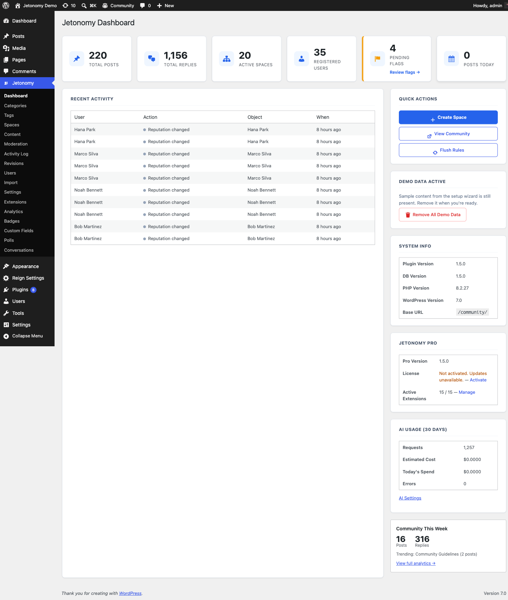

# Admin Dashboard

The Jetonomy admin dashboard is your first stop after logging in to wp-admin. It shows a live snapshot of community health and gives you one-click access to the most common management tasks.

## What You Will Learn

- What each stat card measures
- How to use the Quick Actions panel
- What the Recent Activity feed shows
- Where to find System Info

Go to **Jetonomy → Dashboard** to access this screen. It is also the landing page when you click **Jetonomy** in the wp-admin sidebar.

## Setup Wizard Notice

On a fresh install where the setup wizard has not been completed, a blue notice appears at the top of the dashboard asking you to run the wizard. The wizard creates your first space and seeds optional demo content. Once you complete it, the notice disappears and does not return.

## Stat Cards

Six cards show current counts for the most important community metrics. Counts update in real time - refreshing the page fetches the latest values.

| Card | What It Counts |
|---|---|
| Total Posts | All published posts across every space |
| Total Replies | All published replies across every post |
| Active Spaces | Spaces with status "active" |
| Registered Users | Total WordPress users with at least one Jetonomy profile row |
| Pending Flags | Flags in the moderation queue that have not been resolved |
| Posts Today | Posts created in the current calendar day (UTC) |

When the **Pending Flags** count is greater than zero, the card turns orange and shows a **Review flags →** link that takes you straight to the moderation queue - so the count is a one-click action, not just a visual signal. On the moderation queue itself, the "N pending" badge updates live as you resolve each flag, without a page reload.

## Recent Activity Feed

The Recent Activity table on the left side of the dashboard shows the most recent member actions logged in the activity system. Columns:

| Column | Description |
|---|---|
| User | Display name of the member who took the action |
| Action | What they did (colored dot indicates category: green = create, blue = vote, orange = moderation) |
| Object | The post, reply, space, or user the action involved, with a link to the relevant admin page |
| When | Relative time (e.g. "3 minutes ago") |

If no activity has been logged yet, a placeholder message appears. The feed is read-only - use it for monitoring, not for taking action on specific items.

## Quick Actions Panel

The right sidebar has a Quick Actions card with three buttons:

| Button | What It Does |
|---|---|
| Create Space | Opens the new-space form at Jetonomy → Spaces → Add New |
| View Community | Opens the community home in a new browser tab |
| Flush Rules | Triggers `flush_rewrite_rules()` to rebuild WordPress permalink rules |

Use **Flush Rules** any time your community URLs return 404s after changing the base slug, activating a new plugin, or running a migration.

## Demo Data Notice

If you used the setup wizard's demo-data option, a yellow card labeled **Demo Data Active** appears below Quick Actions. Click **Remove All Demo Data** to delete all demo posts, replies, spaces, and the related setup option.

This card only appears while `jetonomy_demo_data` option is set. It disappears permanently once you click Remove.

## System Info

A small table at the bottom of the sidebar shows:

| Row | Value |
|---|---|
| Plugin Version | Current Jetonomy version constant |
| DB Version | The database schema version currently applied |
| PHP Version | Server PHP version |
| WordPress Version | WordPress core version |
| Base URL | The configured community base slug (e.g. `/community/`) |

Use this table when filing a support request or diagnosing compatibility issues. Copy the values rather than describing them from memory.

## Pro Analytics Widget (Jetonomy Pro)

When Jetonomy Pro is active and the Analytics extension is enabled, Pro adds an analytics mini-widget to the sidebar showing recent engagement trends. A full analytics dashboard is available at **Jetonomy → Analytics**.

When Pro is not active, a small card in the sidebar describes what the Analytics extension adds and links to the Jetonomy Pro store page.

## What's Next?

Give members a sign-in experience that matches your community by adding in-page login and registration.

[In-Page Authentication →](04-in-page-auth.md)
