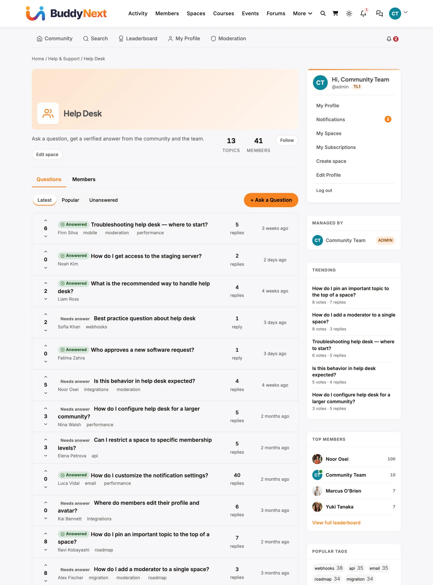

# Launch a Support Forum

Use this guide if you sell a product or service and want customers to ask questions, get answers from your team, and mark the best answer. When you finish, you will have a Q&A space where staff are notified of new questions.

## What you will set up

- A **Support** category and a Q&A space inside it
- Staff members who can answer and accept answers
- Notifications so your team sees every new question
- Optional labels such as **Bug** or **Billing** on each question

## Before you start

- Jetonomy is installed and the setup wizard is finished. See [Setup Wizard](../getting-started/02-setup-wizard.md).
- Your outgoing email works. Send a test first: **Jetonomy → Settings → Email → Send Test Email**.
- You have a second browser (or a private window) and a test customer account.

> **Note:** If you renamed "Space" under **Settings → General → Terminology**, use your own word wherever this guide says "space".

## Step 1: Create a Support category

1. Go to **Jetonomy → Categories**.
2. In **Add New Category**, type a **Name** such as `Support`.
3. Leave **Visibility** on **Public** so customers and search engines can find your answers.
4. Click **Add Category**.

## Step 2: Create the Q&A space

1. Go to **Jetonomy → Spaces** and click **Add New**.
2. Enter a **Title**, for example `Help Desk`. Add a short **Description** that tells customers what to ask here.
3. Set **Category** to `Support`.
4. Set **Type** to **Q&A**.
5. Set **Visibility** to **Public** and **Join Policy** to **Open**.
6. Click **Create Space**.

> **Tip:** Running several products? Create one Q&A space per product inside the same category. Customers then pick the right place before they ask.

Want support for paying customers only? Follow [Restrict a Space to Paying Members](03-restrict-a-space-to-paying-members.md) after this guide.

## Step 3: Choose who answers

Space moderators can accept an answer on any question and can close, pin or move topics. They do not need access to wp-admin.

1. Go to **Jetonomy → Spaces** and click **Edit** under your space.
2. Open the **Members** tab.
3. Under **Add Member**, search by name or email.
4. Set the role to **Moderator** and click **Add**.

Repeat for each team member. Customers who answer each other stay ordinary members. Their answers can still be accepted.

## Step 4: Get notified about new questions

Jetonomy notifies people who **follow** a space. Your staff are members now, so each of them follows it like this:

1. Open the space on the community side and click **Follow** in the space header.
2. Open your profile edit screen (`/community/u/your-username/edit/`).
3. Under **Notification Preferences**, find **New topic in followed space** and switch **Email** on.

Email is off by default for this notification. To turn it on for everyone at once, go to **Jetonomy → Settings → Email → Notification Defaults**, tick **Email** on the **New post in subscribed space** row, and click **Save Settings**. Members can still change it for themselves.

(Pro) **Reply by Email** lets people answer a notification email without logging in. See [Reply by Email](../pro-features/11-reply-by-email.md).

## Step 5: Add labels (optional)

Labels help your team sort questions at a glance.

1. Edit the space and open the **Settings** tab.
2. Next to **Topic Prefixes**, tick **Enable topic prefixes for this space**.
3. Click **+ Add Prefix**, type a **Label** such as `Bug`, and pick a colour.
4. Click **Save Settings**.

## Check that it works

1. In your second browser, sign in as the test customer and open the space.
2. Click **+ Ask a Question**, fill in the form and click **Post Question**.
3. As staff, you should receive the new-question notification. Open the question and post a reply.
4. As the test customer, click **Accept** on the staff reply. The reply gets an **Accepted** tag.
5. Back in the space list, the question now shows an **Answered** badge. The **Unanswered** filter no longer lists it.

If the notification does not arrive, check **Notification Preferences** for that staff member.

## Common questions

**Who can accept an answer?**
The person who asked, plus moderators and admins of that space. A wrong choice can be undone with **Unaccept**.

**Can customers ask a question privately?**
Yes. The question form shows a **Private: only you and moderators can see this topic** box. It is always available to signed-in members. You cannot switch it off per space.

**Can I let only staff reply?**
Edit the space, open **Settings**, and set **Who Can Reply** to **Moderators & Admins**. Customers can still ask, but only staff can answer.

**Do customers need an account?**
Anyone can read a public space. Asking and replying needs a signed-in account.

## Related guides

- [Space Types](../spaces-and-categories/02-space-types.md)
- [Membership & Join Policies](../spaces-and-categories/03-membership-policies.md)
- [Private Topics & Prefixes](../discussions/07-private-and-prefixes.md)
- [Email Settings](../admin-settings/03-email.md)
- [Moderation Queue](../moderation-and-trust/03-moderation-queue.md)
