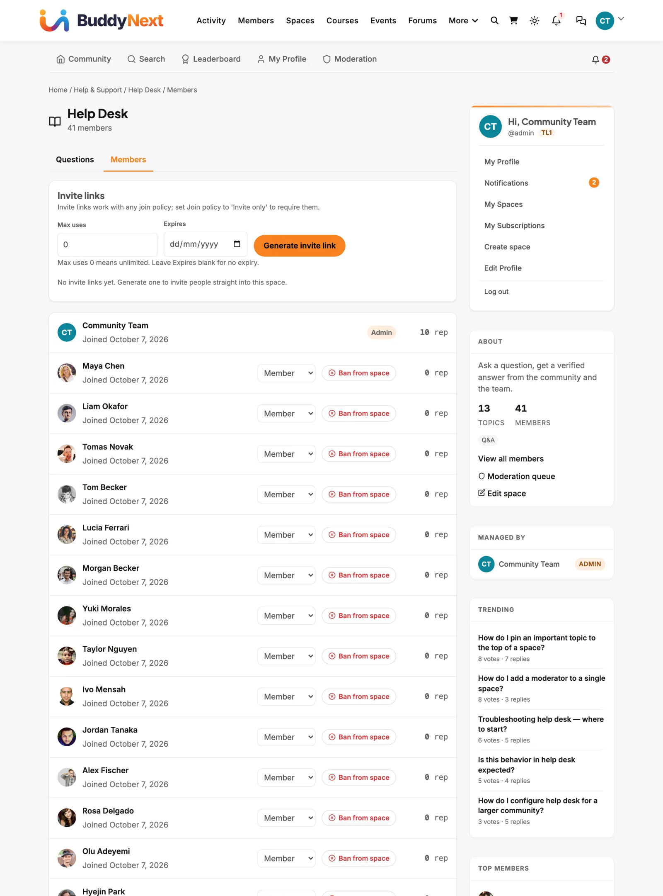
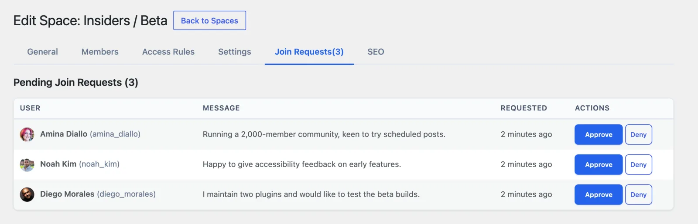

# Invite Your First Members

Use this guide to bring your first people into a space. You will choose how people join, share an invite link, add people yourself, and approve requests. It works the same on free and Pro.

## What you will set up

- A join policy for your space: **Open**, **Requires Approval** or **Invite Only**
- A shareable invite link with an optional limit and expiry date
- A routine for approving join requests

## Before you start

- You have a space. If not, see [Your First Community](../getting-started/03-first-community.md).
- Your email works, so people get join and approval emails. Check with **Jetonomy → Settings → Email → Send Test Email**.
- You are an administrator, or the space admin. Space moderators can approve requests but cannot create invite links.
- You have a second browser window to try the link as a new person.

## Step 1: Choose how people join

1. Go to **Jetonomy → Spaces** and click **Edit** under the space.
2. On the **General** tab, set **Join Policy**:

| Policy | What happens |
|---|---|
| **Open** | A signed-in person clicks **Join Space** and is in at once |
| **Requires Approval** | They click **Join** and wait for you to approve |
| **Invite Only** | There is no join button. People need an invite link |

3. Click **Update Space**.

A **Hidden** space is always **Invite Only**. An invite link works with any policy. Only **Invite Only** makes it the single way in.

## Step 2: Create an invite link

You can do this from the community side or from wp-admin.

**On the community side:**

1. Open the space and click the **Members** tab.
2. Find the **Invite links** panel. Only space admins see it.
3. Set **Max uses**. `0` means unlimited.
4. Set **Expires**, or leave it blank for no expiry.
5. Click **Generate invite link**.
6. Click **Copy** and share the link anywhere: email, chat or social media.

**In wp-admin:** open **Jetonomy → Spaces → Edit → Members** and use the **Invite Links** section, which has the same fields and a table of links.

Each link lists **Uses** and **Expires**. A link that has run out is marked **No longer works**. Click **Revoke** to cancel one early. Anyone still holding it will not be able to join.

## Step 3: What the invited person sees

1. They open the link.
2. If they are signed out, they see "You've been invited to join" and the space name.
3. They click **Create free account** or **Log in to accept invite**. The sign-up button shows only when **Anyone can register** is on under WordPress **Settings → General**.
4. After signing in, they land in the space as a **Member**.

> **Note:** If your whole community is private, guests are sent to the WordPress login page first. After login, the link brings them back. See [Run a Members-Only Community](02-run-a-members-only-community.md).

## Step 4: Add people yourself (optional)

1. Edit the space and open the **Members** tab.
2. Under **Add Member**, type a name or email in the search box and pick the person.
3. Choose a role: **Member**, **Moderator**, **Admin** or **Viewer**.
4. Click **Add**.

The person must already have an account. Jetonomy does not send invitation emails. You share the link yourself.

## Step 5: Approve join requests

With **Requires Approval**, you and the space moderators are notified when someone asks to join. The requester can add a note under "Optional: why do you want to join?".

**In wp-admin:**

1. Edit the space and open the **Join Requests** tab. It appears only when the policy is **Requires Approval** or requests are waiting.
2. Read the **Message**, then click **Approve** or **Deny**.

**On the community side:** open the space **Members** tab and use the **Pending join requests** panel. It has the same **Approve** and **Deny** buttons, so moderators do not need wp-admin.

The requester is told the result. Approved people can post straight away.

## Check that it works

1. In a private window, open your invite link. You should see the invitation page.
2. Sign in as a test account. You should land in the space.
3. Open the space **Members** tab as admin. The test account is listed, and the link's **Uses** count went up by one.
4. For approval spaces, request access from another test account. The request shows under **Join Requests**. Approve it and confirm the account can post.

## Common questions

**Can a moderator create invite links?**
No. Invite links are a way into a space, so only space admins and site administrators can see or create them.

**Can I limit a link to one person?**
Set **Max uses** to `1`. It stops working after one person joins.

**Does a link work after I switch the policy?**
Yes. It still admits people, whatever the policy. Revoke it if you no longer want that.

**Can I invite someone by email address?**
Jetonomy does not send invitations by email. Copy the link and send it yourself.

## Related guides

- [Membership & Join Policies](../spaces-and-categories/03-membership-policies.md)
- [Space Status and Roles](../spaces-and-categories/05-space-status-and-roles.md)
- [Users, Roles and Trust](../getting-started/08-users-roles-and-trust.md)
- [Email Settings](../admin-settings/03-email.md)
