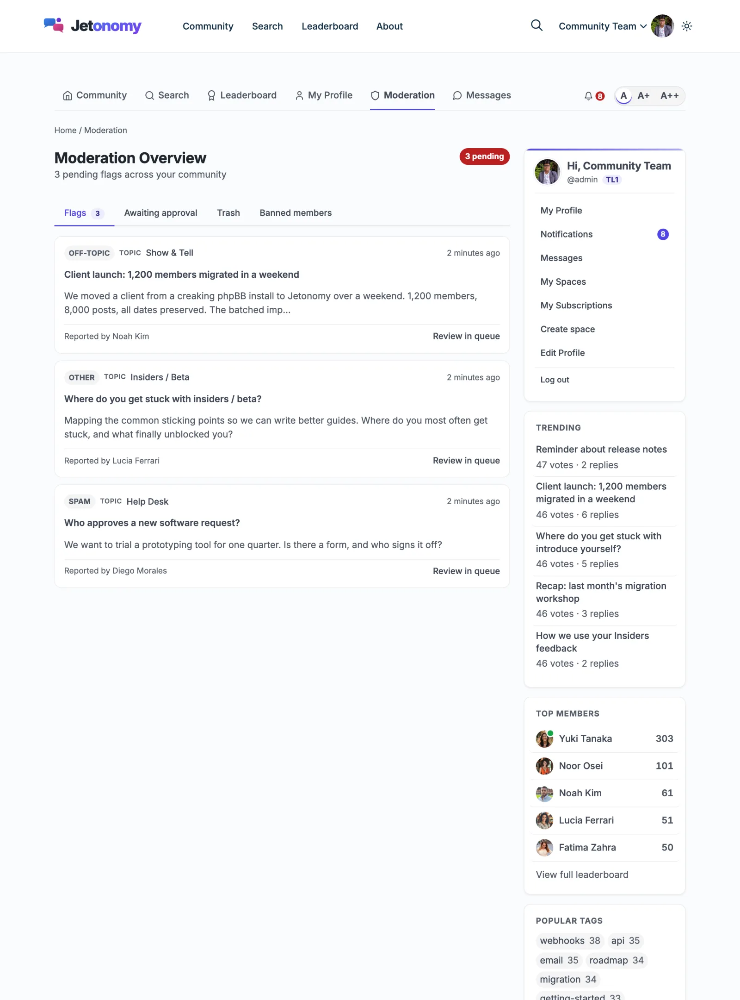

# Add a Moderator and Handle Reports

This guide is for community owners who want help keeping the peace. You will give someone moderator powers, find out where reported posts land, and clear them.

## What you will set up

- A moderator for one space, or for the whole community
- A place for your moderator to review reports and held posts
- A routine for approving, removing and banning

## Before you start

- You need to be a WordPress administrator.
- The person needs a WordPress account on your site.
- At least one space exists. See [Your First Community](../getting-started/03-first-community.md).

## Step 1: Choose the kind of moderator

Jetonomy has two kinds. Pick the one that fits.

| Kind | What it gives | Best for |
|---|---|---|
| **Space moderator** | Moderation in one space only: review its queue, plus pin, close, move, merge and delete topics there | A volunteer who looks after one topic area |
| **Site-wide moderator** | The **Moderate (queue, flags, bans)** capability across every space | Staff who watch the whole community |

Space moderators do not need wp-admin access. They work from the community pages.

## Step 2: Make someone a space moderator

1. Go to **Jetonomy → Spaces** and click **Edit** on the space.
2. Open the **Members** tab.
3. To add someone new, type a name or email in the search box under **Add Member**, set the role dropdown to **Moderator**, and click **Add**.
4. To promote an existing member, find them in the **Members** list and change their role dropdown to **Moderator**.

The role change saves as soon as you pick it. There is no Save button for this list.

> **Tip:** The role dropdown also offers **Viewer**, **Member** and **Admin**. A space **Admin** can also manage the space itself, so give that role sparingly.

## Step 3: Make someone a site-wide moderator

By default, the WordPress **Editor** role already holds the moderation capabilities. The simplest route is to set the person's role to **Editor** on the WordPress **Users** screen.

If you do not want to hand out Editor, change the capability grid instead:

1. Go to **Jetonomy → Settings → Permissions**.
2. Scroll to the **Role Capability Mapping** card.
3. Tick **Moderate (queue, flags, bans)** in the column for the role you want.
4. Click **Save Settings**.

Only administrators can change this grid. Others see it read-only. See [Role Capability Mapping](../admin-settings/18-role-capabilities.md) for every capability.

> **Tip:** Members at the highest trust levels do not become moderators on their own. The moderation power comes from the capability above or a space role.

## Step 4: Know where reports land

A member reports a topic with the flag button under it (labelled **Report**) and types a reason. The topic stays visible until someone acts.

Each person who holds the Moderate capability, and every administrator, gets a notification that reads "New content flag requires review".

You can work the queue in two places.

**In wp-admin**, go to **Jetonomy → Moderation**. It has four tabs: **Pending Posts**, **Pending Replies**, **Flags** and **Banned Users**, each with a count.

**On the community pages**, site-wide moderators and administrators see a **Moderation** link in the site header. Space moderators open the **Moderation queue** link in the sidebar of their own space. Both views have **Flags**, **Awaiting approval**, **Trash** and **Banned Members** tabs.

The **Banned Members** tab only shows for people with the Moderate capability.

## Step 5: Act on what you find

On the **Flags** tab in wp-admin, each report has two buttons:

- **Valid (Trash):** the report was right. The content goes to trash and the flag closes.
- **Dismiss:** the report was wrong. The content stays and the flag closes.

On the front-end **Flags** tab, the matching buttons are **Remove** and **Dismiss**, plus **View** to read the content first.

On **Pending Posts** and **Pending Replies** in wp-admin, you get **Approve**, **Spam** and **Trash**. Choose **Spam** for obvious junk. On the front-end **Awaiting approval** tab, the buttons are **Approve** and **Reject**.

To act on a person, go to **Jetonomy → Users**, find them, and click **Ban**. In the **Ban User** dialog pick a **Type** (**Global Ban**, **Silence** or **Space Ban**), a **Duration** and an optional **Reason**. See [Banning Members](../moderation-and-trust/05-banning-members.md) for what each type does.

To undo a ban, use **Unban** on the wp-admin **Banned Users** tab, or **Lift** on the front-end **Banned Members** tab.

## Check that it works

1. Open a private browser window and sign in as a normal test member.
2. Click the flag (**Report**) button under any topic and submit a reason.
3. In your admin window, open **Jetonomy → Moderation → Flags**. The report should be listed.
4. Click **Dismiss** and confirm the topic is still visible.
5. Sign in to a second window as your new moderator. A space moderator should see **Moderation queue** in that space's sidebar. A site-wide moderator should see **Moderation** in the header.

## Common questions

**Can a moderator see reports from spaces they do not moderate?**
A space moderator only sees queues for their own spaces. A site-wide moderator sees all of them.

**Why does a flagged post stay visible?**
By design. One flag should not hide content on its own. A moderator decides.

**Does a moderator get a notification by email?**
The "Moderator action on your content" row on **Jetonomy → Settings → Email → Notification Defaults** controls this. It is on for email by default.

**Can I stop a moderator from deleting posts?**
Yes. Give their role **Moderate (queue, flags, bans)** but leave **Delete others' posts** unticked.

## Related guides

- [Moderation Queue](../moderation-and-trust/03-moderation-queue.md)
- [Flagging and Reporting](../moderation-and-trust/02-flagging-reporting.md)
- [Space Status and Member Roles](../spaces-and-categories/05-space-status-and-roles.md)
- [Topic Management](../discussions/06-topic-management.md)
