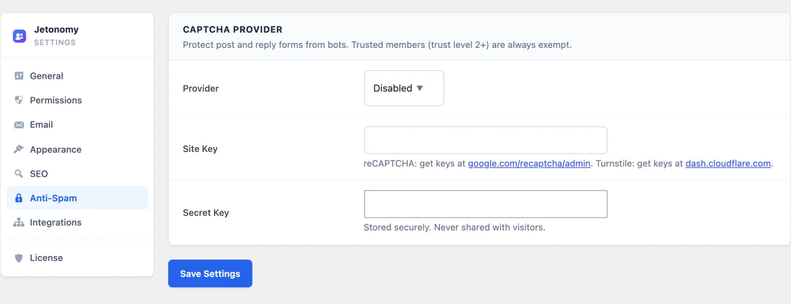

# Stop Spam and Low-Quality Posts

This guide is for community owners who want to keep bots and drive-by junk out. You will turn on a bot check, slow down brand-new accounts, and hold posts for review where it matters.

## What you will set up

- An invisible bot check on the post and reply forms
- Daily limits for brand-new members
- Approval for new posts in the spaces you choose
- Stricter entry for sensitive spaces
- (Pro) A rule that holds posts from low-trust members

## Before you start

- You need to be a WordPress administrator.
- For the bot check, a free account with Google reCAPTCHA or Cloudflare Turnstile.
- For approval, at least one person who can review the queue. See [Add a Moderator and Handle Reports](08-add-a-moderator-and-handle-reports.md).

## Step 1: Turn on the bot check

1. Go to **Jetonomy → Settings → Anti-Spam**.
2. In the **CAPTCHA Provider** card, set **Provider** to **Cloudflare Turnstile (privacy-friendly)** or **Google reCAPTCHA v3 (invisible)**.
3. Create a site with your provider and copy its keys. The card links to both dashboards.
4. Paste them into **Site Key** and **Secret Key**.
5. For reCAPTCHA only, leave **Score Threshold** at 0.5. Raise it to be stricter. Lower it if real members get blocked.
6. Click **Save Settings**.

If the keys and the provider do not match, a "Heads up:" notice appears at the top of the card. Fix it and save again.

Members at trust level 2 or above, and administrators, skip this check. See [Anti-Spam Settings](../admin-settings/06-anti-spam.md) for every field.

## Step 2: Slow down brand-new members

New accounts start at trust level 0 (Newcomer). You can cap what they do each day.

1. Go to **Jetonomy → Settings → Permissions**.
2. In **Rate Limits for New Users (Level 0)**, set **Posts per Day**, **Replies per Day** and **Votes per Day**. The defaults are 3, 10 and 5.
3. Click **Save Settings**.

Members move up on their own as they take part. In the **Trust Level Thresholds** card, each earned level has **Posts Required**, **Days Active**, **Reputation** and **Replies Received**. By default, level 1 (Member) needs 5 posts, 3 days active and 10 replies received. Level 1 and above have no daily limits.

Administrators and anyone with the Moderate capability are never limited. Each field accepts 1 or more.

> **Tip:** Lower thresholds let good members out of the limits sooner. Higher ones keep new accounts on a short leash for longer.

## Step 3: Hold new posts for approval in a space

Jetonomy has no single switch that holds every new member's first post across the whole community. You choose it space by space.

1. Go to **Jetonomy → Spaces** and click **Edit** on the space.
2. Open the **Settings** tab.
3. Tick **New posts require moderator approval before publishing** (the **Require Approval** row).
4. Click **Save Settings**.

From now on, topics and replies from regular members wait as pending. Space moderators, space admins and WordPress administrators post straight through.

Held items appear under **Jetonomy → Moderation** on the **Pending Posts** and **Pending Replies** tabs. The **Approve**, **Spam** and **Trash** buttons are there. On the community pages, held items show under **Awaiting approval**.

> **Tip:** Use this for spaces like Introductions or Support, where first posts attract the most spam. Leave busy social spaces open.

## Step 4: Make sensitive spaces harder to enter

On the same space screen, **General** tab, you can narrow who gets in.

- **Visibility:** **Public**, **Private** or **Hidden**.
- **Join Policy:** **Open**, **Requires Approval** or **Invite Only**.

With **Requires Approval**, a **Join Requests** tab appears on the space screen. Approve or decline people there before they can post.

You can also go to **Jetonomy → Settings → General** and tick **Require new members to confirm their email before they can sign in** (the **Email verification** row). This stops throwaway addresses from getting in.

## Step 5 (Pro): Hold posts from low-trust members

If you have Jetonomy Pro, a rule can hold posts everywhere.

1. Go to **Jetonomy → Extensions** and switch on **Advanced Moderation**.
2. Go to **Jetonomy → Moderation** and open the **Auto-Rules** tab.
3. Under **Add Auto-Moderation Rule**, enter a **Name**.
4. Set **Type** to **New User Restriction**. In **Pattern**, enter the minimum trust level, for example 1.
5. Set **Action** to **Hold for Approval** and **Scope** to **Global (all spaces)**.
6. Click **Save Rule**.

Posts from members below that trust level now wait for approval. Other types are **Keyword Filter**, **Regex Pattern**, **Link Limit** and **Spam Score**. The other actions are **Flag for Review**, **Block (reject)** and **Mark as Spam**. See [Advanced Moderation](../pro-features/07-advanced-moderation.md).

> **Tip:** Rules do not skip staff accounts. Test with a regular member, not your admin login.

## Check that it works

1. Open a private browser window and sign up as a new test member.
2. Post in the space where you turned on **Require Approval**. The post should not appear publicly.
3. In your admin window, open **Jetonomy → Moderation → Pending Posts**. Your test post should be there.
4. Click **Approve** and refresh the private window. The post now shows.
5. Post four times in a row as the test member. The fourth topic should be refused until the daily limit resets.

## Common questions

**Where does Akismet-caught spam go?**
If the Akismet plugin is active and connected, flagged content is saved with a Spam status and is not published. Find it under **Jetonomy → Content** using the **Spam** filter.

**Do trust levels block uploads or links?**
Not by themselves. The working effects are the daily limits for new members and the CAPTCHA exemption at level 2. Everything else comes from capabilities, which you set under [Role Capability Mapping](../admin-settings/18-role-capabilities.md).

**A real member says they are blocked. What now?**
Lower the reCAPTCHA **Score Threshold**, or switch to Turnstile. You can also raise their level from **Jetonomy → Users** with **Change Trust Level**.

**Can I ban a spammer for good?**
Yes. See [Banning Members](../moderation-and-trust/05-banning-members.md).

## Related guides

- [Anti-Spam Protection](../moderation-and-trust/04-anti-spam.md)
- [Trust Levels](../moderation-and-trust/01-trust-levels.md)
- [Moderation Queue](../moderation-and-trust/03-moderation-queue.md)
- [Membership and Join Policies](../spaces-and-categories/03-membership-policies.md)
