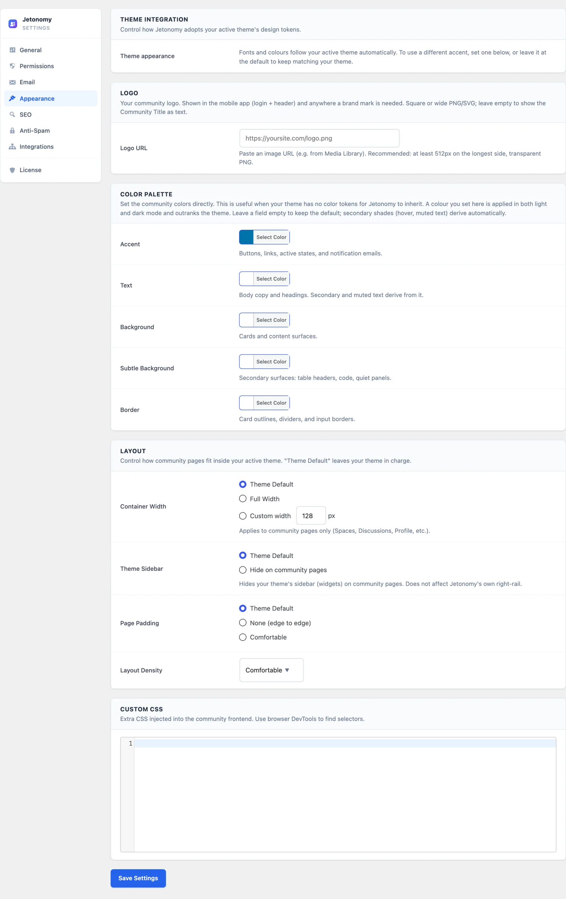

# Match Your Brand

This guide is for community owners who want the community to look like their own site. You will decide whether to keep your theme's colours or pin your own, check dark mode, and add your logo and wording.

## What you will set up

- Colours that match your brand, either from your theme or from you
- A check that dark mode looks right
- Your logo, community title and wording
- Page width and spacing that fit your theme
- (Pro) Your own name on the wp-admin menu

## Before you start

- You need to be a WordPress administrator.
- Have your brand colour ready as a hex code, for example `#7c3aed`.
- Have your logo uploaded to the Media Library so you can copy its URL.

## Step 1: Start with your theme's colours

Do nothing first. Jetonomy follows your active theme's fonts and brand colour on its own. It reads the brand colour from BuddyX, BuddyX Pro, Reign and BuddyNext, from your theme's WordPress "primary" colour, and from several popular themes. See [Appearance Settings](../admin-settings/04-appearance.md) for the full order.

Open your community at `/community/` and look. If the buttons and links already match your brand, you can stop here.

## Step 2: Pin your own colours

Do this when the theme gives the wrong colour, or has none for Jetonomy to read.

1. Go to **Jetonomy → Settings → Appearance**.
2. Find the **Color Palette** card.
3. Click the **Accent** picker and choose your brand colour. The **Accent** field controls buttons, links, active states and notification emails.
4. Optional: set **Text**, **Background**, **Subtle Background** and **Border**. Leave any field empty to keep the default.
5. Click **Save Settings**.

> **Tip:** Set only **Accent** unless you have a reason. Hover shades and muted text are worked out from it for you.

The **Accent** picker shows `#0073aa` when nothing is set. That value means "keep matching my theme". Pick any other colour to override the theme. A colour you set here applies in both light and dark mode and outranks the theme.

Button text turns black or white on its own so it stays readable on your colour.

## Step 3: Check dark mode

Jetonomy has no dark mode switch of its own. It follows your theme.

1. Turn on dark mode in your theme, using whatever switch the theme offers.
2. Reload `/community/`.
3. Look at the home page, a space and a topic.

On Reign, BuddyX and BuddyX Pro, Jetonomy mirrors the theme's dark switch automatically. On other themes, test it yourself and confirm the community goes dark with the rest of the page.

> **Tip:** If you set **Text**, **Background** or **Border** in Step 2, those colours show in dark mode too. A light background colour will look wrong on a dark page. Clear those fields and keep only **Accent** if dark mode matters to you.

## Step 4: Add your logo, title and wording

1. On the same **Appearance** tab, open the **Logo** card and paste your image's address into **Logo URL**. The logo is used in the mobile app and wherever a brand mark is needed. A transparent PNG of at least 512px works best. With the field empty, your **Community Title** shows as text.
2. Go to **Jetonomy → Settings → General**. Change **Community Title**. It is the main heading on the community home page.
3. In the **Terminology** row, rename the words your community uses. For example, change **Space** to **Forum**, or **Member** to **Player**. Fill in both **Singular** and **Plural**.
4. Go to **Jetonomy → Settings → Email** and paste your logo address into **Email Logo**. Around 200 by 40 pixels works well.
5. Click **Save Settings** on each tab.

Custom wording is shown exactly as you type it. It is not translated, so on a non-English site, type it in your own language.

## Step 5: Fit the page to your theme

Back on **Jetonomy → Settings → Appearance**, the **Layout** card has four controls. Each starts at its theme default.

| Control | Choices |
|---|---|
| **Container Width** | **Theme Default**, **Full Width**, **Custom width** (in px) |
| **Theme Sidebar** | **Theme Default**, **Hide on community pages** |
| **Page Padding** | **Theme Default**, **None (edge to edge)**, **Comfortable** |
| **Layout Density** | **Compact**, **Comfortable**, **Spacious** |

For an app-like feel, choose **Full Width**, **Hide on community pages** and **Comfortable**. Click **Save Settings**. The rest of your site keeps its normal layout.

The **Custom CSS** card is there for small tweaks. Anything you type is used as written, so keep it short.

## Step 6 (Pro): Rename Jetonomy in wp-admin

White Label changes what your team sees in the dashboard. It does not change what members see.

1. Go to **Jetonomy → Extensions** and switch on **White Label**.
2. Go to **Jetonomy → Settings** and open **Branding** in the **Advanced** group.
3. Fill in **Brand Name**, **Admin Menu Label**, **Admin Menu Icon** and **Admin Footer Text**.
4. Click **Save Branding Settings**.

The brand name replaces "Jetonomy" in the admin menu, on the Plugins page and in the admin footer. See [White Label](../pro-features/12-white-label.md).

## Check that it works

1. Open `/community/` in a private browser window, signed out.
2. Confirm the buttons and links use your colour.
3. Switch your theme to dark mode and check again.
4. Open the page on your phone, or narrow the browser to about 390 pixels, and check the layout.
5. Send yourself a test email from **Jetonomy → Settings → Email** and check the logo. See [Set Up Email Notifications](11-set-up-email-notifications.md).

## Common questions

**I picked a colour and nothing changed.**
Clear your page cache and any cache plugin, then reload. If you set the picker back to `#0073aa`, Jetonomy goes back to your theme's colour.

**Can I get my logo in the community header?**
There is no logo field for the web header. The **Logo URL** is used in the mobile app. Your theme controls the site header.

**How do I brand the mobile app?**
See [Brand Your App](../mobile-app/01-brand-your-app.md).

**Can I hide the Jetonomy name from members?**
Community pages do not add a "Powered by Jetonomy" line, so there is nothing to remove. Pro White Label only renames the admin side.

## Related guides

- [Appearance Settings](../admin-settings/04-appearance.md)
- [Email Settings](../admin-settings/03-email.md)
- [Theming and Tokens](../developer-guide/16-theming-and-tokens.md)
