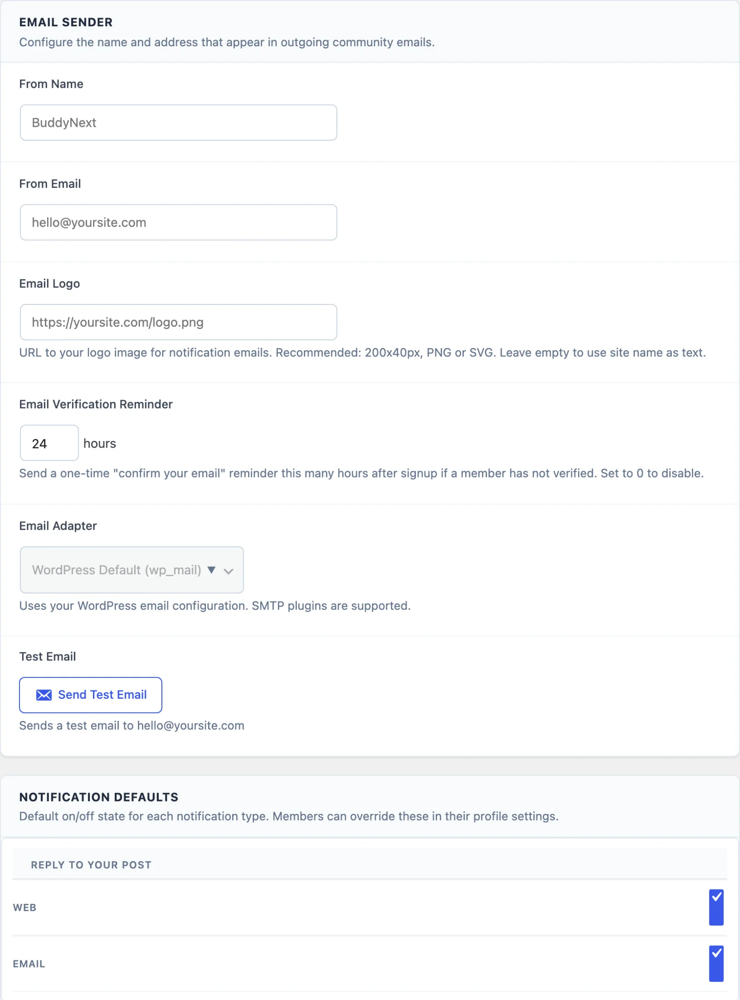

# Set Up Email Notifications

This guide is for community owners who want members to get useful emails and want those emails to arrive. You will prove that mail leaves your site, set the sender, and choose what gets emailed.

## What you will set up

- A working test email, before any member depends on it
- The name and address your emails come from
- Which events send an email by default
- (Pro) A daily or weekly digest, and reply by email

## Before you start

- You need to be a WordPress administrator.
- Check that your WordPress admin email address is one you can open. The test email goes there.
- Plan for an SMTP plugin such as WP Mail SMTP or FluentSMTP. Many hosts cannot send mail reliably without one.

## Step 1: Send a test email first

1. Go to **Jetonomy → Settings → Email**.
2. In the **Email Sender** card, find the **Test Email** row.
3. Click **Send Test Email**.

A message starting "Test email sent to" your admin address means WordPress handed the message over. Open your inbox and confirm it arrived. Check spam too.

If you see "Failed to send test email. Check your WordPress email configuration.", install an SMTP plugin, connect it to a mail service, and try again. The **Email Adapter** row on this screen is fixed to **WordPress Default (wp_mail)**. It works with any SMTP plugin.

## Step 2: Set who the emails come from

In the same **Email Sender** card:

1. Type your community name in **From Name**. Empty means your site name.
2. Type a sender address in **From Email**. Empty means your WordPress admin email.
3. Optional: paste your logo address into **Email Logo**. Around 200 by 40 pixels works well.
4. Click **Save Settings**.

> **Tip:** Use an address your mail service has verified, such as `community@yoursite.com`. An unverified sender can land in spam.

## Step 3: Choose what gets emailed

Scroll to the **Notification Defaults** card. Each row is one event. Tick **Web** for the bell inside the community. Tick **Email** for an email.

The rows are:

- Reply to your post
- Reply to your reply
- Mention (@username)
- Your answer accepted
- Your idea roadmap status changed
- New post in subscribed space
- Badge earned
- Vote on your post
- Reaction on your post
- Moderator action on your content
- Your report was reviewed
- Space join request
- Private message (only when Pro messaging is on)

On a fresh install, email is on for replies to your post, mentions, accepted answers, idea status changes, moderator actions and join requests. It is off for the rest, because votes and followed-space posts can be frequent.

Click **Save Settings** when you finish.

New flag alerts for your team use the "Moderator action on your content" row. See [Add a Moderator and Handle Reports](08-add-a-moderator-and-handle-reports.md).

## Step 4: Know what members control

Your tick boxes are only defaults. A member's own choice always wins. Members who never set their own choice follow your defaults.

Members change their choices here:

1. Open the **Edit Profile** page at `/community/u/their-username/edit/`.
2. Find **Notification Preferences**. Each event has a **Web** and an **Email** switch.
3. To silence email completely, tick **Pause all email notifications. You will still see web notifications in the community.**
4. Click **Save Profile**.

Members do not see the moderator and join-request rows. Only you control those. Every notification email also has an unsubscribe link in its footer.

## Step 5: Put your wording on the emails

Still on the **Email** tab, the **Email Templates** card lets you edit emails without code.

1. Type a line into **Footer Text**. It shows at the bottom of every branded email.
2. For any event, change **Subject** or **Body / Intro**. You can use `{site}`, `{user}`, `{message}`, `{type}` and `{url}`.
3. Click **Preview** to see the email with sample data.
4. Click **Send test** to send that email to your admin address.
5. Click **Reset to default** to undo a change. It only shows once you have saved an edit.
6. Click **Save Settings**.

Leave a field blank to keep the default.

## Optional (Pro): Digest and reply by email

Turn on each feature at **Jetonomy → Extensions** first.

**Email Digest.** Open **Email Digest** in the **Advanced** group of **Jetonomy → Settings**. Tick **Enable Digests**, choose a **Default Frequency** of **Daily**, **Weekly** or **None (opt-in only)**, then click **Save Digest Settings**. Use **Send Test Daily** or **Send Test Weekly** to see one first. See [Email Digest](../pro-features/08-email-digest.md).

**Reply by Email.** Open **Reply by Email** in the same group. You need an inbound address on your own domain. Set **Email Domain** and choose an **Inbound Method**. Your host or mail provider can help with this part. See [Reply by Email](../pro-features/11-reply-by-email.md).

## Check that it works

1. Click **Send Test Email** and confirm it arrives.
2. Open a private browser window and sign in as a test member who has not changed their notification choices.
3. Post a topic as that test member.
4. As another account, reply to that topic.
5. The test member should get a bell notification and, because "Reply to your post" emails by default, an email.
6. Untick **Email** for that row in the member's **Notification Preferences**, save, reply again, and confirm no email arrives.

## Common questions

**Nothing arrives, even the test email.**
Mail is not leaving your server. Set up an SMTP plugin and try again.

**Emails go to spam.**
Use a verified **From Email** on your own domain and a proper mail service.

**Why do members stop getting emails after I change a default?**
They set their own choice. Their choice wins over your default.

**Can I change a template's design?**
You can change the text here. Layout changes need code. See [Customize Emails](../developer-guide/19-customize-emails.md).

## Related guides

- [Email Settings](../admin-settings/03-email.md)
- [Notifications](../notifications/01-notifications.md)
- [Email Notification Settings](../notifications/02-email-settings.md)
