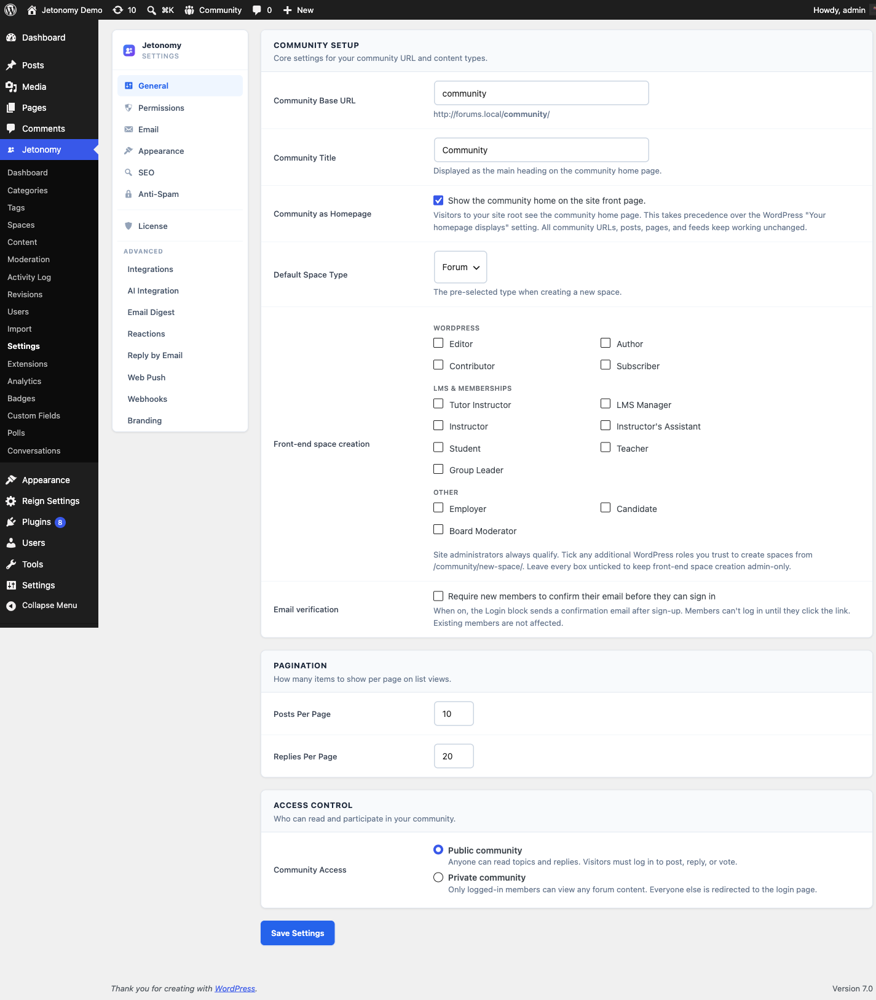

Connect MemberPress membership levels to Jetonomy spaces - so paying members automatically land in the right discussion areas the moment their subscription activates.

> **Available in Jetonomy free.** The MemberPress and Paid Memberships Pro adapters ship in the free plugin - you do not need Jetonomy Pro to gate spaces by these two membership plugins. (WooCommerce, Restrict Content Pro, and all LMS integrations require Jetonomy Pro.)



## What You Will Learn

- How Jetonomy detects and communicates with MemberPress
- How to gate a space by membership level using Access Rules
- What happens when a membership activates or expires
- How to test the integration before going live

## How Detection Works

Jetonomy checks for MemberPress automatically on every page load. No configuration needed. When MemberPress is active, the MemberPress adapter registers itself with Jetonomy's Adapter Registry and enables the Access Rules UI inside each space's settings.

> **Note:** If you activate MemberPress after Jetonomy, navigate to **Jetonomy → Settings** and save once. This triggers adapter re-registration.

## Setting Up an Access Rule

This is the standard Access Rules flow that every membership and LMS integration in this section follows. The other integration guides link back here for the full walkthrough.


1. Go to **Jetonomy → Spaces** and open the space you want to gate.
2. Click the **Access Rules** tab in the space settings panel.
3. Set **Rule Type** to your MemberPress level (membership levels appear in the dropdown once MemberPress is active).
4. Pick the membership level in the **Value** field.
5. Choose the **Access level** the rule grants - Read, Participate, or Full (see below). Participate is the default and the right answer for most paid spaces.
6. Click **Add Rule**. The rule appears in the table below the form, and the form reads your rule back to you in plain English before you save it.

Members who hold the selected level gain access to this space at the level you chose. Members without it see the space as locked (or hidden, depending on your space visibility setting).

> **Tip:** Add more than one rule if you want to grant access for more than one membership level. Rules are evaluated top to bottom by priority, and a member passes on the first rule they match.

## Access level

An Access Rule has **one** setting that decides what a matching member can do:

| Access level | What the member can do |
|---|---|
| Read | View topics and replies, but not post or reply |
| Participate | Read, post topics, and reply (the usual choice for a course or paid space) |
| Full | Participate, plus close and pin topics and edit other people's posts |

The space role a matching member is recorded as is **derived from the access level**, not chosen separately:

| Access level | Recorded as |
|---|---|
| Read | Viewer |
| Participate | Member |
| Full | Moderator |

> **Changed in 1.8.1.** This used to be two dropdowns - an access level *and* a space role - which could contradict each other. A rule labelled "Read" could be set to record people as space Admins, and that combination handed out post deletion and moderation. The role is now derived from the access level and capped by it, so a rule can never grant more than it advertises. **Rules already saved on your site are capped automatically; you do not need to change anything.**

> **Membership rules never create moderators.** Whatever access level you pick, a rule based on a *membership* tier tops out at Member. Moderation is an appointment you make per person on the space's Members tab - nobody should be able to buy it. Role, capability and trust-level rules keep the full range, because those are deliberate decisions about a known group rather than anything a visitor can purchase.

> **Note:** There is no separate "Grant vs Revoke" switch. A rule always *grants* the access you choose to members who match it; members who match no rule simply do not get in. To take a level's access away, delete its rule.

## Access Follows the Subscription

Access is worked out **at the moment someone opens the space**, by reading your Access Rules against what they currently hold. Nothing has to be synchronised, and there is no step for you to run.

- Their membership goes active → they can open the space on their very next page load.
- Their membership expires, is cancelled, refunded or paused → they lose access just as immediately.
- They buy again → access returns.

Their posts and replies are never touched by any of this. Losing access hides the space from them; it does not remove what they wrote.

This is handled by the `MemberPress_Adapter` class, which hooks `mepr-txn-status-complete` for activation and `mepr-txn-status-refunded`, `mepr-txn-expired`, and `mepr_subscription_transition_status` for deactivation.

> **Changed in 1.8.1.** Access rules used to be read only *after* Jetonomy had already decided you were a member of the space, which meant a rule could raise an existing member's access but could never let anybody new in. Pointing a private space at a membership tier produced a space nobody could enter, and the only way in was the manual **Sync Members** button - which then never took anyone back out when their plan lapsed. Access is now resolved live, both directions, with nothing to sync.

### What a paying member does *not* get yet

Access is automatic; the **roster** is not. Someone who gets in through a membership rule can read and post, but until you press **Sync Members** on the rule they:

- do not appear in the space's Members list,
- are not included in the member count,
- are not matched by space settings that act on roles, such as "who can post: members".

**Sync Members** writes those roster rows, and nothing removes them again when a plan lapses - so treat it as a snapshot, not a subscription. Access itself is always correct regardless; the roster is a convenience. Automatic roster upkeep is planned.

## What a Visitor Without the Membership Sees

Somebody who lands on a space gated by a membership rule is told **which plan opens it** and given a button to go and get it - rather than a generic "this space is private".

The button goes to that membership's own MemberPress registration page, so they arrive at the right plan instead of a pricing table they have to re-read. Every membership and LMS integration in this section does the same thing, each pointing at wherever that system sells the thing:

| Integration | The button goes to |
|---|---|
| MemberPress | the membership's own page |
| Paid Memberships Pro | checkout with that level preselected |
| Restrict Content Pro | your registration page with that level preselected |
| WooCommerce Memberships | the product that grants the plan |
| LearnDash, Tutor, LifterLMS, Sensei, MasterStudy | the course (or LearnDash group) |
| Learnomy | the course or membership plan |

**When there is no button**, that is deliberate. Two cases:

1. **The requirement is not something anyone can buy.** Rules based on a WordPress role, a capability, a trust level, a CRM tag (WP Fusion) or an access group (SureMembers) state the requirement plainly and stop there, because sending a visitor to a checkout would be misleading.
2. **The answer is ambiguous.** A WooCommerce Memberships plan granted by three different products has three possible answers, and guessing which price point to sell somebody is worse than saying nothing. One granting product gives one button; several give none.

In either case you can point the button wherever you like with the `jetonomy_membership_upgrade_url` filter - see [Custom Access Logic](../developer-guide/28-custom-access-logic.md).

## Visibility Behavior

| Space Visibility | Non-member sees... |
|---|---|
| Public | Space listed, content visible, locked from posting |
| Private | Space listed with lock icon, content hidden |
| Hidden | Space not listed at all |

## Developer Hook

Both membership events fire the Jetonomy standard hooks you can use in your own code:

```php
// Fires when a MemberPress membership activates.
add_action( 'jetonomy_membership_activated', function( int $user_id, string $level_id, string $adapter ) {
    // $adapter will be 'memberpress'
    if ( 'memberpress' === $adapter ) {
        // Custom logic here.
    }
}, 10, 3 );
```

## Troubleshooting

**Access rules dropdown is empty** - MemberPress may not be active. Check **Plugins → Installed Plugins** and confirm MemberPress is activated.

**Member not joining on activation** - Ensure the membership level ID in the Access Rule exactly matches the level in MemberPress. Level IDs are numeric; check the MemberPress level edit URL for the ID.

**Member still has access after expiry** - Check whether the member holds a second membership level that also grants access to the space.

## What's Next?

Learn how to gate spaces using Paid Memberships Pro, which follows the same pattern.

[Paid Memberships Pro Integration →](02-pmpro.md)
