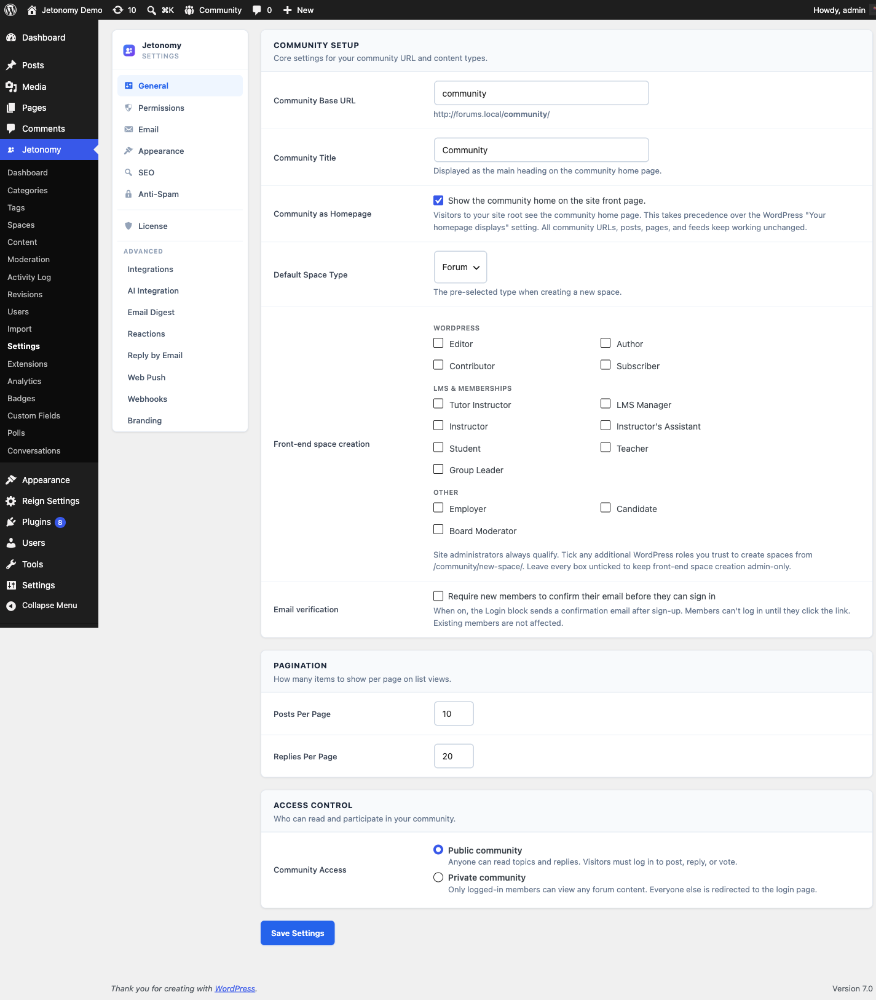

Gate Jetonomy spaces by Restrict Content Pro subscription level - with automatic access on activation and automatic removal on expiry or cancellation.



> **PRO** - This feature requires [Jetonomy Pro](https://jetonomy.com/pro/).

## What You Will Learn

- How Jetonomy Pro detects Restrict Content Pro (RCP)
- How to create an Access Rule tied to an RCP subscription level
- What membership events trigger auto-join and auto-leave
- How to handle free and paid RCP levels differently

## How Detection Works

Jetonomy Pro detects Restrict Content Pro automatically when both plugins are active. The RCP adapter registers with the Adapter Registry and adds **Restrict Content Pro Level** as a Rule Type in the Access Rules tab for every space.

> **Note:** Jetonomy Pro supports Restrict Content Pro version 3.x and above. If you are on an older version, update RCP first.

## Setting Up an Access Rule

1. Go to **Jetonomy → Spaces** and open the space you want to gate.
2. Click the **Access Rules** tab.
3. Click **Add Rule** → set Rule Type to **Restrict Content Pro Level**.
4. Select the subscription level from the dropdown.
5. Set the action to **Grant**.
6. Save the space.

Members with an active subscription to the selected level gain access immediately. You can add multiple rules to grant access across more than one RCP level.

> **Tip:** RCP supports free membership levels. You can use a free level as a gate to require a (free) registration before members can post - while still keeping the community open to anyone willing to sign up.

## Auto-Join on Activation

When a member's RCP subscription status becomes **active**, Jetonomy Pro adds them to any spaces that grant that subscription level. The standard Jetonomy hook fires:

```php
add_action( 'jetonomy_membership_activated', function( int $user_id, string $level_id, string $adapter ) {
    // $adapter is 'rcp' for Restrict Content Pro events.
}, 10, 3 );
```

## Auto-Leave on Expiry or Cancellation

When an RCP subscription expires, is cancelled, or is set to **pending**, Jetonomy Pro removes the member from any spaces gated exclusively to that level. The hook `jetonomy_membership_deactivated` fires with `$adapter = 'rcp'`.

| RCP Status | Access |
|---|---|
| Active | Granted |
| Pending | Revoked |
| Expired | Revoked |
| Cancelled | Revoked |
| Disabled | Revoked |

## Combining with Other Adapters

RCP rules stack with all other Access Rule types in Jetonomy. A member gains access to a space if they satisfy any single Grant rule - whether it comes from RCP, MemberPress, WooCommerce, or trust level.

## Troubleshooting

**RCP Level not appearing in Rule Type dropdown** - Confirm Jetonomy Pro is active and Restrict Content Pro is active. Check that at least one subscription level exists in **Restrict Content → Subscription Levels**.

**Member not removed after subscription expires** - RCP can be configured to change status on expiry, grace periods, or manual review. Jetonomy listens to the `rcp_set_status` action. If a custom RCP workflow bypasses this action, auto-removal will not fire.

**Access still active after cancellation** - Check whether the user holds a second active RCP subscription that also grants access to the space via a separate rule.

## What's Next?

Learn how Jetonomy integrates with BuddyNext for a unified community hub experience.

[BuddyNext Integration →](06-buddynext.md)
