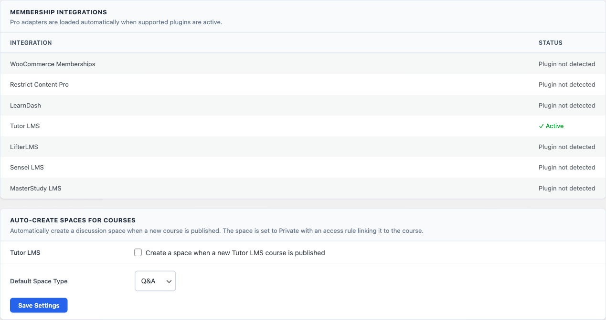

Connect Tutor LMS course enrollment to Jetonomy spaces - students get a dedicated discussion area automatically when they enroll, and lose access when they cancel or are removed.

> **PRO** - This feature requires [Jetonomy Pro](https://jetonomy.com/pro/).

> Tutor LMS works exactly like the other LMS integrations. The course picker, the **Sync Members** button, and the Auto-Create card are shown in the [LearnDash guide](04-learndash.md), which is the lead LMS reference for this section.

## What You Will Learn

- How to gate a Jetonomy space by Tutor LMS course enrollment
- How to auto-create spaces when new courses are published
- How to sync existing students into a space
- What happens when a student un-enrolls or cancels

## How Detection Works

Jetonomy Pro detects Tutor LMS automatically when both plugins are active. A **Tutor Course** option appears in the Access Rules rule type dropdown - no setup needed.

## Linking a Course to a Space

1. Go to **Jetonomy → Spaces** and open (or create) the discussion space for your course.
2. Open the **Access Rules** tab.
3. Select **Tutor Course** from the rule type dropdown.
4. Start typing your course name - a searchable dropdown appears showing all published Tutor courses (see the [course picker screenshot](04-learndash.md#gating-a-space-by-course-enrollment)).
5. Select the course, set **Grants** to **Participate** and **Space Role** to **Member**.
6. Click **Add Rule**.

The rule appears in the table showing the course name (not an ID), with a **Sync Members** button and **Delete** button. For what the **Grants** and **Space Role** fields mean, see [Grants and Space Role](01-memberpress.md#grants-and-space-role).

## Syncing Existing Students

If students are already enrolled in the course before the rule was created, click the **Sync Members** button next to the rule. This pulls in all currently enrolled students and adds them to the space. A toast notification shows how many were synced.

New enrollments and cancellations are handled automatically after the rule is created - no further action needed.

## Auto-Create Spaces for New Courses

Instead of manually creating a space for each course:

1. Go to **Jetonomy → Settings → Integrations**.
2. Under **Auto-Create Spaces for Courses**, enable the Tutor LMS toggle.
3. Choose the default space type (Q&A, Forum, or Feed).
4. Click **Save Settings**.

Now when you publish a new course in Tutor, a private discussion space is automatically created with:
- The course title as the space name
- A membership access rule linking the course to the space
- The course author assigned as space admin

## Enrollment and Un-enrollment Events

| Tutor LMS Event | Jetonomy Action |
|---|---|
| Student enrolls in course | Added to linked space as Member |
| Student completes course | Access retained |
| Student enrollment cancelled | Removed from linked space |
| Student enrollment deleted | Removed from linked space |

Content (posts and replies) created by the student remains in the space - only access is revoked.

## Typical Setup

- One **Private** space per paid course, gated to enrollment
- One **Public** space per free course for open discussion
- One **Public** space for general Q&A open to all students

## Troubleshooting

**Tutor Course does not appear in the rule type dropdown** - Confirm Jetonomy Pro and Tutor LMS are both active. Check **Jetonomy → Settings → Integrations** to see the Tutor LMS status.

**Students still have access after cancellation** - Confirm the cancellation uses Tutor's standard enrollment management. Set the space to **Private** to fully restrict access.

**Sync Members shows 0 synced** - The students may already be space members, or no users are enrolled in the selected course.

## What's Next?

[LifterLMS Integration →](09-lifterlms.md)
