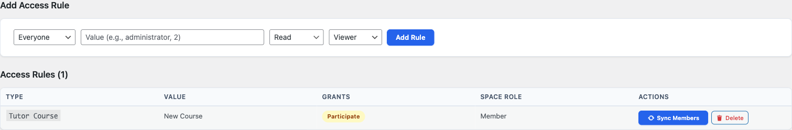
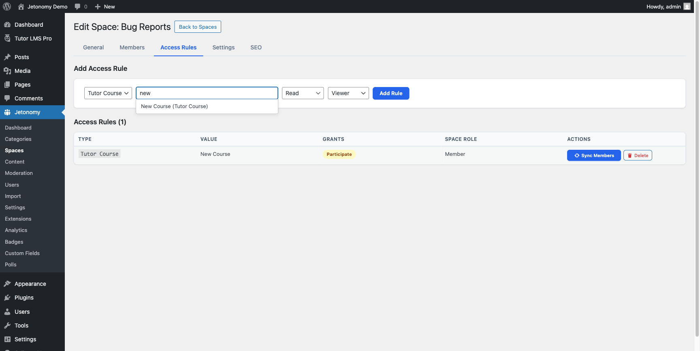

Connect Learnomy course enrollment and membership-plan subscriptions to Jetonomy spaces - students get a discussion area automatically when they enroll or subscribe, and lose access when they un-enroll or their subscription ends.

> **PRO** - This feature requires [Jetonomy Pro](https://jetonomy.com/pro/).

Learnomy stores its courses, membership plans, enrollments, and subscriptions in its own custom tables, not in WordPress posts. Jetonomy Pro connects to it through Learnomy's public model API, so gating a space by a Learnomy course works the same as the LearnDash flow.

## What You Will Learn

- How to gate a Jetonomy space by Learnomy course enrollment
- How to gate a space by a Learnomy membership plan
- How to sync existing students into a space
- What happens when a student un-enrolls or a subscription ends

## How Detection Works

Jetonomy Pro detects Learnomy automatically when both plugins are active. Detection requires the `LEARNOMY_VERSION` constant plus Learnomy's `Enrollment` and `Subscription` model classes, so the option only appears when Learnomy is present and exposing the API this integration needs. A **Learnomy Course** option then appears in the Access Rules rule type dropdown - no setup needed.

## Gating a Space by Course Enrollment

1. Go to **Jetonomy → Spaces** → open the space → **Access Rules** tab.
2. Select **Learnomy Course** from the rule type dropdown.
3. Start typing the course name - a searchable dropdown filters the Learnomy catalog. Courses show as "Course Name (Learnomy Course)".
4. Select the course, set **Grants** to **Participate** and **Space Role** to **Member**.
5. Click **Add Rule**.

The rule appears in the table showing the course label and a **Sync Members** button. For what the **Grants** and **Space Role** fields mean, see [Grants and Space Role](01-memberpress.md#grants-and-space-role).

The catalog picker lists up to 500 courses and plans. Filter `jetonomy_learnomy_max_levels` raises or lowers that cap when a site's catalog is larger.

## Gating a Space by Membership Plan

Learnomy membership plans appear in the same **Learnomy Course** picker alongside courses. Plans show as "Plan Name (Learnomy Membership)" in the results.

1. Select **Learnomy Course** from the rule type dropdown.
2. Type the membership plan name and pick it from the results.
3. Set Grants and Space Role, and click **Add Rule**.

Members with an active subscription to that plan gain access. When the subscription is cancelled or expires, access is removed.

## Syncing Existing Students

If students are already enrolled or subscribed before the rule was created, click the **Sync Members** button on the rule. This checks every user against the linked course or plan and adds the ones who currently hold it. The button reports how many members were synced.

New enrollments, subscriptions, and removals are handled automatically after the rule is created.

## Enrollment and Subscription Events

| Learnomy Event | Jetonomy Action |
|---|---|
| Student enrolls in course | Added to linked spaces at the rule's Space Role |
| Student un-enrolls from course | Removed from linked spaces |
| Course enrollment expires | Removed from linked spaces |
| Membership plan subscription created | Added to linked spaces at the rule's Space Role |
| Membership plan subscription cancelled | Removed from linked spaces |
| Membership plan subscription expires | Removed from linked spaces |

On each add or remove, Jetonomy fires `jetonomy_membership_activated` or `jetonomy_membership_deactivated` with the source set to `learnomy`. Content the member created in the space stays in place - only access is revoked.

## Troubleshooting

**Learnomy Course does not appear in the rule type dropdown** - Confirm Jetonomy Pro and Learnomy are both active, and that Learnomy has at least one published course.

**Students still have access after un-enrolling** - Confirm the un-enrollment uses Learnomy's standard enrollment API. Custom code that bypasses the `learnomy_student_unenrolled` or `learnomy_enrollment_expired` hooks will not trigger removal.

**A course or plan is missing from the picker** - The picker lists up to 500 entries. Raise the cap with the `jetonomy_learnomy_max_levels` filter, or confirm the plan is active in Learnomy - inactive plans are not returned.

## What's Next?

Learn how to gate spaces by a WP Fusion CRM tag.

[WP Fusion Integration →](15-wp-fusion.md)
