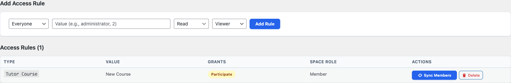
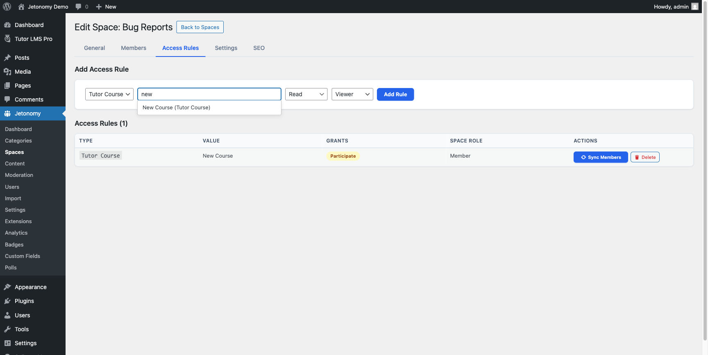

Connect Learnomy course enrollment, cohort membership, and membership-plan subscriptions to Jetonomy spaces - students get a discussion area automatically when they enroll, join a cohort, or subscribe, and lose access when they leave.

> **PRO** - This feature requires [Jetonomy Pro](https://jetonomy.com/pro/).



Learnomy stores its courses, membership plans, enrollments, and subscriptions in its own custom tables, not in WordPress posts. Jetonomy Pro connects to it through Learnomy's public model API, so gating a space by a Learnomy course works the same as the LearnDash flow.

## What You Will Learn

- How to gate a Jetonomy space by Learnomy course enrollment
- How to gate a space by a Learnomy cohort - one run of a course, not everyone who ever took it
- How to gate a space by a Learnomy membership plan
- How to sync existing students into a space
- What happens when a student leaves, and what happens when a cohort finishes
- What learners see when BuddyNext is installed alongside

## How Detection Works

Jetonomy Pro detects Learnomy automatically when both plugins are active. Detection requires the `LEARNOMY_VERSION` constant plus Learnomy's `Enrollment` and `Subscription` model classes, so the option only appears when Learnomy is present and exposing the API this integration needs. A **Learnomy Course** option then appears in the Access Rules rule type dropdown - no setup needed.

Cohorts need one thing more: they live in Learnomy Pro, inside the Cohorts extension. When that extension is off, or only free Learnomy is installed, cohorts simply do not appear in the picker. An existing cohort rule stays in place and grants nobody until the extension is switched back on - it never errors.

## Which Learnomy Object to Gate By

One rule type, **Learnomy Course**, covers every Learnomy object. The picker tells you which kind each result is by its suffix. Pick the one that matches who should be in the room:

| Pick this | Shown as | Who gets in |
|---|---|---|
| Course | `(Learnomy Course)` | Everyone enrolled in the course, for as long as they stay enrolled |
| Cohort | `(Learnomy Cohort)` | Only the people in that one run of the course - not everyone who has ever taken it |
| Membership plan | `(Learnomy Membership)` | Everyone on the plan, from the moment it becomes active until it lapses |
| Learnomy Space | `(Learnomy Space)` | Everyone holding an active seat in that organisation, across every course assigned to it |

**Course or cohort is the choice most people get wrong.** A course rule is right for a permanent space where every past and present student belongs. A cohort rule is right for a class going through together on a schedule - the twenty people on the spring run, talking to each other, without last year's students in the same thread.

You can use both. A course-wide space for everyone, plus a private space per cohort, is a normal setup.

## Gating a Space by Course Enrollment



1. Go to **Jetonomy → Spaces** → open the space → **Access Rules** tab.
2. Select **Learnomy Course** from the rule type dropdown.
3. Start typing the course name - a searchable dropdown filters the Learnomy catalog. Courses show as "Course Name (Learnomy Course)".
4. Select the course, set the **Access level** to **Participate**.
5. Click **Add Rule**.

The rule appears in the table showing the course label and a **Sync Members** button. For what each **Access level** means, see [Access level](01-memberpress.md#access-level).

The catalog picker lists up to 500 courses and plans. Filter `jetonomy_learnomy_max_levels` raises or lowers that cap when a site's catalog is larger.

## Gating a Space by Cohort

A cohort is one scheduled run of a course - seat-capped, with a start and end date. Gating by cohort gives that group its own room.

1. Select **Learnomy Course** from the rule type dropdown.
2. Type the cohort name and pick the result ending `(Learnomy Cohort)`.
3. Set the **Access level** and click **Add Rule**.

Anyone in the cohort gets in. Anyone who leaves the cohort loses access.

**A cohort finishing does not remove anyone.** When a cohort reaches its end date, or is marked completed or archived, its members keep the space. Their run is over; their conversation and the people in it are not. Only *leaving* the cohort removes access.

If you want a finished cohort's space closed, close or archive the space itself - that is a deliberate act by you, not something that happens to your members on a date.

## Gating a Space by Membership Plan

Learnomy membership plans appear in the same **Learnomy Course** picker alongside courses. Plans show as "Plan Name (Learnomy Membership)" in the results.

1. Select **Learnomy Course** from the rule type dropdown.
2. Type the membership plan name and pick it from the results.
3. set the **Access level**, and click **Add Rule**.

Members with an active subscription to that plan gain access. When the subscription is cancelled or expires, access is removed.

## Gating a Space by Learnomy Space

A Learnomy Space is an organisation with a pool of seats - the shape you use when a company buys access for its people. Gating by Space gives that whole organisation one discussion area.

1. Select **Learnomy Course** from the rule type dropdown.
2. Type the organisation name and pick the result ending `(Learnomy Space)`.
3. Set the **Access level** and click **Add Rule**.

Everyone holding an **active** seat gets in.

**A suspended seat loses access straight away.** When you suspend someone in the Learnomy Space, they keep their place on the roster - so restoring them later brings back their role and their history - but they lose the space's courses and its discussion together, which is what suspension is for. Restoring them gives both back.

## Syncing Existing Students

If students are already enrolled or subscribed before the rule was created, click the **Sync Members** button on the rule. This checks every user against the linked course or plan and adds the ones who currently hold it. The button reports how many members were synced.

New enrollments, subscriptions, and removals are handled automatically after the rule is created.

## Enrollment and Subscription Events

| Learnomy Event | Jetonomy Action |
|---|---|
| Student enrolls in course | Given access to linked spaces at the rule's access level |
| Student un-enrolls from course | Removed from linked spaces |
| Course enrollment expires | Removed from linked spaces |
| Membership plan subscription created | Given access to linked spaces at the rule's access level |
| Membership plan subscription cancelled | Removed from linked spaces |
| Membership plan subscription expires | Removed from linked spaces |
| Seat taken in a Learnomy Space | Given access to spaces gated on that Space |
| Seat given up or reclaimed | Removed from those spaces |
| Seat **suspended** | Removed - the roster place is kept, the access is not |
| Seat **restored** | Access comes back |
| Student added to a cohort | Given access to spaces gated on that cohort |
| Student removed from a cohort | Removed from spaces gated on that cohort |
| Cohort marked completed or archived | **Nothing** - members keep the space |

On each add or remove, Jetonomy fires `jetonomy_membership_activated` or `jetonomy_membership_deactivated` with the source set to `learnomy`. Content the member created in the space stays in place - only access is revoked.

## How the Data Flows

Learnomy owns who has access to what. Jetonomy reads that; it never writes back, and it never keeps its own copy of the roster. Access is worked out from the rule at the moment someone tries to read the space, which is why it is always correct and never needs re-syncing.

```
   LEARNOMY  (owns access)              JETONOMY  (reads it)
   ─────────────────────────            ──────────────────────────
   Course      enrollments  ─┐
   Cohort      roster       ─┤           lrn_course_12
   Space       seats        ─┼─ event ─▶ lrn_cohort_4   ─▶ Access Rule ─▶ Space
   Membership  subscriptions─┘           lrn_space_7
                                         lrn_membership_3

   one direction only. Jetonomy never writes into Learnomy,
   and never copies the roster into its own tables.
```

The practical consequences:

- **Remove someone in Learnomy and they are out of the space.** There is no second list to remember to update.
- **A rule added later works retroactively** once you press **Sync Members**.
- **Two rules on one space are additive.** A space gated on both a course and a cohort lets in anyone matching either. Adding a rule never locks out people who are already in.

## When BuddyNext Is Also Installed

BuddyNext and Jetonomy do different jobs for the same course: BuddyNext gives it a community with a member list and a feed, Jetonomy gives it a discussion space. A site running both used to show learners two buttons, going to two places, for what feels to them like one destination.

Now there is one. When BuddyNext has a community for the course, the course and lesson pages link to **that**, because a BuddyNext community also carries a link through to the Jetonomy discussion - so it reaches both. When BuddyNext has no community for the course, the link is Jetonomy's, exactly as before.

Nothing to configure. On a site without BuddyNext nothing changes at all.

| What you run | What a learner sees |
|---|---|
| Learnomy + Jetonomy | The discussion link, on the course and lesson pages |
| Learnomy + Jetonomy + BuddyNext, community on this course | One link, to the community, which carries on to the discussion |
| Learnomy + Jetonomy + BuddyNext, no community on this course | The discussion link, unchanged |

## Troubleshooting

**Learnomy Course does not appear in the rule type dropdown** - Confirm Jetonomy Pro and Learnomy are both active, and that Learnomy has at least one published course.

**Students still have access after un-enrolling** - Confirm the un-enrollment uses Learnomy's standard enrollment API. Custom code that bypasses the `learnomy_student_unenrolled` or `learnomy_enrollment_expired` hooks will not trigger removal.

**A course, cohort, or plan is missing from the picker** - The picker lists up to 500 entries across all three kinds together, so a large catalog reaches the cap sooner than you would expect. Raise it with the `jetonomy_learnomy_max_levels` filter, or confirm the plan is active in Learnomy - inactive plans are not returned.

**No cohorts or Learnomy Spaces in the picker** - Both need Learnomy Pro with their extension enabled. With only free Learnomy, courses and plans appear and the other two do not.

**Someone in a Learnomy Space cannot get in** - Check their seat is *active* rather than suspended. A suspended seat is still on the roster but has no access, by design.

**A cohort rule stopped letting anyone in** - Check the Cohorts extension is still enabled. A cohort rule on a site where the extension is off grants nobody, by design, rather than erroring.

**Members disappeared when a cohort ended** - That is not this integration. A cohort reaching its end date, or being marked completed or archived, does not remove anyone. Look for a separate rule on the space, or a manual removal.

## What's Next?

Learn how to gate spaces by a WP Fusion CRM tag.

[WP Fusion Integration →](15-wp-fusion.md)
