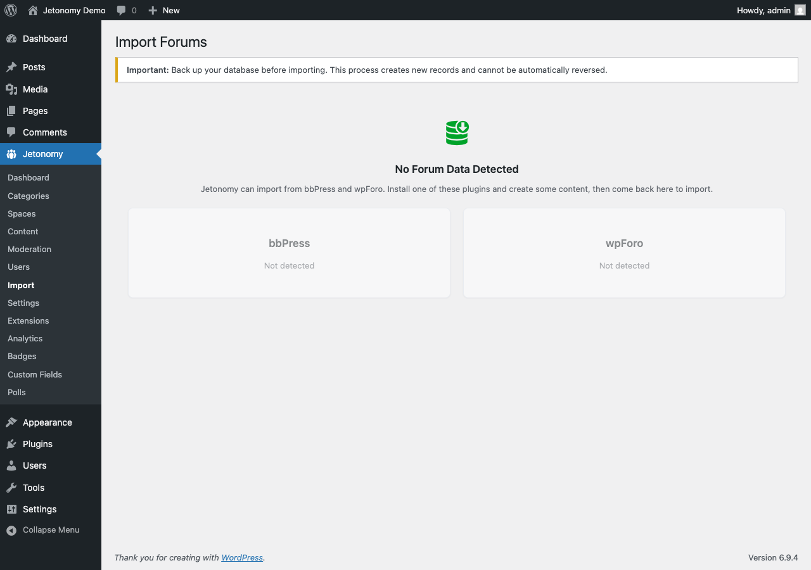

Bringing an existing forum into Jetonomy? This page covers everything that is the same across all three importers - which source to pick, how to read the import screen, and the checklist to run after any import. Then follow the guide for your specific forum software.



## Which Importer Do I Need?

Jetonomy ships with three built-in importers. Pick the one that matches the forum plugin you are moving away from:

| You are coming from | Use this guide |
|---|---|
| bbPress | [Importing from bbPress](01-bbpress-import.md) |
| wpForo | [Importing from wpForo](02-wpforo-import.md) |
| Asgaros Forum | [Importing from Asgaros Forum](03-asgaros-import.md) |

These three are the only built-in sources. Developers can add support for other forum software through the `jetonomy_importers` filter - see the developer reference for details.

## Before Any Import: Back Up

**Always take a full database backup before importing, no matter which source you use.** The importers read from your old forum's tables and never modify them, but importing creates new records in Jetonomy and cannot be automatically undone. A backup is your safety net if you want to start fresh.

Keep your old forum plugin (bbPress, wpForo, or Asgaros) **active** during the import - each importer reads directly from that plugin's live tables. You can deactivate it once you have confirmed the import looks right.

## Browser or WP-CLI?

You can run any import two ways. Use this to decide:

- **Browser (Jetonomy → Import)** - the simplest option, with a live progress bar. Best for small to medium communities (under roughly 50,000 topics + replies). The risk on large databases is a browser or server timeout part-way through.
- **WP-CLI (command line)** - the reliable option for large communities, because it is not subject to browser timeouts. Run it from your server's command line (SSH). The valid source values are `bbpress`, `wpforo`, and `asgaros` (all lowercase):

  ```bash
  wp jetonomy import bbpress
  wp jetonomy import wpforo
  wp jetonomy import asgaros
  ```

  If you run the command on a managed host where you must point at the WordPress install, add `--path`:

  ```bash
  wp --path="/path/to/wordpress" jetonomy import bbpress
  ```

  If you type a source name that does not exist, the command lists the valid ones back to you.

## Attachments and Inline Images

As of Jetonomy 1.8.0, all three importers bring over more than text. Images embedded in a topic or reply, and files attached to it, are downloaded from your old forum and registered into the WordPress media library as part of the same import run - members do not need to re-upload anything, and the files keep working even if you later remove the old forum plugin's upload folder.

If a specific file cannot be recovered (for example, it is already missing from disk), the import does not fail because of it. It finishes normally and reports how many files it could not recover, for example: *"3 files could not be recovered and were left linked in the original post text."* Treat that message as a to-do list for a handful of posts, not as a failed import - everything else has already come across.

## Reading the Import Screen

When you open **Jetonomy → Import**, each forum plugin that Jetonomy detects appears as its own card. Here is what every part of the card means:

- **No Forum Data Detected** - if none of bbPress, wpForo, or Asgaros is installed with content, you see this empty state instead of cards. Install and add content to one of those plugins, then return.
- **Stat preview** - each detected source shows a live count of what it found (for example Forums, Topics, Replies). This is read straight from your old forum so you can confirm Jetonomy sees your data before you start.
- **Status badge** - one badge per card tells you the card's state:
  - **Available** - detected and ready to import; this is the normal first-time state.
  - **Previously Imported** - you have already run this import once. The card shows the date of the last import and how many records it brought over.
  - **Import Interrupted** - a browser import stopped before finishing. The card offers **Resume Import** to continue, or **Start Over** to begin again.
- **Re-Import** - once a source shows **Previously Imported**, its button changes to **Re-Import**. The card explains that running it again imports only what is new since then, and asks you to confirm before it starts. See [Running an Import Again](#running-an-import-again).
- **Already imported, skipped** - after a re-run, the result and the card show how many items were already in Jetonomy and were skipped, for example *"1,240 items were already imported and were skipped."* That number is the proof nothing was duplicated, not a list of failures.
- **Progress tracker** - while an import runs, a five-step tracker shows where it is: **Forums → Topics → Replies → Profiles → Finalize**, with a percentage progress bar underneath.

## Running an Import Again

Re-running an import is safe for all three sources. Jetonomy records every forum, topic and reply it imports, so a second run recognises what is already there, skips it, and adds only what is new. New topics and replies posted in a forum you already imported come across into the existing space.

That makes the usual migration pattern work:

1. Import once and check the result while your old forum stays live.
2. Keep the old forum open to members while you set Jetonomy up.
3. Just before you switch over, run the import again to bring in everything posted since the first run.

**Imported on an earlier version?** Content brought over by an earlier Jetonomy release is recognised on the first re-run too: forums by their slug inside the category the importer created (never a space you made yourself), and topics and replies by their parent, author and original date. From then on it is tracked like any new import. A site that imported bbPress on 1.9.x can re-run the import to bring in the private, hidden and BuddyPress group forums the older importer skipped, without duplicating what is already there.

Two limits to know:

- A topic or reply whose source had no date cannot be recognised as imported by an earlier version, so a re-run imports it again.
- A re-run does not rewrite rows that are already in Jetonomy, with one exception: bbPress replies an earlier version imported flat get their threading back, and only where the reply has no parent yet. Everything else an earlier version imported stays as it was (for example, stickies that were not kept), so nothing you have changed since is overwritten.

## After Any Import

These steps apply to every source. The individual guides list the same checklist with source-specific notes, but the essentials are:

- [ ] Visit your community home and confirm your spaces match your old forums.
- [ ] Open several posts and confirm the content and replies came across intact.
- [ ] **Re-assign moderators.** Forum moderator assignments are not imported - set Space Moderator roles manually under **Jetonomy → Spaces**. (The one exception: a bbPress forum that belongs to a BuddyPress group brings the group's admins and moderators across with their roles.)
- [ ] **Flush permalinks if spaces 404.** Go to **Jetonomy → Settings → Permalinks** and click Save. (The bbPress importer does this for you automatically; wpForo and Asgaros do not, so do it by hand if new spaces return a 404.)
- [ ] **Clean up old shortcodes.** If your pages or widgets used your old forum's shortcodes, remove or replace them - they will print raw shortcode text while the old plugin is still active.
- [ ] Once everything checks out, you can deactivate the old forum plugin.
- [ ] If the import reported files it could not recover, open those specific posts and re-attach or re-upload the file by hand.

## What's Next?

Ready to import? Start with the guide for your forum software:

- [Importing from bbPress](01-bbpress-import.md)
- [Importing from wpForo](02-wpforo-import.md)
- [Importing from Asgaros Forum](03-asgaros-import.md)
