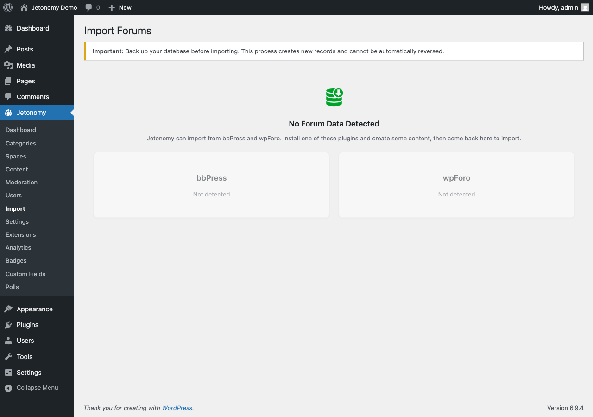

Move your existing bbPress community into Jetonomy - forums, topics, replies, user data, and vote history - using the built-in importer.



## What You Will Learn

- What data the bbPress importer brings over and what it leaves behind
- How to prepare your site before running the import
- How to start the import, monitor progress, and resume if it stops
- How to use the dry-run option to estimate time and check for issues
- What to verify after the import completes

## What Gets Imported

| bbPress Data | Imported As | Notes |
|---|---|---|
| Forums | Jetonomy Spaces | Forum description → space description |
| Topics | Jetonomy Posts | Topic title + content preserved |
| Replies | Jetonomy Replies | Threaded up to 3 levels; deeper threads flattened |
| Tags | Jetonomy Tags | Applied to posts |
| User accounts | Linked to existing WP users | Matched by user ID |
| User activity counts | Reputation score | Approximate mapping |
| Votes (if present) | Jetonomy votes | Only if bbPress vote plugin data is in standard tables |
| Forum moderators | Space Moderator role | Matched to WP users by ID |
| Sticky topics | Pinned posts | Preserved |

**Not imported:**
- bbPress subscriptions (replaced by Jetonomy follow/subscribe)
- bbPress private messages (import to Jetonomy Pro private messaging separately)
- Custom bbPress meta fields (use the `jetonomy_importers` filter to extend)
- Forum avatars (WordPress avatars carry over via Gravatar/WP user accounts)

## Pre-Import Checklist

Complete these steps before starting the import:

1. **Back up your database.** The importer does not modify bbPress tables, but a backup is essential.
2. **Activate Jetonomy** and complete the setup wizard. Your community base URL should be set.
3. **Keep bbPress active** during the import. The importer reads directly from bbPress tables.
4. **Set your server timeout high.** Large imports (100,000+ records) take time. Increase `max_execution_time` in `php.ini` or use WP-CLI (recommended for large sites).
5. **Disable other heavy plugins** during import if your server is resource-constrained.

> **Tip:** For large communities (10,000+ topics), run the import via WP-CLI to avoid browser timeouts entirely. See the WP-CLI section below.

## Running the Import

1. Go to **Jetonomy → Import** in your WordPress admin.
2. Select **bbPress** as the source.
3. (Optional) Enable **Dry Run** to preview results without writing any data.
4. Click **Start Import**.

The importer processes records in batches of 50. A progress bar shows completion percentage, current batch, and estimated time remaining.

Do not close the browser tab while the import is running. If the page refreshes or you navigate away, the import will pause - but can be resumed (see below).

## Dry-Run Mode

Enable **Dry Run** before your first real import. In dry-run mode, Jetonomy reads all your bbPress data, validates it, and reports:

- Total record counts (forums, topics, replies, users)
- Estimated import time
- Any data integrity issues (orphaned topics, missing user accounts, encoding problems)
- A preview of the first 10 forum-to-space mappings

Dry-run mode makes no database writes. Run it as many times as you need.

## Estimated Import Times

| Community Size | Topics + Replies | Estimated Time |
|---|---|---|
| Small | Under 10,000 | 2–5 minutes |
| Medium | 10,000–100,000 | 10–40 minutes |
| Large | 100,000–500,000 | 1–4 hours |
| Very large | 500,000+ | Use WP-CLI |

These are estimates for a typical shared hosting server. Dedicated servers will be significantly faster.

## Resuming a Paused Import

If the import stops (browser closed, timeout, server restart), return to **Jetonomy → Import**. The importer stores its progress in the database. Click **Resume Import** to continue from the last completed batch.

You can safely resume multiple times. Records that were already imported are skipped.

## Running via WP-CLI

For large communities, WP-CLI is more reliable than the browser-based importer:

```bash
wp --path="/path/to/wordpress" jetonomy import run --source=bbpress
```

Optional flags:

```bash
# Dry run
wp jetonomy import run --source=bbpress --dry-run

# Set batch size (default 50)
wp jetonomy import run --source=bbpress --batch-size=100

# Resume from a specific batch offset
wp jetonomy import run --source=bbpress --offset=500
```

WP-CLI runs without a timeout limit and outputs a progress line for each batch.

## Post-Import Checklist

After the import completes, verify the following:

- [ ] Navigate to your community home - spaces should match your old bbPress forums
- [ ] Open several posts and confirm content and replies are intact
- [ ] Check that user profiles show post counts
- [ ] Verify that moderators have the Moderator role in their respective spaces
- [ ] Test creating a new post as a regular user
- [ ] Visit **Jetonomy → Settings → Permalinks** and click Save to flush rewrite rules
- [ ] If you used bbPress shortcodes on pages, remove or replace them - they will output raw shortcode text now that bbPress is still active

> **Note:** After a successful import, you can deactivate bbPress. Your community data is now in Jetonomy's tables and bbPress is no longer needed.

## What's Next?

Migrating from wpForo? The process is similar with a few wpForo-specific field mappings.

[Importing from wpForo →](02-wpforo-import.md)
