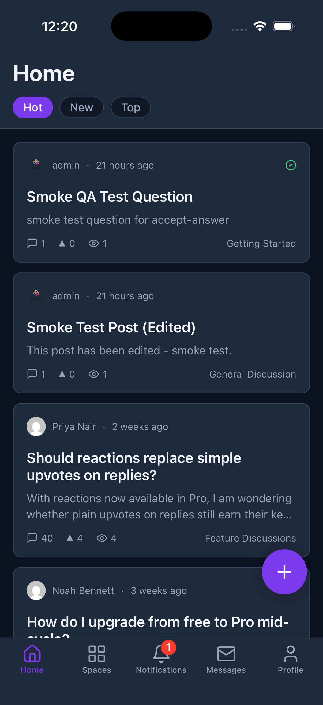
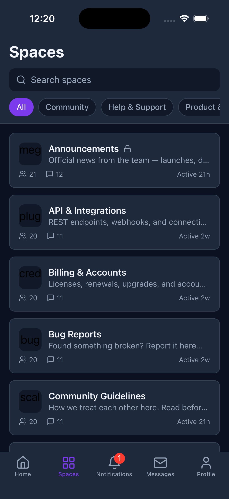

# Mobile App Overview

Jetonomy communities have a native **iOS and Android app**. Your members get a real mobile app for your forum - feed, topics, replies, votes, spaces, notifications, and (with Jetonomy Pro) messaging, reactions, polls, and badges - and it automatically shows **your** logo, color, and community name.

> **Requires Jetonomy 1.6.0 or newer** for the per-site branding endpoint (`/app/config`). Older sites still work with default styling.



## What you will learn

- What the mobile app is and how it connects to your site
- What it takes to ship your own branded app
- Where to set your branding and how members sign in

## How it works

The app connects **directly to your WordPress site** over the Jetonomy REST API (`jetonomy/v1`). There is no middleman server and no separate account system - members sign in with your site, and your data stays on your site.

```
Member's phone  ->  Jetonomy App  ->  Your WordPress site (jetonomy/v1 REST API)
```

When the app opens your community it reads your branding from `GET /wp-json/jetonomy/v1/app/config` (logo, accent color, community name) and themes itself to match.

## Two ways to ship it

| Option | Best for | What members see |
|---|---|---|
| **Open-source Jetonomy app** | Trying it out, smaller communities, members who belong to several communities | A generic app they point at your site; it themes itself with your branding |
| **Your own branded app** | Established communities that want their own store presence | Your icon and name in the App Store / Play Store, published under your own developer accounts |

Both use the same codebase. You set the in-app branding (logo, color, name) the same way in either case - see [Brand Your App](01-brand-your-app.md).

## What members can do



- Browse the feed across spaces (Hot / New / Top), post topics and questions, reply, and vote
- Join forums, Q&A, and idea spaces; get notifications; search
- **With Jetonomy Pro:** private messaging, reactions, polls, custom badges, custom fields, and native push
- Belong to several communities and switch between them in one app
- Read offline - the last-seen content is available without a connection

## Next steps

- [Brand Your App](01-brand-your-app.md) - set your logo, color, and community name
- [Connect Members](02-connect-members.md) - how admins and members sign in
- [Get the App](03-get-the-app.md) - how to get a branded app of your own
