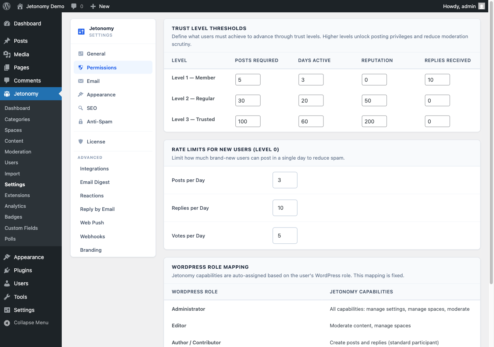

Jetonomy's trust system automatically promotes reliable members to higher privilege levels as they earn reputation - so you spend less time manually managing who can do what, and your most active members get recognized for their contributions.

## What You Will Learn

- What the six trust levels are and what each one unlocks
- How members earn reputation points
- How automatic promotion works
- How to adjust thresholds in your admin settings
- How trust badges appear on member avatars

## The Six Trust Levels

Jetonomy has six trust levels, numbered 0 through 5. Every new member starts at Trust Level 0 and rises as they earn reputation and meet the configured thresholds.

| Level | Name | Default Threshold |
|-------|------|-------------------|
| TL0 | New Member | Automatic on signup |
| TL1 | Basic Member | 50 reputation |
| TL2 | Member | 200 reputation |
| TL3 | Regular | 500 reputation |
| TL4 | Leader | 1,000 reputation |
| TL5 | Trusted | 2,500 reputation |

## What Each Level Unlocks

Trust levels expand what a member can do without moderator intervention.

| Capability | TL0 | TL1 | TL2 | TL3 | TL4 | TL5 |
|------------|-----|-----|-----|-----|-----|-----|
| Create topics | Yes | Yes | Yes | Yes | Yes | Yes |
| Post replies | Yes | Yes | Yes | Yes | Yes | Yes |
| Upload images | No | Yes | Yes | Yes | Yes | Yes |
| Flag content | Yes | Yes | Yes | Yes | Yes | Yes |
| Skip CAPTCHA | No | No | Yes | Yes | Yes | Yes |
| Edit own posts | Yes | Yes | Yes | Yes | Yes | Yes |
| Daily post limit lifted | No | No | Yes | Yes | Yes | Yes |
| Rate limit lifted | No | No | Yes | Yes | Yes | Yes |

Space moderators and WordPress admins always have full capabilities regardless of trust level.

## How Members Earn Reputation

Reputation is updated in real time whenever a qualifying event occurs.

| Event | Points |
|-------|--------|
| Your topic is upvoted | +10 |
| Your reply is upvoted | +5 |
| Your reply is accepted as an answer (Q&A) | +15 |
| Your topic or reply is downvoted | -2 |
| A moderator deletes your content | -20 |

Reputation points accumulate on your public profile. The leaderboard ranks members by reputation score - see the [Leaderboard](../user-profiles/02-leaderboard.md) doc for details.

## Automatic Promotion

A cron job runs twice daily to evaluate all members against the current trust level thresholds. Any member whose reputation meets or exceeds the next threshold is automatically promoted.

Promotion is silent - members are not notified by default. You can add a welcome notification using the `jetonomy_trust_level_changed` action hook if you want to acknowledge promotions.

Demotion works the same way. If a member's reputation falls below a threshold (for example, because posts were deleted), they are automatically moved back to the appropriate level on the next cron run.

> **Tip:** You can trigger an immediate re-evaluation for a specific user from **Jetonomy → Users** in the WordPress admin. Find the user and click **Recalculate Trust Level**.

## Configuring Thresholds

Go to **Jetonomy → Settings → Permissions** to adjust the reputation threshold for each trust level. Changes take effect on the next cron run - or immediately if you run a manual recalculation.

Lower thresholds make promotion faster and more accessible. Higher thresholds make higher trust levels a meaningful achievement. There is no right answer - tune these to the pace and size of your community.

> **Note:** Setting a threshold to 0 makes that trust level automatic for all members who meet all lower thresholds. Use this carefully - it effectively grants TL capabilities to your entire community.

## Trust Badges on Avatars

Each trust level has a colored badge that appears on a member's avatar across topic listings, reply cards, and their profile page. The badge uses the `data-jt-tl` attribute so you can restyle it in your theme using CSS if needed.

| Level | Badge Color |
|-------|-------------|
| TL0 | Grey |
| TL1 | Blue |
| TL2 | Green |
| TL3 | Teal |
| TL4 | Purple |
| TL5 | Gold |

## Why Trust-Based Moderation Beats Manual Role Assignment

In a traditional forum, you manually decide who is a "trusted" member. That does not scale. With Jetonomy's trust system, your community self-selects. Members who contribute quality content earn their way to higher levels automatically. You only need to intervene in edge cases - banning bad actors or manually elevating a known expert to a higher level.

## What's Next?

Learn how members can flag content for review and how flagged content reaches the moderation queue.

[Flagging & Reporting Content →](02-flagging-reporting.md)
