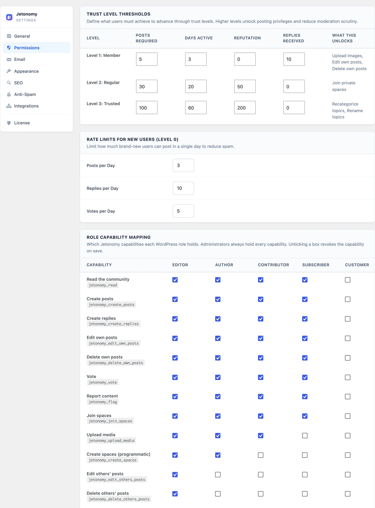
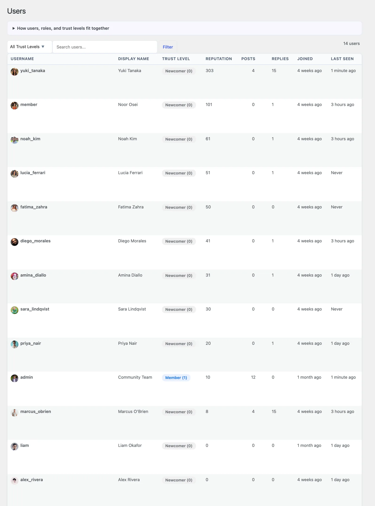

# Trust Levels

Jetonomy's trust system automatically promotes reliable members to higher privilege levels as they earn reputation - so you spend less time manually managing who can do what, and your most active members get recognized for their contributions.

## What You Will Learn

- What the six trust levels are and what each one unlocks
- How members earn reputation points
- How automatic promotion works
- How to adjust thresholds in your admin settings
- How trust badges appear on member avatars

## The Six Trust Levels

Jetonomy has six trust levels, numbered 0 through 5. Every new member starts at Trust Level 0. Levels 1 through 3 are earned automatically when a member meets the configured requirements. Levels 4 and 5 are not earned automatically - they are granted manually by an admin.

Promotion to levels 1-3 is based on a combination of activity stats, not a single reputation number. A member must meet every requirement listed for a level to reach it.

| Level | Name | Default Requirements |
|-------|------|----------------------|
| TL0 | Newcomer | Automatic on signup |
| TL1 | Member | 5 posts, 3 days active, 10 replies received |
| TL2 | Regular | 30 posts, 20 days active, 50 reputation |
| TL3 | Trusted | 100 posts, 60 days active, 200 reputation |
| TL4 | Leader | Manually granted by an admin |
| TL5 | Moderator | Manually granted by an admin |

## What Each Level Unlocks

Trust levels only change a few things. What a member can do day to day comes from their WordPress role capabilities and their space role, not from their trust level. Here is what trust level actually controls, and what it does not.

| Capability | TL0 | TL1 | TL2 | TL3 | TL4 | TL5 |
|------------|-----|-----|-----|-----|-----|-----|
| Create topics | Yes | Yes | Yes | Yes | Yes | Yes |
| Post replies | Yes | Yes | Yes | Yes | Yes | Yes |
| Flag content | Yes | Yes | Yes | Yes | Yes | Yes |
| Upload images | Yes | Yes | Yes | Yes | Yes | Yes |
| Edit / delete own posts | Yes | Yes | Yes | Yes | Yes | Yes |
| Free of the daily post, reply and vote limits | No | Yes | Yes | Yes | Yes | Yes |
| Skip CAPTCHA | No | No | Yes | Yes | Yes | Yes |
| Edit others' topics, move, close and pin topics | See below | See below | See below | Yes, if the role allows it | Yes, if the role allows it | Yes, if the role allows it |

**Controlled by trust level**

- **Daily limits.** Brand-new TL0 accounts have daily caps on topics, replies and votes. TL1 and above have none. Administrators and moderators are never limited.
- **CAPTCHA.** TL2 and above skip the CAPTCHA check.
- **Edit, move, close and pin others' topics.** A role that holds these capabilities (Editor and above by default) also needs TL3. Space Moderators, Space Admins and WordPress administrators are not held to this.

**Not controlled by trust level**

- **Uploads and editing or deleting your own posts.** Every member's role gets the capabilities by default, so every trust level can do them. To change this, edit the role in [Role Capabilities](../admin-settings/18-role-capabilities.md).
- **Moderation.** Trust level never makes someone a moderator. Moderating needs the `jetonomy_moderate` capability (Editor and above by default) or a **Moderator** or **Admin** role in the space. TL4 ("Leader") and TL5 ("Moderator") are names only. Promoting a member to TL4 or TL5 does not give them moderation tools, access to the moderation queue, or any admin screen.
- **Managing settings, categories and analytics.** These need the matching capabilities, which Administrators hold. TL5 does not grant them.
- **Creating spaces.** Front-end space creation follows the **Front-end space creation** role list in **Jetonomy → Settings → General**. Trust level does not unlock it. The permission engine also lists TL4 plus the `jetonomy_create_spaces` capability as a requirement for programmatic checks, but the front-end form and the REST route do not use it.

The **Unlocks** column on the Permissions settings screen is a summary of each level's intent. Use the table above as the source of truth for what is enforced.

Space Moderators and Space Admins can moderate inside their own space regardless of trust level. WordPress administrators bypass all of these checks.

> **Note:** "Rate limit lifted" at TL1 refers to the per-day posting caps that apply to brand-new (TL0) accounts - 3 topics, 10 replies, and 5 votes per day by default. Those caps and how to tune them are covered in [Anti-Spam Protection → Rate Limiting for New Members](04-anti-spam.md#rate-limiting-for-new-members).

## How Members Earn Reputation

Reputation is updated in real time whenever a qualifying event occurs.

| Event | Points |
|-------|--------|
| Your topic is upvoted | +10 |
| Your reply is upvoted | +5 |
| Your reply is accepted as an answer (Q&A) | +15 |
| Your idea is moved to Planned/Shipped | +20 |
| A flag you submitted is confirmed | +5 |
| Your topic or reply is downvoted | -2 |
| Your post is reported | -10 |
| A moderator deletes your content | -20 |

Every point value is editable at **Jetonomy → Settings → Permissions → Reputation Points** - adjust any action's score without touching code.

Reputation points accumulate on your public profile. The leaderboard ranks members by reputation score - see the [Leaderboard](../user-profiles/02-leaderboard.md) doc for details.

## Automatic Promotion

A cron job runs twice daily to evaluate all members against the current requirements for levels 1-3. Any member who meets every requirement for the next level is automatically promoted.

Promotion is silent - members are not notified by default. You can add a welcome notification using the `jetonomy_trust_level_changed` action hook if you want to acknowledge promotions.

Demotion works the same way. If a member's reputation falls below a threshold (for example, because posts were deleted), they are automatically moved back to the appropriate level on the next cron run.

> **Tip:** You can set a member's trust level directly from **Jetonomy → Users** in the WordPress admin. Find the user and click **Change Trust Level**, then pick the level. This is a manual override that sets the level immediately - useful for elevating a known expert or correcting an edge case.

The **Jetonomy → Users** page is the central place to manage individual members: each row shows the member's trust level, post and reputation stats, and per-row controls to **Change Trust Level** and to **Ban / Unban** (covered in [Banning Members](05-banning-members.md)).

## Configuring Thresholds

Go to **Jetonomy → Settings → Permissions** to adjust the promotion requirements. Each of the three earned levels (1, 2, and 3) has its own row with four inputs: **posts**, **days active**, **reputation**, and **replies received**. A member must meet every value in a row to reach that level. Changes take effect on the next cron run.

Levels 4 and 5 have no requirement inputs - they are granted manually from **Jetonomy → Users** and cannot be earned automatically.

Lower requirements make promotion faster and more accessible. Higher requirements make higher trust levels a meaningful achievement. There is no right answer - tune these to the pace and size of your community.

> **Note:** Setting a requirement to 0 removes it as a gate for that level. For example, setting a level's reputation requirement to 0 means members can reach it on activity stats alone.

## Trust Badges on Avatars

Each trust level has a colored badge that appears on a member's avatar across topic listings, reply cards, and their profile page. The badge uses the `data-jt-tl` attribute so you can restyle it in your theme using CSS if needed.

| Level | Badge Color |
|-------|-------------|
| TL0 | Grey |
| TL1 | Blue |
| TL2 | Green |
| TL3 | Teal |
| TL4 | Purple |
| TL5 | Gold |

## Why Trust-Based Moderation Beats Manual Role Assignment

In a traditional forum, you manually decide who is a "trusted" member. That does not scale. With Jetonomy's trust system, members who contribute quality content earn their way past the new-account limits and the CAPTCHA automatically. You only need to intervene in edge cases - banning bad actors, or assigning a known expert as a Space Moderator so they can moderate.

## For Developers

Trust and moderation events fire WordPress action hooks you can listen to in a small custom plugin or your theme's `functions.php` - for example to send a welcome message when a member is promoted, or to log every resolved flag to an external system:

- `jetonomy_trust_level_changed` - fires when a member's trust level goes up or down.
- `jetonomy_flag_resolved` - fires when a moderator marks a flag valid or dismisses it.
- `jetonomy_sidebar_auth_card` - lets you add content to the community sidebar.

The full signatures (parameters and when each one runs) are in the [Hooks Reference](../developer-guide/02-hooks-reference.md) in the developer guide.

## What's Next?

Learn how members can flag content for review and how flagged content reaches the moderation queue.

[Flagging & Reporting Content →](02-flagging-reporting.md)
