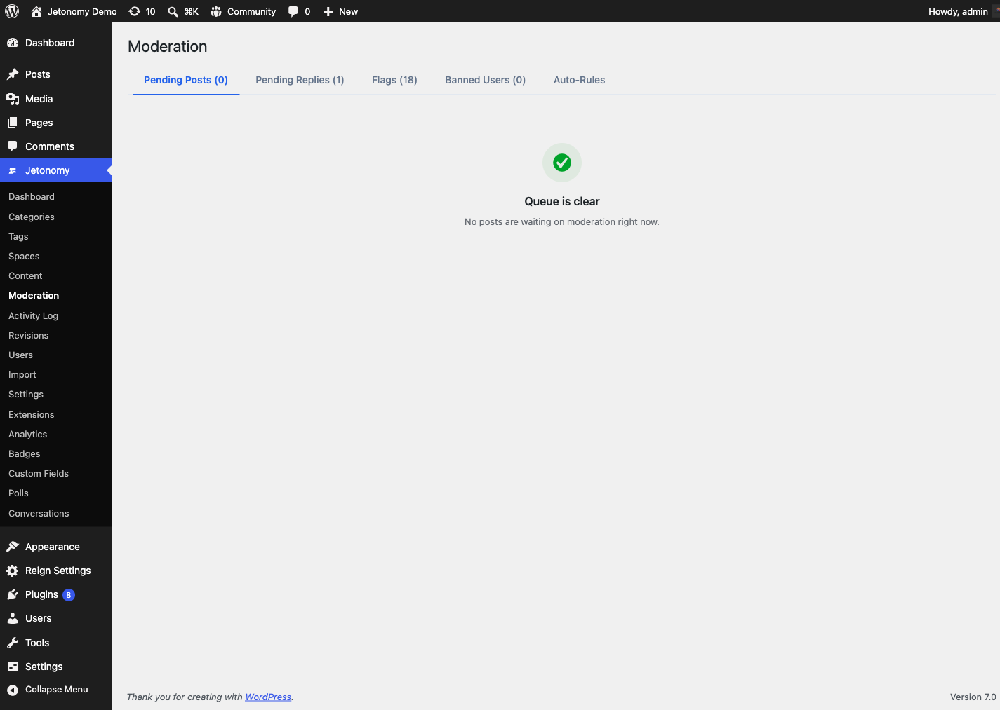
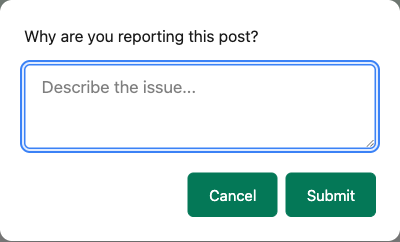

Flagging lets any logged-in member report content that breaks your community rules. It is the first step in the moderation pipeline - members surface problems, and your moderators review and act.

## What You Will Learn

- How to flag a topic or reply
- How to report an entire member account
- How to block a member from the mobile app or the REST API
- What information a flag captures
- What the reason categories mean and where they come from
- Who can flag content and what the restrictions are
- What happens to flagged content before a moderator reviews it
- How flags flow into the moderation queue

## How to Flag Content

Every topic and every reply has a **...** (more actions) menu. Open it and click **Report**. A prompt dialog appears asking why you are reporting the content. Type a brief description of the problem - for example, "This contains spam links" or "This is abusive toward another member" - and confirm.

The flag is saved immediately and you receive a confirmation message. The text you type is stored as the flag's description; the member-side report files every flag under the **Other** reason category, and moderators see that category alongside your description when they review it.

> **Tip:** A good flag reason helps moderators act faster. "Spam" alone works, but "Contains a link to a commercial site unrelated to this community" gives the moderator everything they need without having to investigate.

## Who Can Flag Content

Any logged-in member can flag a topic or reply, regardless of their trust level. There is one restriction: you cannot flag your own content.

The flag button is not visible to guests (logged-out visitors). If you want guests to be able to report content, you will need a custom solution - the built-in flagging system requires authentication.

There is no daily limit on flags per member. A member who finds multiple pieces of problematic content can flag all of them.

## Reporting a Member

Flagging is not limited to individual posts and replies - a member can also report an entire user account. This is for cases where the problem is the person rather than one piece of content (for example, a member sending unwanted messages or repeatedly causing trouble across many topics).

To report a member, open their **profile page** (`/community/u/their-username/`) and click the **Report** button next to the Message button. A prompt asks why you are reporting the user; type a brief reason and confirm. As with content flags, you cannot report your own account, and the control only appears to logged-in members.

A user report creates a flag the same way a content report does - it is recorded against that member's account, captures your reason text and your name as the reporter, and surfaces in the moderation tools for a moderator to review and act on (for example, by [banning the member](05-banning-members.md) if the report is justified).

## Blocking a Member (1.8.0+)

Blocking hides a member's replies from your own view without removing them for anyone else - useful when you want to stop seeing someone's content without waiting on a moderator. As of 1.8.0, blocking is available from the mobile app and the REST API.

You can report the member in the same action - blocking and filing a report travel together in one request, so members do not need to submit them separately.

If the blocked member's reply has other replies nested underneath it, only their own content is hidden; the innocent replies in that nested thread stay visible.

> **Note:** Blocking is a personal, per-viewer preference. It does not stop the blocked member from posting, and moderators and other members still see everything as normal. To remove someone's ability to post at all, a moderator needs to [ban them](05-banning-members.md).

## What a Flag Captures

When a flag is submitted, Jetonomy records:

- The content or member being flagged (a post, a reply, or a user account, with its ID)
- The member who submitted the flag
- The reason category and the reason text they entered
- The timestamp

Moderators see all of this information when they review the flag in the moderation queue.

## Reason Categories vs Free Text

When a moderator opens the queue, each flag shows a **reason category** - one of *Spam*, *Offensive*, *Off-topic*, *Harassment*, or *Other*. The built-in Report button that members click always files under the **Other** category and stores their typed description, so most member-submitted flags you see will be tagged *Other* with a free-text note.

The other categories (Spam, Offensive, Off-topic, Harassment) come from automated and advanced paths - the REST API, WP-CLI, and Jetonomy Pro's moderation automation - which can file a flag with a specific structured reason. So if you see category chips other than *Other* in your queue, those flags were raised by an integration or automation rule, not chosen by a member in the standard report dialog.

## What Happens to Flagged Content

Flagging alone does not change the visibility of a post or reply. The content stays live and readable by all members until a moderator reviews it and takes action. This is intentional - hiding content automatically on a single flag would allow abuse of the flagging system.

A moderator can then mark the flag **Valid** (confirming the content breaks the rules, which trashes it) or **Dismiss** it (marking it unfounded, leaving the content live). See the [Moderation Queue](03-moderation-queue.md) guide for the full review workflow.

> **Note:** If the same piece of content receives multiple flags from different members, all flags are grouped under that content item in the moderation queue. Moderators see the total flag count and each individual reason.

## Preventing Flag Abuse

Jetonomy does not currently auto-penalize members who submit flags that moderators consistently dismiss. If you have a member who is abusing the flagging system, handle it by adjusting their trust level or banning them from **Jetonomy → Users** in the WordPress admin.

## What's Next?

See how flagged content and posts pending approval appear in the moderation queue, and learn how moderators take action.

[Moderation Queue →](03-moderation-queue.md)
