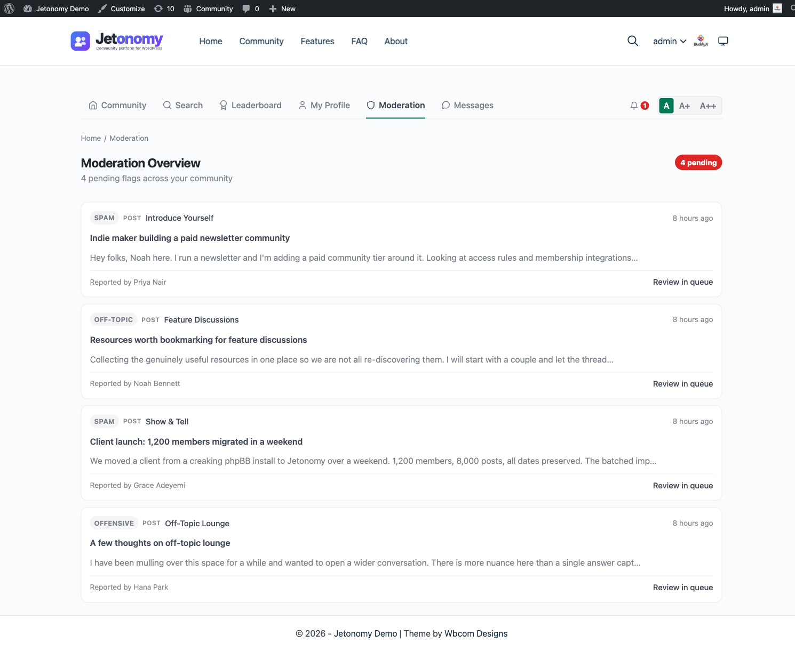

The moderation queue is your single dashboard for everything that needs human review - posts waiting for approval, flagged content, and items caught by spam filters. You can action everything from one page without digging through individual topics.

## What You Will Learn

- How to access the moderation queue
- What types of content appear in the queue
- What actions you can take on each item
- How per-space moderation differs from global moderation
- How Akismet-held content appears in the queue
- Where to ban a member when content-level actions are not enough

## Accessing the Moderation Queue

Go to **Jetonomy → Moderation** in your WordPress admin. The page is also accessible from the frontend at `/community/mod/` - WordPress Administrators and users with the `jetonomy_moderate` capability can access both routes.

The queue shows a count badge on the admin menu item whenever there are items waiting for review.

## What Appears in the Queue

The queue is split into four tabbed views, each with a count of how many items it holds:

### Pending Posts

These are topics submitted in a space with **Require Post Approval** enabled. They are not visible to other community members until a moderator approves them.

Each pending item shows the full content, the author, the space it was submitted to, and how long it has been waiting. Items are ordered oldest first so nothing sits in the queue unnoticed.

Automated checks can also route content here. Jetonomy Pro's AI spam detection and moderation rules can place a post or reply into this held "pending" state for review rather than publishing it outright.

### Pending Replies

The same as Pending Posts, but for replies awaiting approval in spaces that require it. Replies get their own tab so you can clear topics and replies independently.

### Flags

These are live topics and replies that members have flagged for review. Flagged content stays visible in the community until a moderator acts. Each item shows the content, the flag reason(s), how many unique members flagged it, and the timestamp of the most recent flag.

### Banned Users

A list of members who are currently banned, with the option to lift each ban. See [Banning Members](05-banning-members.md) for the full ban workflow.

## Available Actions

Actions differ between the pending tabs and the Flags tab.

**On Pending Posts and Pending Replies**, each item has three buttons:

| Action | What it does |
|--------|-------------|
| Approve | Publishes the pending post or reply so the community can see it |
| Spam | Marks the content as spam and moves it to trash; updates Akismet's spam training if Akismet is active |
| Trash | Moves the content to trash without marking it as spam |

**On the Flags tab**, each flag row has two buttons:

| Action | What it does |
|--------|-------------|
| Valid (Trash) | Confirms the flag was justified - the content is trashed and the flag resolved |
| Dismiss | Marks the flag unfounded - the content stays live and the flag is resolved |

> **Tip:** Use Spam rather than Trash when content is clearly commercial spam. This trains Akismet for your site, making future auto-detection more accurate.

## Per-Space vs Global Moderation

The queue shows content from all spaces by default. Use the **Space** filter dropdown at the top of the queue to narrow to a single space. This is useful when you have dedicated space moderators - a moderator for your Support space only needs to see Support space items.

Space moderators who do not have global admin access see only their own spaces' items when they visit `/community/mod/`. They do not see content from spaces they do not moderate.

> **Fixed in 1.4.1:** moderators of multiple spaces now see every queue they own when they visit `/community/mod/`. Earlier versions could redirect a multi-space moderator away from the dashboard if access checks ran in the wrong order. If you have moderators who report "I can see one space's queue but not the others," update to 1.4.1 and the dashboard will load all of them.

## Akismet Integration

If the Akismet Anti-Spam plugin is active and configured on your site, Jetonomy automatically passes new posts and replies through Akismet before saving them. If Akismet marks content as spam:

- The post or reply is saved with a Spam status (not Pending)
- It does not appear in the community

Spam-flagged content is set to a Spam status rather than surfaced as a dedicated tab in the moderation screen. The four moderation tabs are Pending Posts, Pending Replies, Flags, and Banned Users.

> **Note:** Akismet integration requires the Akismet plugin to be installed, activated, and connected with a valid API key. Jetonomy does not bundle Akismet - it integrates with it automatically when present.

## Banning Members

Approve, Mark as Spam, and Trash all act on individual pieces of content. When a member is repeatedly disruptive, content-level actions are not enough and you need to act on the person instead. The **Banned Users** tab here shows everyone who is currently banned, with an Unban control on each row.

Banning is a subsystem of its own - three ban types, durations, auto-expiry, and the **Jetonomy → Users** admin page - covered in full in its own guide.

[Banning Members →](05-banning-members.md)

## What's Next?

Learn about Jetonomy's built-in anti-spam tools - reCAPTCHA, Turnstile, and rate limiting - that reduce how much reaches the moderation queue in the first place.

[Anti-Spam Protection →](04-anti-spam.md)

## Related Pro Features

- [Advanced Moderation](../pro-features/07-advanced-moderation.md) - automated content rules that act before items ever reach the queue.
