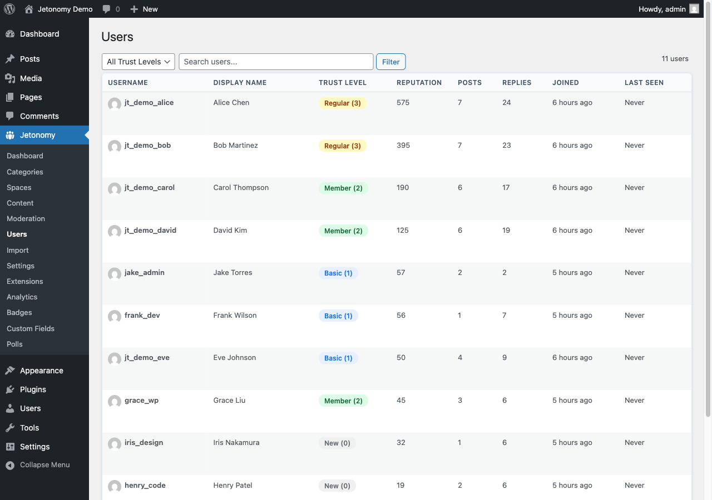

Approving, marking as spam, and trashing all act on a single piece of content. Banning acts on the person. When a member is not just posting one bad item but is repeatedly disruptive - or is a confirmed bad actor - you ban the account so they cannot keep posting. This guide covers the three ban types, how long a ban lasts, and where to manage bans.

## What You Will Learn

- Where to ban and unban members
- The three ban types and when to use each
- How ban durations work, including automatic expiry
- How to lift a ban early
- Who is allowed to ban members

## Where to Manage Bans

You ban and unban members from the **Jetonomy → Users** page in the WordPress admin. The page lists every community member with their trust level and stats, and gives each row a **Ban / Unban** control (plus a quick **Silence** link). Currently banned members also appear on the **Banned Users** tab of the [Moderation Queue](03-moderation-queue.md), where you can lift each ban.

Banning requires the `jetonomy_moderate` capability - the same capability that gates the moderation queue itself. WordPress administrators and Trust Level 4+ members have it by default.

## The Ban Dialog

Clicking **Ban** on a member's row opens the Ban User dialog with three choices:

### Ban Types

Jetonomy supports three levels of restriction so the response fits the situation:

| Type | Effect |
|------|--------|
| Global Ban | The member is blocked from posting anywhere in the community |
| Space Ban | The member is blocked from a single space but can still participate elsewhere |
| Silence | The member can still read everything but cannot post or reply anywhere |

> **Tip:** The **Silence** quick-link on each user row opens this same dialog pre-set to the Silence type with a 7-day duration - a fast way to cool down a heated member without a full ban.

### Duration

Pick how long the ban lasts from the **Duration** selector:

| Duration | Effect |
|----------|--------|
| Permanent | The ban stays in place until you lift it manually |
| 1 Day | Lifts automatically 1 day after it is applied |
| 7 Days | Lifts automatically 7 days after it is applied |
| 30 Days | Lifts automatically 30 days after it is applied |

Time-limited bans lift themselves automatically when they expire, so you do not have to remember to unban a member after a cooling-off period.

### Reason

The dialog has an optional **Reason** field. The reason is stored with the ban for your own records - it does not change how the ban behaves. Recording why you banned someone makes it easy for you or another moderator to understand the history later.

## Lifting a Ban Early

To remove a ban before it expires, click **Unban** on the member's row (on the Users page or the Banned Users tab). The restriction is cleared and the member can participate again immediately.

## When to Ban vs. Act on Content

Reach for a ban only when content-level actions are not enough:

- **A single bad post** - use Trash or Mark as Spam from the [Moderation Queue](03-moderation-queue.md).
- **A member causing trouble in one space** - use a Space Ban so they keep their access elsewhere.
- **A member you want to cool down, not remove** - use Silence (they can still read).
- **A member who keeps coming back** - use a Global Ban, permanent or timed, to stop the behavior at the source.

## What's Next?

Learn how in-app notifications keep your members engaged and informed about replies, mentions, and votes.

[Notifications →](../notifications/01-notifications.md)
