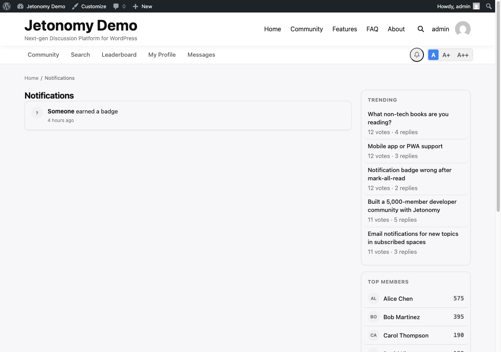

Notifications keep your community members in the loop without requiring them to check back manually. Every relevant activity (replies, mentions, votes) surfaces instantly in the notification bell so members always know when something needs their attention.

## What You Will Learn

- How the notification bell works and where it appears
- Every notification type and when each one fires
- How to mark notifications as read
- How to view, filter, and delete notifications on the full notifications page
- How the verification reminder email nudges members who never confirmed their address
- Where members set their personal notification preferences

## The Notification Bell

The notification bell icon appears in the community navigation bar on every page. When you have unread notifications, a red badge shows the count. The count updates automatically. You do not need to refresh the page.

Click the bell to open a dropdown showing your most recent notifications. The dropdown lazy-loads its content when you click, keeping page load times fast.

Each notification in the dropdown shows:

- The notification type (icon)
- A summary of what happened (for example, "Sarah replied to your topic")
- The time it occurred
- A direct link to the relevant content

Clicking a notification in the dropdown marks it as read and navigates you to the relevant topic, reply, or profile.

## Notification Types

Jetonomy fires a notification for each of the following events:

| Event | Who receives it | Channels |
|-------|-----------------|---------|
| Someone replies to your topic | Topic author | In-app, email |
| Someone replies to your reply (threaded) | Reply author | In-app, email |
| Someone mentions you with @username | Mentioned member | In-app, email |
| Your reply is accepted as an answer (Q&A) | Reply author | In-app, email |
| A new topic is posted in a space you follow | All followers of that space | In-app, email |
| Your topic or reply receives an upvote | Content author | In-app |
| Your topic or reply receives a downvote | Content author | In-app |
| An idea's status changes (Ideas spaces) | Idea author + all followers of that space | Activity log, email digest, in-app inbox |

Upvote and downvote notifications can be turned off per-member if members prefer not to see them. See the Preferences section below.

## Marking Notifications as Read

**Mark one as read:** Click any notification in the dropdown. Navigating to it marks it read automatically.

**Mark all as read:** Click the **Mark all as read** link at the top of the dropdown. All notifications are cleared in a single action. The badge disappears immediately.

Unread notifications are highlighted with a subtle background tint in the dropdown so you can spot them at a glance.

## The Full Notifications Page

The dropdown shows your most recent notifications, roughly the last 10 to 20 items depending on screen size. To see your full notification history, click **See all notifications** at the bottom of the dropdown or navigate directly to `/community/notifications/`.

The full page lists every notification you have received, paginated 25 per page. Notifications older than 90 days are automatically cleaned up from the database by a background cron job.

### Filter Tabs

The page has a row of filter tabs across the top so members can focus on one kind of update at a time. Each tab shows a count badge of how many notifications match it, so you can see at a glance where the activity is.

| Tab | What it shows |
|-----|---------------|
| All | Every notification you have received |
| Unread | Only notifications you have not opened yet |
| Mentions | Notifications where someone @-mentioned you |
| Replies | Replies to your posts and to your replies |
| Votes | Upvotes and downvotes on your posts and replies |
| Badges | Badges you have earned (only shown when Jetonomy Pro is active) |

Switching tabs reloads the list filtered to that type and keeps your place. The **Badges** tab appears only on communities running Jetonomy Pro, since badges are a Pro feature.

### Deleting Notifications

Members can clear out notifications they no longer need, not just mark them read.

- **Delete one:** Open the **...** actions menu on any notification row and choose **Delete**. The row is removed immediately.
- **Bulk delete:** Tick the checkbox on one or more rows. A toolbar appears at the top of the list showing how many you have selected, with **Mark read** and **Delete** buttons that apply to every selected row at once. A **Select all on page** checkbox selects the whole visible page in one tick.

Deleting is permanent for that member's own inbox. It does not affect anyone else's notifications or the underlying post or reply.

> **Note:** Per-notification delete and the bulk-delete toolbar were added in 1.4.3.

## The Verification Reminder Email

When a community requires email verification at signup (**Jetonomy → Settings → Email**), some members register but never click the verification link in their welcome email. Jetonomy sends those members a single follow-up reminder email nudging them to finish verifying, so they do not get stuck unable to participate.

- The reminder is sent once per member. It will never email the same person twice.
- It goes out a configurable number of hours after registration. Set the delay in `jetonomy_settings.verification_reminder_hours`. Setting it to `0` disables the reminder entirely.
- It respects each member's email opt-out, so anyone who has opted out of community email is skipped.
- It uses the same branded email template as your other Jetonomy emails, so the subject and body can be customised under **Settings → Email → Email Templates**.
- The reminder only runs while email verification is switched on. Turn verification off and there is nothing to remind about.

## Per-User Notification Preferences

Each member can control which notification types they receive. Go to **Profile → Edit Profile → Notifications** (at `/community/u/your-username/edit/`).

Options are:

- In-app notifications on/off per type
- Email notifications on/off per type (see [Email Notifications](02-email-settings.md) for the full email guide)

Members cannot disable notifications for direct mentions. The @mention notification is always delivered to ensure important communications reach their target.

> **Note:** Administrators can set the default notification preferences that new members start with. Go to **Jetonomy → Settings → Email** to configure the defaults applied at signup.

## What's Next?

Learn how to configure email notification delivery, set community-wide defaults, and understand which notification types support email.

[Email Notifications →](02-email-settings.md)

## Related Pro Features

Pro adds more ways to reach and message members:

- [Private Messaging](../pro-features/02-private-messaging.md) - one-to-one and group direct messages.
- [Email Digest](../pro-features/08-email-digest.md) - scheduled activity summary emails.
- [Web Push](../pro-features/10-web-push.md) - browser push notifications.
- [Reply by Email](../pro-features/11-reply-by-email.md) - reply to threads straight from your inbox.
