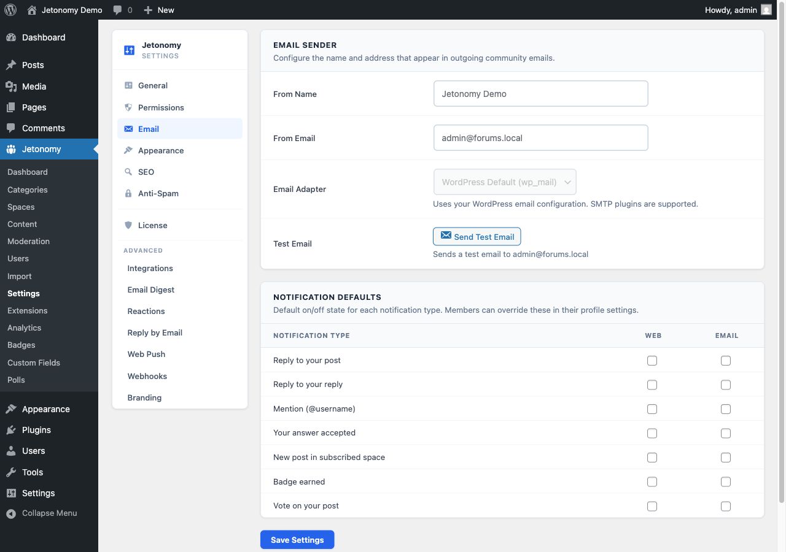

Email notifications bring members back to your community even when they are not actively browsing. Jetonomy sends a notification email for every in-app event type, and both you and your members have control over which emails are delivered.

## What You Will Learn

- Which notification types send email
- How to configure default email settings for new members
- How members control their own email preferences
- How one-click unsubscribe links work
- How Jetonomy sends email and how to use your own SMTP provider
- What email digest options are available in Jetonomy Pro

## Which Notification Types Send Email

Every notification type that appears in the in-app bell can also send an email. The email mirrors the in-app notification - it names the event, shows a short excerpt of the content, and includes a direct link back to the relevant topic or reply.

| Notification type | Email sent by default |
|-------------------|-----------------------|
| Reply to your topic | Yes |
| Reply to your reply | No |
| @mention | Yes |
| Answer accepted (Q&A) | Yes |
| New post in followed space | No |
| Upvote on your content | No |
| Downvote on your content | No |

The defaults above are what Jetonomy applies when a new member signs up. You can change these defaults in **Jetonomy → Settings → Email**.

> **Tip:** "New post in followed space" email is off by default because members who follow many active spaces would receive a high volume of email. Let members opt in rather than having to opt out.

## Editable Email Templates *(updated in 1.4.1)*

Every notification email Jetonomy sends has an editable template - subject and body - at **Jetonomy → Settings → Email → Templates**. Change the wording to match your community's voice without writing any code.

Two improvements landed in 1.4.1 that are worth knowing about:

- **Reset to default button** on every template - one click restores the shipped subject and body. No more retyping if you change your mind or want to start over.
- **Verification reminder template** is now editable from the same screen. The reminder fires once per member, 24 hours after sign-up, if they haven't clicked the verification link in their welcome email. The interval is configurable.

Defaults now have a single source of truth so reset always restores the exact copy the plugin ships with - even if a future update changes the default wording, your reset still gets the version you'd see on a fresh install.

### Template Placeholders

You can use these placeholders in any subject or body. They are replaced with the real values when the email is sent:

| Placeholder | Replaced with |
|-------------|---------------|
| `{site}` | Your site name |
| `{user}` | The recipient's display name |
| `{message}` | The notification summary text |
| `{type}` | The notification type key |
| `{url}` | A direct link to the relevant content |
| `{post_title}` | The title of the related topic or idea |
| `{actor_display_name}` | The member who triggered the notification |
| `{reply_excerpt}` | A short excerpt of the reply |
| `{space_title}` | The space the activity happened in |

Any placeholder with no value for a given event renders as an empty string, so it never shows up as literal `{post_title}` text in the email.

## Configuring Default Settings

Go to **Jetonomy → Settings → Email** to set the community-wide defaults.

| Setting | Default | Description |
|---------|---------|-------------|
| Default: reply notifications | Yes | Whether new members receive reply emails by default |
| Default: mention notifications | Yes | Whether new members receive mention emails by default |
| Default: followed space notifications | No | Whether new members receive followed-space emails by default |
| Default: vote notifications | No | Whether new members receive vote emails by default |
| From name | Your site name | The sender name that appears in email clients |
| From email | WordPress admin email | The sender address for notification emails |

Changes to defaults apply only to new members who sign up after the change. Existing members keep their current preferences.

## How Members Control Their Preferences

Each member can override the defaults from their profile settings at `/community/u/their-username/edit/` under the **Notifications** tab. Every notification type has a separate toggle for in-app and email delivery.

Members can disable all notification emails at once with the **Pause all email** toggle. This is the equivalent of a temporary snooze - all preferences are preserved so they can turn email back on later.

## One-Click Unsubscribe

Every notification email sent by Jetonomy includes an unsubscribe link in the footer. Clicking it immediately unsubscribes the member from that one notification type and shows a confirmation message.

No login is required to unsubscribe - the link contains a signed token that authenticates the action. This keeps unsubscribe rates low and means members who receive an email do not need to remember their password to opt out.

## How Jetonomy Sends Email

Jetonomy uses WordPress's `wp_mail()` function to send all notification emails. This means it automatically works with any SMTP plugin you have installed - WP Mail SMTP, FluentSMTP, Postmark, Mailgun, or any other `wp_mail` compatible provider.

No additional configuration is needed in Jetonomy when you add an SMTP plugin - it just works.

> **Note:** If you send high volumes of notification email, use a dedicated transactional email provider (Postmark, Mailgun, Sendgrid) rather than your hosting server's mail. Dedicated providers give you delivery tracking, bounce handling, and higher sending limits.

## Email Digest (Jetonomy Pro)

> **PRO** - This feature requires [Jetonomy Pro](https://jetonomy.com/pro/).

The Email Digest feature bundles all notifications from a configurable time window into a single summary email. Members can choose daily or weekly digests instead of receiving individual emails for each event. This dramatically reduces email volume for active community members while keeping them informed.

## What's Next?

Learn how member profiles work, what stats are displayed, and how members can edit their own information.

[User Profiles →](../user-profiles/01-profiles.md)
