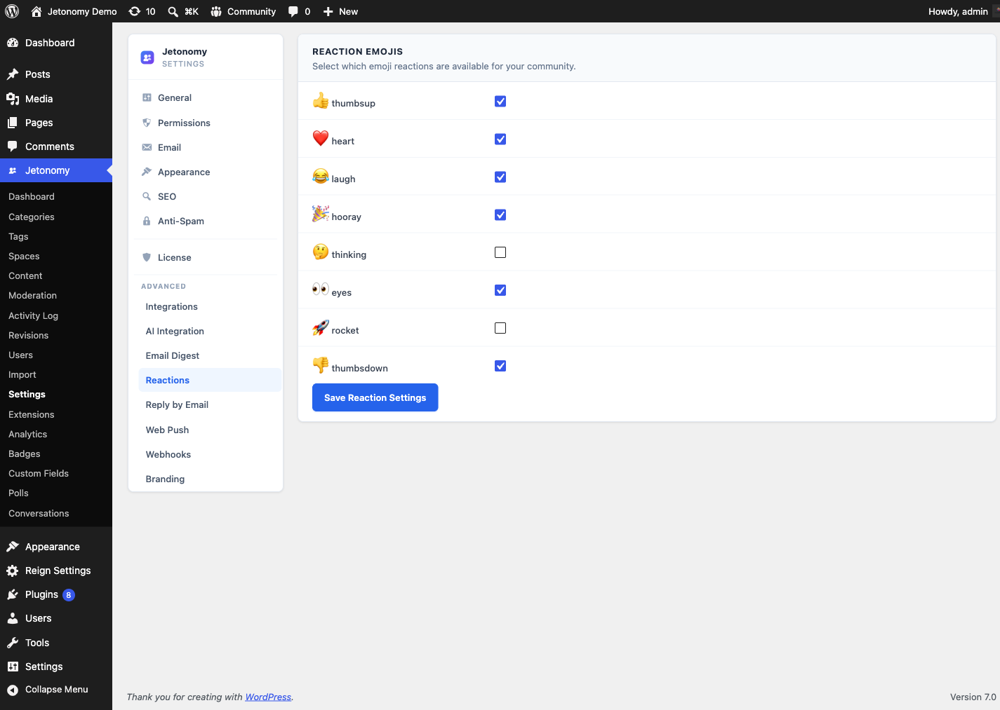
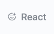

Add expressive emoji reactions to every post and reply - so members can respond instantly without writing a full reply.

> **PRO** - This feature requires [Jetonomy Pro](https://jetonomy.com/pro/).


## What You Will Learn

- How to enable Reactions for your community
- How to customize which emojis appear per space
- How members react to and change their reaction on a post
- How to read reaction counts from the REST API

## Why Reactions Matter

A quick reaction lowers the bar for engagement. Members who would never write a reply will tap a rocket emoji or a heart. That micro-engagement adds up - you get richer signal on your best content and members feel heard without the pressure of composing a response.

## How It Works

Every post and every reply in your community shows a reaction strip. Members click any emoji to react. Clicking a different emoji replaces the previous one - each member can hold exactly one reaction per piece of content at a time. Clicking the same emoji again removes the reaction entirely.

The reaction counts are displayed as chips directly below the post body. Each chip shows the emoji and the total count. Hovering a chip reveals the names of recent reactors.


## Enabling Reactions

1. Go to **Jetonomy → Extensions** in your WordPress admin.
2. Find **Reactions** and click **Enable**.
3. Reactions appear on all posts and replies immediately - no page-level configuration needed.

> **Tip:** Enabling Reactions does not affect any existing posts. Historical content simply starts with zero reactions.

## Default Emoji Set

Jetonomy ships with eight emoji reactions out of the box:

| Emoji | Label | Use case |
|-------|-------|----------|
| Like | Thumbs up | General agreement |
| Love | Heart | Enthusiasm, appreciation |
| Haha | Laughing face | Humor, something funny |
| Celebrate | Party popper | Wins, announcements |
| Thinking | Thinking face | Interesting, thought-provoking |
| Watching | Eyes | Following along, keeping an eye on it |
| Rocket | Rocket | Fast, shipped, love it |
| Dislike | Thumbs down | Disagreement |

All eight are enabled globally by default. You can adjust which ones appear per space.

## Per-Space Customization

Different spaces have different tones. A Support space might not need a Celebrate emoji, and a General Chat space might not need Dislike.

1. Go to **Jetonomy → Spaces** and open the space you want to customize.
2. Open the **Reactions** tab in the space settings panel.
3. Toggle individual emojis on or off for this space.
4. Save. The change takes effect immediately for all posts in that space.


## REST API

The Reactions extension registers these endpoints under `jetonomy/v1`:

| Method | Endpoint | Description |
|--------|----------|-------------|
| `GET` | `/posts/{id}/reactions` | Get the reactions and counts for a post |
| `POST` | `/posts/{id}/reactions` | Toggle your reaction on a post (add, replace, or remove) |
| `GET` | `/replies/{id}/reactions` | Get the reactions and counts for a reply |
| `POST` | `/replies/{id}/reactions` | Toggle your reaction on a reply |

`{id}` is the numeric ID of the post or reply. A single `POST` toggles your reaction: sending a new emoji replaces your previous one, and sending your current emoji again clears it.

**Example - toggle a reaction:**

```json
POST /wp-json/jetonomy/v1/posts/42/reactions
{
  "emoji": "rocket"
}
```

Reading reactions is open to any visitor; toggling a reaction requires the `jetonomy_vote` capability (logged-in members by default). See the [REST API reference](../developer-guide/01-rest-api.md) for full payloads.

## What's Next?

Allow members to message each other privately, without leaving your community.

[Private Messaging →](02-private-messaging.md)
