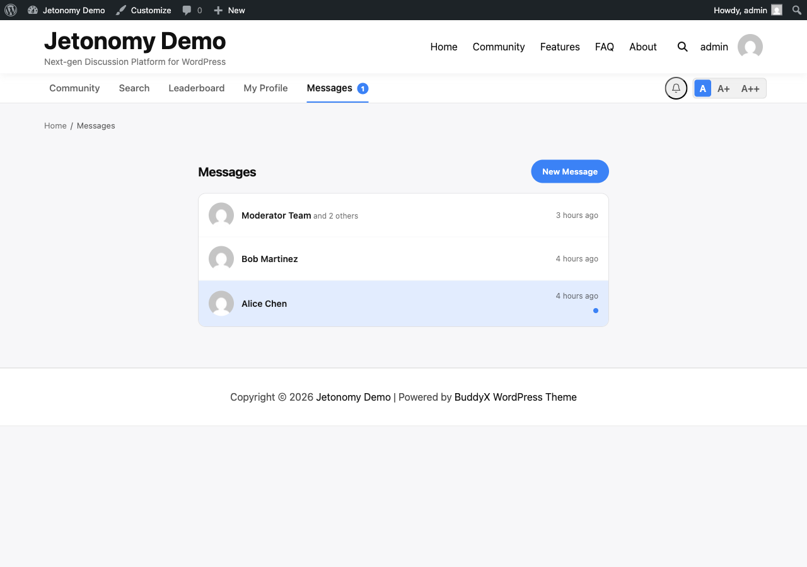
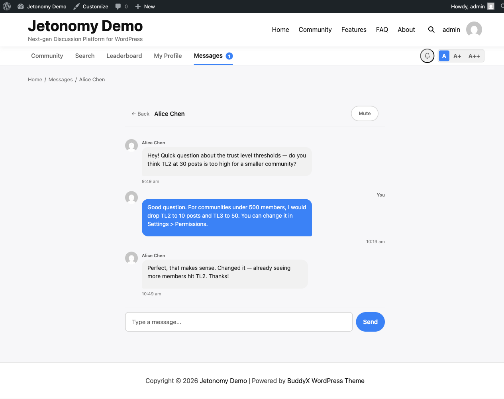

Let members send direct messages to each other - one-on-one or in small groups - without leaving your community.

> **PRO** - This feature requires [Jetonomy Pro](https://jetonomy.com/pro/).


## What You Will Learn

- How to enable Private Messaging
- How members start conversations and send messages
- How unread counts and notifications work
- How to block users from messaging you
- How to use the REST API for conversations and messages

## Why Private Messaging Matters

When members can message each other directly, your community becomes a platform - not just a forum. It reduces off-site communication, keeps relationships within your ecosystem, and gives you a richer, stickier product.

## How It Works

Private Messaging adds a dedicated inbox at `/community/messages/`. Members can start a new conversation with any other member, or create a group conversation with up to 20 participants. Each conversation is a persistent thread - messages appear in chronological order, and new messages are loaded automatically via polling.


## Enabling Private Messaging

1. Go to **Jetonomy → Extensions** in your WordPress admin.
2. Find **Private Messaging** and click **Enable**.
3. A **Messages** link appears automatically in the community navigation bar.

No additional configuration is required to go live.

## Starting a Conversation

Members start a new conversation in two ways:

- Click **New Message** from the Messages inbox at `/community/messages/`.
- Click the **Message** button on any member's profile page.

Both methods open a composer. Members type the recipient's name (autocomplete searches by display name and username), write their first message, and hit **Send**. The conversation thread opens immediately.

For group conversations, members add multiple recipients before sending. The group conversation shows all participants' avatars at the top of the thread.

## Unread Counts and Notifications

A red badge on the Messages nav icon shows the total number of unread conversations. The count updates every 30 seconds via polling. It drops to zero when a member opens and reads the conversation.

Jetonomy also sends a notification to the recipient's bell icon when a new message arrives. Members who have email notifications enabled for private messages receive an email notification as well.

> **Tip:** Members control their messaging email notifications in **Profile → Notification Settings**. Admins cannot override individual user preferences.

## Blocking Users

Any member can block another from sending them messages:

1. Open a conversation with the person.
2. Click the **···** menu in the thread header.
3. Select **Block [username]**.

Blocked users cannot send new messages to the member who blocked them. Existing conversation history is preserved but no new messages are delivered. The blocked user sees a generic "Unable to send message" error - they are not told they are blocked.

Admins can view and clear blocks in **Jetonomy → Users → [username] → Messaging**.

## REST API

Private Messaging adds endpoints under `jetonomy/v1`:

| Method | Endpoint | Description |
|--------|----------|-------------|
| `GET` | `/conversations` | List your conversations (paginated) |
| `POST` | `/conversations` | Start a new conversation |
| `GET` | `/conversations/{id}` | Get conversation details and participant list |
| `GET` | `/conversations/{id}/messages` | List messages (cursor-based pagination) |
| `POST` | `/conversations/{id}/messages` | Send a message |
| `POST` | `/conversations/{id}/read` | Mark conversation as read |
| `DELETE` | `/conversations/{id}` | Leave a conversation |
| `POST` | `/blocks` | Block a user from messaging you |
| `DELETE` | `/blocks/{user_id}` | Unblock a user |

All endpoints require authentication. The `jetonomy_send_messages` capability controls who can start conversations - by default all Trust Level 1+ members.

**Example - start a conversation:**

```json
POST /wp-json/jetonomy/v1/conversations
{
  "recipients": [45, 67],
  "message": "Hey, wanted to follow up on your question about onboarding."
}
```

**Example - get messages with cursor pagination:**

```
GET /wp-json/jetonomy/v1/conversations/12/messages?after=msg_abc123&per_page=20
```

## What's Next?

Add polls to any topic to gather community input and drive decisions.

[Polls →](03-polls.md)
