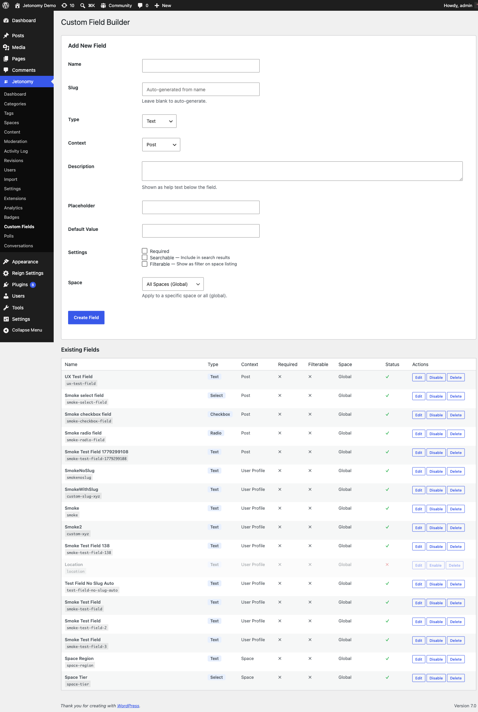

Add structured fields to member profiles - collect the information that matters to your specific community.

> **PRO** - This feature requires [Jetonomy Pro](https://jetonomy.com/pro/).

> **As of 1.4.1, custom field values are exposed on the REST API for both posts and users.** Earlier versions only saved the values to the database; third-party API consumers couldn't read them because the response filters were registered against an event nothing emitted. Free 1.4.1 fires the matching filters on `/jetonomy/v1/posts` and `/jetonomy/v1/users`, so any tool reading from the API now sees every custom field you have configured.


## What You Will Learn

- How to create and manage custom profile fields
- Which field types are available
- How to set visibility and required status
- How members fill in their fields
- How to read and update field values via the REST API

## Why Custom Fields Matter

A generic WordPress profile has a bio and a website URL. That is not enough for most communities. A developer community needs a GitHub handle. A healthcare community needs a specialty. A SaaS community needs a company name. Custom Fields lets you define exactly the information that makes members useful and findable in your community.

## Enabling Custom Fields

1. Go to **Jetonomy → Extensions** in your WordPress admin.
2. Find **Custom Fields** and click **Enable**.
3. A **Custom Fields** item appears under the Jetonomy admin menu.

## Creating a Field

1. Go to **Jetonomy → Custom Fields**.
2. Click **Add Field**.
3. Fill in the field settings:

| Setting | Description |
|---------|-------------|
| **Label** | Displayed on the profile and in the edit form |
| **Field Key** | Unique slug used in the REST API (auto-generated, editable) |
| **Type** | See field types below |
| **Required** | If on, members cannot save their profile without filling this in |
| **Visibility** | Who can see the field value |
| **Description** | Optional helper text shown below the input |

4. Click **Save Field**.

<!-- TODO screenshot needed: Custom Fields admin list with Add Field form (was ../images/pro-custom-fields-admin.png) -->
## Field Types

| Type | Best for |
|------|----------|
| **Text** | Short single-line answers (job title, company, username) |
| **Textarea** | Longer free-form text (bio supplement, expertise description) |
| **Number** | Numeric values (years of experience, team size) |
| **Email** | Contact email address |
| **URL** | Website, GitHub, LinkedIn, portfolio links |
| **Select** | Predefined options as a dropdown, single choice (country, role, industry) |
| **Checkbox** | Yes/no toggle (newsletter opt-in, open to work) |
| **Radio** | Predefined options as radio buttons, single choice |
| **Date** | A calendar date (joined date, availability) |

For the **Select** and **Radio** types, you define the options in the field editor - one per line. Select renders a dropdown; Radio renders a set of radio buttons.

## Visibility Options

Each field has one of three visibility settings:

| Visibility | Who sees the value |
|------------|--------------------|
| **Public** | Anyone, including logged-out visitors |
| **Members only** | Logged-in community members |
| **Private** | Only the member themselves and admins |

Private fields are still editable by the member but do not appear on their public profile. They are accessible to admins via the admin Users page.

## How Members Fill In Fields

Members edit their custom fields at `/community/u/{username}/edit/` under the **Profile Details** section. Required fields show a red asterisk. Saving the profile validates all required fields before updating.

> **Tip:** Guide members to complete their profiles right after joining by linking to the edit profile page in your welcome notification or email digest.

## REST API

Custom Fields adds field-aware parameters to the existing profile and post endpoints:

| Method | Endpoint | Description |
|--------|----------|-------------|
| `GET` | `/users/{id}` | Profile response includes `custom_fields` object |
| `GET` | `/users` | List response includes `custom_fields` on each member |
| `PATCH` | `/users/{id}` | Pass `custom_fields: { field_key: value }` to update |
| `GET` | `/posts/{id}` | Post response includes `custom_fields` if any post-level fields are configured |
| `GET` | `/posts` | List response includes `custom_fields` on each post |
| `GET` | `/custom-fields` | List all defined fields and their settings |
| `POST` | `/custom-field-values` | Set a single field value on a target object (user or post) |

**Example - read a profile with custom fields:**

```json
GET /wp-json/jetonomy/v1/users/45

{
  "id": 45,
  "name": "Priya Sharma",
  "custom_fields": {
    "company": "Acme Corp",
    "github_username": "priyasharma",
    "open_to_work": true
  }
}
```

**Example - update custom fields:**

```json
PATCH /wp-json/jetonomy/v1/users/45
{
  "custom_fields": {
    "company": "New Horizons Ltd"
  }
}
```

Members can only update their own fields. Admins can update any member's fields.

**Setting one value at a time:** if you want to set a single field on a single object rather than sending the whole `custom_fields` object, `POST /custom-field-values` with the field key, the target object type and ID, and the value. This is the lightweight path used by the edit-profile form and is handy for partial updates from custom tooling.

**How fields surface in output:** once a field is configured, its value is embedded automatically in the relevant REST responses - the `custom_fields` object on `/users` and `/posts` (and their list endpoints) - and rendered on the matching frontend surface (the member profile for profile fields, the post for post fields), subject to the field's visibility setting. You do not register a separate read endpoint per field; the value rides along with the object it belongs to.

See the [REST API reference](../developer-guide/01-rest-api.md) for full payloads.

## What's Next?

Recognize and reward your most engaged members with custom badges.

[Custom Badges →](05-custom-badges.md)
