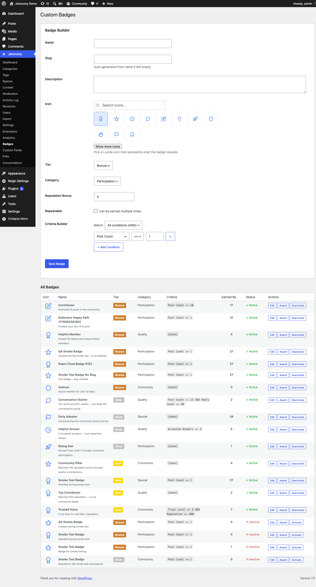

Design your own badges, set the conditions that earn them, and watch members compete to collect them.

> **PRO** - This feature requires [Jetonomy Pro](https://jetonomy.com/pro/).

## What You Will Learn

- How to create a badge with a name, icon, and tier
- How to set auto-award conditions
- How to award badges manually as an admin
- How badges display on member profiles

## Why Custom Badges Matter

Trust levels and reputation points are invisible to casual members. Badges are visible, collectible, and shareable - they give members a concrete goal to aim for. A "100 Posts" badge tells the community this member is active. A "Top Answerer" badge signals expertise. Badges convert passive lurkers into active contributors.

## Enabling Custom Badges

1. Go to **Jetonomy → Extensions** in your WordPress admin.
2. Find **Custom Badges** and click **Enable**.
3. A **Badges** item appears under the Jetonomy admin menu.

## Creating a Badge

1. Go to **Jetonomy → Badges**.
2. Click **Create Badge**.
3. Fill in the badge details:

| Field | Description |
|-------|-------------|
| **Name** | Displayed on the badge and in the award notification |
| **Description** | One sentence explaining how to earn it |
| **Icon** | Upload a 64×64 PNG or SVG icon |
| **Tier** | Bronze, Silver, or Gold - controls the border color on profile |

4. Set the award conditions (see below).
5. Click **Save Badge**.

<!-- TODO screenshot needed: Badge editor with tier selector and criteria settings (was ../images/pro-badges-editor.png) -->
## Award Conditions

### Auto-Award

Auto-awarded badges evaluate all members on a regular schedule and grant the badge automatically when the conditions are met. Choose from built-in criteria:

| Criteria | Example threshold |
|----------|------------------|
| **Total posts** | 10, 50, 100, 500 posts |
| **Accepted answers** | 5, 25, 50 accepted answers |
| **Total replies** | 25, 100, 250 replies |
| **Upvotes received** | 10, 50, 200 upvotes on any content |
| **Days as member** | 30, 180, 365 days since joining |

Set the threshold for each criteria you want to use. You can combine multiple criteria - the member must satisfy all of them to earn the badge.

> **Note:** Auto-evaluation runs once every 12 hours via WP-Cron, aligned with the trust level evaluation job. There is no manual "evaluate now" button, but you can trigger evaluation by going to **Jetonomy → Badges → Run Evaluation**.

### Manual Award

Some badges should not be automated - "Staff Pick", "Most Helpful in July", or "Community Founder" are judgment calls. For these, leave all auto-award criteria blank and award manually:

1. Go to **Jetonomy → Users** and open the member's profile.
2. Click **Award Badge**.
3. Select the badge from the list and add an optional private note.
4. Click **Award**.

The member receives a notification immediately and the badge appears on their profile.

## Badge Tiers

Badges have three visual tiers that appear as border colors on the badge icon:

| Tier | Color | Suggested use |
|------|-------|---------------|
| **Bronze** | Warm bronze | Entry-level milestones (first post, 7-day streak) |
| **Silver** | Cool silver | Mid-tier milestones (100 posts, 10 accepted answers) |
| **Gold** | Bright gold | Elite milestones (500 posts, Top Contributor of the year) |

Tiers are visual only - they do not affect permissions or trust levels.

## Badge Display

Badges appear on member profile pages in a dedicated **Badges** section. Members who have earned no badges see an empty state that lists a few featured badges to work toward - this passively encourages engagement.

The three most recently earned badges also appear in the member's hover card, which pops up when anyone hovers their username throughout the community.

## REST API

Custom Badges registers these endpoints under `jetonomy/v1`:

| Method | Endpoint | Description |
|--------|----------|-------------|
| `GET` | `/badges` | List all defined badges and their settings |
| `POST` | `/badges` | Create a badge |
| `PATCH` | `/badges/{id}` | Update a badge |
| `DELETE` | `/badges/{id}` | Delete a badge |
| `POST` | `/users/{id}/badges` | Award a badge to a member |

Badges can be created, edited, and awarded entirely through REST, so you can automate awards from your own tooling or grant a badge as part of an external workflow. Listing badges is open to any logged-in member; creating, editing, deleting, and awarding require `manage_options`. See the [REST API reference](../developer-guide/01-rest-api.md) for full payloads.

## What's Next?

Get a data-driven view of your community's health with the Analytics Dashboard.

[Analytics Dashboard →](06-analytics.md)
