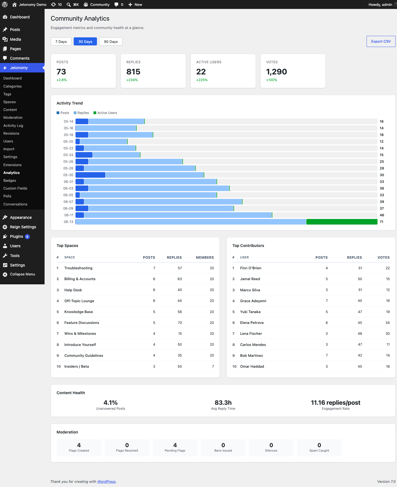

Understand what your community is doing, where it is growing, and who is driving it — all from a single admin dashboard.

> **PRO** — This feature requires [Jetonomy Pro](https://jetonomy.com/pro/).

## What You Will Learn

- How to access the Analytics dashboard
- Which metrics are tracked and what they mean
- How to use the date range filter
- How to export data as CSV

## Why Analytics Matter

You cannot grow what you cannot measure. The Analytics dashboard turns raw community activity into actionable metrics — so you know which spaces need attention, who your power users are, and whether engagement is trending up or down before it becomes a problem.

## Enabling Analytics

1. Go to **Jetonomy → Extensions** in your WordPress admin.
2. Find **Analytics** and click **Enable**.
3. An **Analytics** item appears under the Jetonomy admin menu.

Analytics begin recording from the moment you enable the extension. Historical data before activation is not backfilled.

## Navigating the Dashboard

Go to **Jetonomy → Analytics**. The dashboard opens on the last 30 days by default.

### Date Range Filter

Use the date range picker at the top right to select any custom range. Preset shortcuts:

- Last 7 days
- Last 30 days
- Last 90 days
- This month
- Last month

All charts and tables update instantly when you change the range.

## Overview Metrics

The top row shows four headline numbers for your selected range:

| Metric | What it means |
|--------|---------------|
| **Total Posts** | New topics created in the period |
| **Total Replies** | New replies created in the period |
| **Active Members** | Unique members who posted, replied, or voted |
| **Growth Rate** | Percentage change vs the previous equal-length period |

Below the headline row, a line chart shows daily post and reply volume over the selected range. Spikes are easy to spot — hover any point to see the exact date and count.

## Top Spaces

A ranked table shows your most active spaces sorted by total posts + replies in the period. Columns include post count, reply count, unique contributors, and engagement rate (replies per post).

Use this view to find spaces that are thriving — and spaces that have gone quiet and may need a prompt or a featured topic.

## Top Contributors

A ranked table of your most active members sorted by total contributions (posts + replies + accepted answers). Each row shows the member's avatar, display name, trust level, and contribution breakdown.

> **Tip:** Use this list to identify members to invite into a moderator role, feature in a community spotlight, or send a personal thank-you.

## Engagement Metrics

The engagement section shows:

| Metric | What it means |
|--------|---------------|
| **Avg. replies per post** | How much discussion each new topic generates |
| **Vote activity** | Total upvotes and downvotes cast |
| **Accepted answers** | Q&A spaces only — rate of questions getting resolved |
| **New member joins** | Community growth over the period |

## Moderation Stats

The moderation section shows flagged content volume, auto-moderation rule triggers (if Advanced Moderation is enabled), and moderator response time. A high flag volume combined with slow response time signals you need more moderators.

## CSV Export

Click **Export CSV** in the top right of any table to download a full data export for the current date range. Exports include all rows — not just the visible page.

Exported files are compatible with Excel, Google Sheets, and any BI tool. Column headers match the on-screen labels exactly.

## What's Next?

Reduce your moderation workload by automating common moderation decisions.

[Advanced Moderation Rules →](07-advanced-moderation.md)
