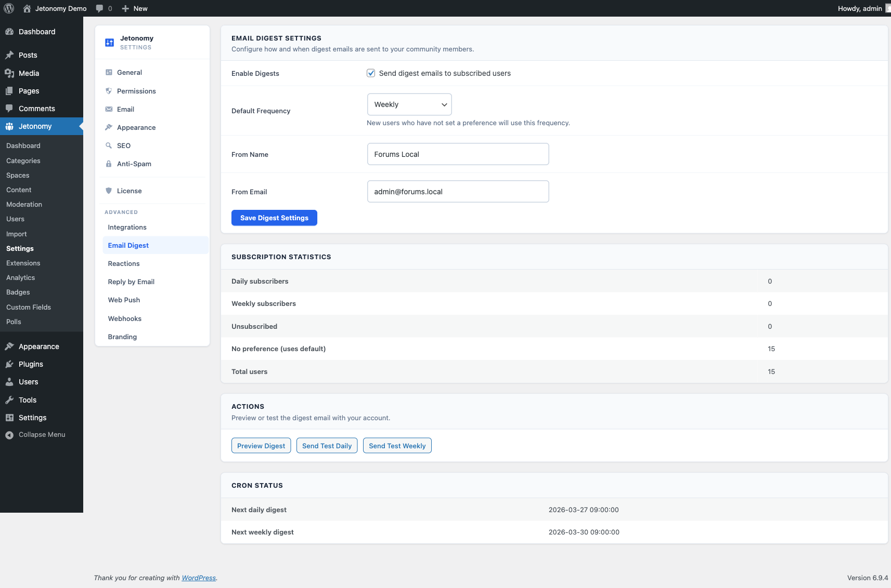

Send a curated summary of community activity to members' inboxes - daily or weekly - so they never feel out of the loop.

> **PRO** - This feature requires [Jetonomy Pro](https://jetonomy.com/pro/).

## What You Will Learn

- How to enable and configure the Email Digest
- What content appears in each digest
- How members control their digest frequency
- How to send a test digest as an admin

## Why Email Digest Matters

Most community members are not daily visitors. They join, participate a few times, and drift away - not because they lost interest, but because they forgot. A well-timed email digest brings them back. It shows them what they missed and gives them a reason to click.

## Enabling Email Digest

1. Go to **Jetonomy → Extensions** in your WordPress admin.
2. Find **Email Digest** and click **Enable**.
3. Go to **Jetonomy → Settings → Email Digest** to configure sending times and content rules.

## Configuring the Digest

### Send Schedule

Set when the digests go out:

| Digest type | Default send time |
|-------------|------------------|
| **Daily** | 8:00 AM (site timezone) |
| **Weekly** | Monday, 8:00 AM (site timezone) |

You can change both send times in the Email Digest settings. Times use the timezone set in **Settings → General → Timezone** in WordPress.

### Digest Content

The digest compiles:

- **Top posts** - the most-upvoted new topics since the last digest
- **Active discussions** - posts with the most replies in the period
- **Spaces you follow** - activity in spaces the member has joined or bookmarked
- **Replies to your topics** - new replies on topics the member created or commented on
- 🏆 **Badges earned** *(new in 1.4.1)* - every badge the member earned during the digest window
- 🗳️ **Polls voted on** *(new in 1.4.1)* - every poll the member participated in during the window

You can toggle each content section on or off in the digest settings. At least one section must remain on.

> **How the new sections work:** badges and polls are tracked in a per-user buffer that's capped at 100 events with a 30-day TTL. The buffer is cleared only after a successful send, so opted-out members never accumulate state, and a missed send doesn't lose the activity.

<!-- TODO screenshot needed: Email Digest settings panel (was ../images/pro-email-digest-settings.png) -->
> **Tip:** Keeping "Replies to your topics" on is the single most effective setting. Members always care more about activity on their own posts than about the broader community.

## Member Notification Preferences

Each member controls their own digest frequency from **Profile → Notification Settings → Email**:

| Option | What it means |
|--------|---------------|
| **Instant** | Individual emails per event (free behavior) |
| **Daily digest** | One email per day summarizing activity |
| **Weekly digest** | One email per week summarizing activity |
| **None** | No community emails |

Members who select **Daily** or **Weekly** stop receiving per-event notification emails. The digest replaces them - they are not sent in addition to them.

New members default to **Daily** digest. You can change this default in the Email Digest settings.

## Admin Test Send

Before going live, send yourself a test digest to check formatting and content:

1. Go to **Jetonomy → Settings → Email Digest**.
2. Scroll to the **Test Send** section.
3. Enter an email address (pre-filled with your admin email).
4. Click **Send Test Digest**.

The test digest uses real community data from the last 7 days. If your community is new and has little activity, the digest may look sparse - that is expected.

## Digest Statistics

The Email Digest settings page shows send statistics for the last 90 days:

| Stat | Description |
|------|-------------|
| **Digests sent** | Total number of emails delivered |
| **Preference breakdown** | How many members are on daily vs weekly vs none |

Open rates and click rates are available if you use a supported ESP adapter (SendGrid, Mailgun, SES, or Postmark) - basic `wp_mail` delivery does not provide tracking data.

## REST API

Email Digest exposes endpoints under `jetonomy/v1`:

| Method | Endpoint | Description |
|--------|----------|-------------|
| `GET` | `/users/me/digest-preferences` | Read the current member's digest frequency and section choices |
| `PATCH` | `/users/me/digest-preferences` | Update the current member's digest preferences |
| `POST` | `/admin/digest/test` | Send a test digest (admin) |
| `GET` | `/admin/digest/stats` | Read digest send statistics (admin) |

Members manage their own preferences; the `/admin/*` routes require `manage_options`. See the [REST API reference](../developer-guide/01-rest-api.md) for full payloads.

## What's Next?

Connect your community to external tools like Slack, CRMs, and Zapier using outbound webhooks.

[Outbound Webhooks →](09-webhooks.md)
