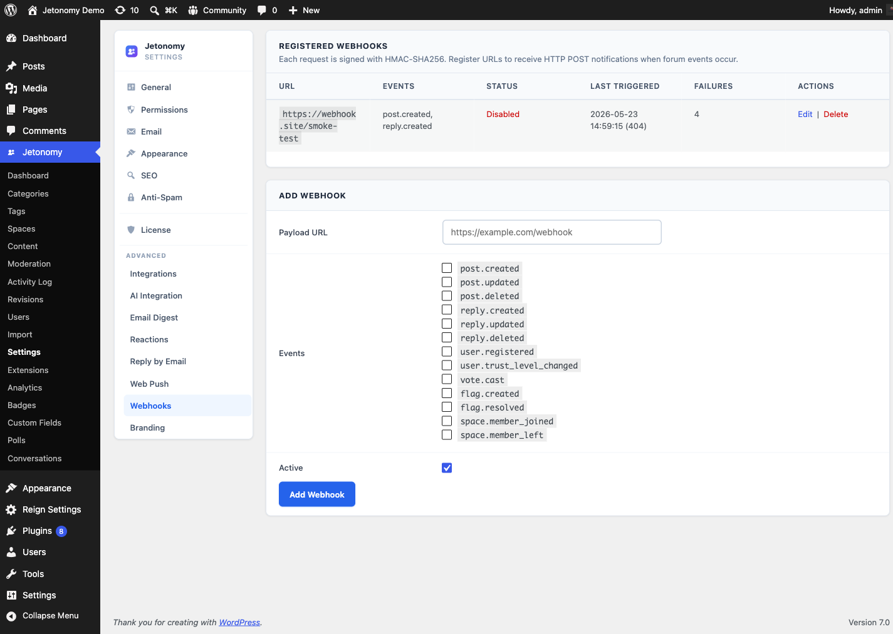

Automatically send community events to any external URL — connect Jetonomy to Slack, Zapier, your CRM, or any custom pipeline.

> **PRO** — This feature requires [Jetonomy Pro](https://jetonomy.com/pro/).


## What You Will Learn

- How to create and manage webhook endpoints
- Which community events you can subscribe to
- How to test a webhook before going live
- How to read the delivery log to debug failures

## Why Webhooks Matter

Jetonomy lives inside WordPress — but your business does not. Your team lives in Slack. Your sales data lives in a CRM. Your analytics live in a data warehouse. Webhooks close that gap. Every time something happens in your community, Jetonomy can push that data wherever you need it — in real time, with zero polling.

## Enabling Webhooks

1. Go to **Jetonomy → Extensions** in your WordPress admin.
2. Find **Outbound Webhooks** and click **Enable**.
3. A **Webhooks** item appears under the Jetonomy admin menu.

## Creating a Webhook

1. Go to **Jetonomy → Webhooks**.
2. Click **Add Webhook**.
3. Fill in the endpoint settings:

| Setting | Description |
|---------|-------------|
| **URL** | The HTTPS endpoint that will receive the POST request |
| **Events** | Which community events trigger this webhook |
| **Secret** | Optional signing secret for verifying payload authenticity |
| **Active** | Toggle the webhook on or off without deleting it |

4. Click **Save Webhook**.

<!-- TODO screenshot needed: Webhook editor with URL, events, and secret fields (was ../images/pro-webhooks-editor.png) -->
## Available Events

Subscribe to any combination of these events:

| Event | Fires when... |
|-------|---------------|
| `post.created` | A new topic is published |
| `post.updated` | A topic is edited |
| `post.deleted` | A topic is deleted or trashed |
| `reply.created` | A new reply is posted |
| `reply.updated` | A reply is edited |
| `vote.cast` | A member votes on a post or reply |
| `answer.accepted` | A Q&A answer is accepted |
| `member.joined` | A new user joins the community |
| `member.banned` | A member is banned |
| `flag.created` | Content is flagged by a member |
| `moderation.action` | A moderator approves, spams, or trashes content |

You can create multiple webhooks pointing to different URLs with different event subsets — for example, one webhook for Slack (post events only) and one for your CRM (member events only).

## Payload Format

Every webhook delivers a JSON body with this structure:

```json
{
  "event": "post.created",
  "timestamp": "2026-03-26T08:14:32Z",
  "site_url": "https://yoursite.com",
  "data": {
    "post_id": 1024,
    "title": "How do I reset my password?",
    "author_id": 45,
    "author_name": "Priya Sharma",
    "space_id": 3,
    "space_slug": "support",
    "url": "https://yoursite.com/community/s/support/t/how-do-i-reset-my-password/"
  }
}
```

The `data` object varies by event type. All events include `event`, `timestamp`, and `site_url`.

## Verifying Payloads

If you set a secret, Jetonomy includes an `X-Jetonomy-Signature` header with each request. The value is an HMAC-SHA256 signature of the raw request body, signed with your secret.

Verify on your server:

```php
$signature = hash_hmac( 'sha256', $raw_body, $your_secret );
$expected   = 'sha256=' . $signature;
$received   = $_SERVER['HTTP_X_JETONOMY_SIGNATURE'];

if ( ! hash_equals( $expected, $received ) ) {
    http_response_code( 401 );
    exit;
}
```

## Testing a Webhook

Before you point a webhook at a production system, send a test:

1. Open the webhook in **Jetonomy → Webhooks**.
2. Click **Send Test**.
3. Jetonomy sends a sample `ping` event to your URL and shows the HTTP response code and body inline.

Use a tool like [webhook.site](https://webhook.site) to inspect the full request during development.

## Delivery Log

Every delivery attempt is logged. Go to **Jetonomy → Webhooks → [webhook name] → Delivery Log** to see:

- Timestamp of each attempt
- HTTP response code
- Response body (first 500 characters)
- Whether the delivery succeeded or failed

Failed deliveries are retried up to three times with exponential backoff (5 min, 30 min, 2 hrs). After the third failure, the delivery is marked as permanently failed and no further retries are attempted.

> **Tip:** If you see consistent failures, check that your endpoint returns a `2xx` response within 10 seconds. Jetonomy times out at 10 seconds and treats the delivery as failed.

## Use Case Examples

- **Slack notifications** — Post a message to a Slack channel whenever a new topic is created in your community.
- **CRM sync** — Push `member.joined` events to HubSpot or Salesforce to trigger a welcome sequence.
- **Zapier** — Connect any event to thousands of apps via a Zapier webhook trigger — no custom code needed.
- **Analytics pipeline** — Stream all events to a data warehouse like BigQuery or Amplitude for long-term retention and custom analysis.

## What's Next?

Send browser push notifications to members even when they are not on your site.

[Web Push Notifications →](10-web-push.md)
