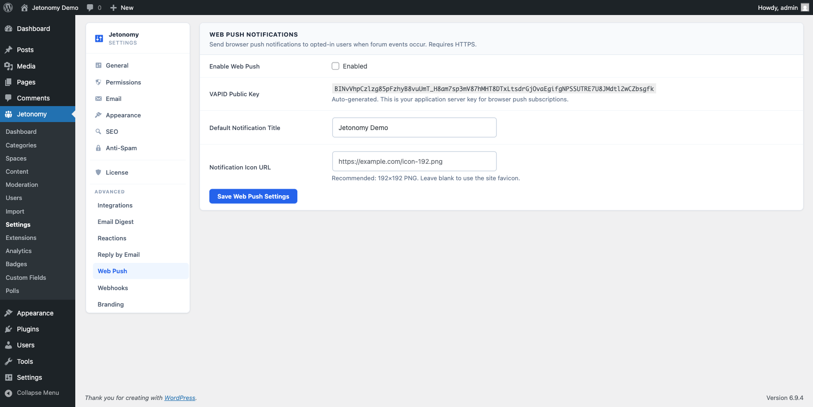

Reach members with browser push notifications - even when they have closed your site.

> **PRO** - This feature requires [Jetonomy Pro](https://jetonomy.com/pro/).

<!-- TODO screenshot needed: Browser push notification appearing on a desktop screen (was ../images/pro-web-push-notification.png) -->
## What You Will Learn

- How to generate VAPID keys and enable Web Push
- How members subscribe to push notifications
- Which events trigger a push notification
- Which browsers are supported

## Why Web Push Matters

Email notifications have open rates around 20–30%. Browser push notifications have open rates above 60% because they appear immediately on the member's screen - no inbox, no subject line, no waiting. For time-sensitive events like a reply to your question or a mention from a teammate, push gets the message there instantly.

## Enabling Web Push

Web Push requires a VAPID key pair to authenticate your server with browsers.

1. Go to **Jetonomy → Settings → Web Push**.
2. Click **Generate VAPID Keys**. Jetonomy creates a public/private key pair and stores them in your WordPress options table.
3. Toggle **Enable Web Push** to on.
4. Click **Save**.

> **Important:** VAPID keys are generated once. If you regenerate them, all existing push subscriptions are invalidated and members must subscribe again. Only regenerate if you believe your private key has been compromised.

## Service Worker Registration

Jetonomy automatically registers a service worker (`/community/sw.js`) on every community page. You do not need to create or configure the service worker - this happens at extension activation.

The service worker handles:

- Receiving push messages from the Jetonomy server
- Displaying the browser notification
- Opening the correct URL when the notification is clicked

## Member Subscription

The first time a logged-in member visits any community page after you enable Web Push, a **Enable push notifications** prompt appears at the top of the page. Clicking **Enable** triggers the browser's native permission dialog.

Members who grant permission are subscribed automatically. Their subscription is stored in the Jetonomy database and associated with their account.

Members can unsubscribe at any time from **Profile → Notification Settings → Push Notifications → Off**.

> **Note:** The browser permission prompt can only be triggered by a user action (a click). Jetonomy waits for the member to interact with the prompt banner before requesting permission - it never requests permission automatically on page load.

## Notification Events

Push notifications are sent for the same events that trigger bell notifications, based on each member's preferences:

| Event | Who receives a push |
|-------|---------------------|
| **New reply on your topic** | Topic author |
| **New reply in a topic you follow** | Followers |
| **You are mentioned** | Mentioned member |
| **Your answer is accepted** | Answer author |
| **New message received** | Message recipient (Private Messaging Pro) |
| **Badge awarded** | Badge recipient |

Members control which of these events trigger a push in **Profile → Notification Settings**.

## Browser Support

Web Push works on all major modern browsers without any app installation:

| Browser | Desktop | Mobile |
|---------|---------|--------|
| Chrome | Yes | Yes (Android) |
| Edge | Yes | Yes (Android) |
| Firefox | Yes | Limited |
| Safari | Yes (macOS 13+) | Yes (iOS 16.4+) |

> **Tip:** Safari on iOS requires members to add your site to their Home Screen before push notifications work. This is an Apple platform limitation - not a Jetonomy limitation.

## What's Next?

Let members reply to community topics directly from their email client.

[Reply by Email →](11-reply-by-email.md)
