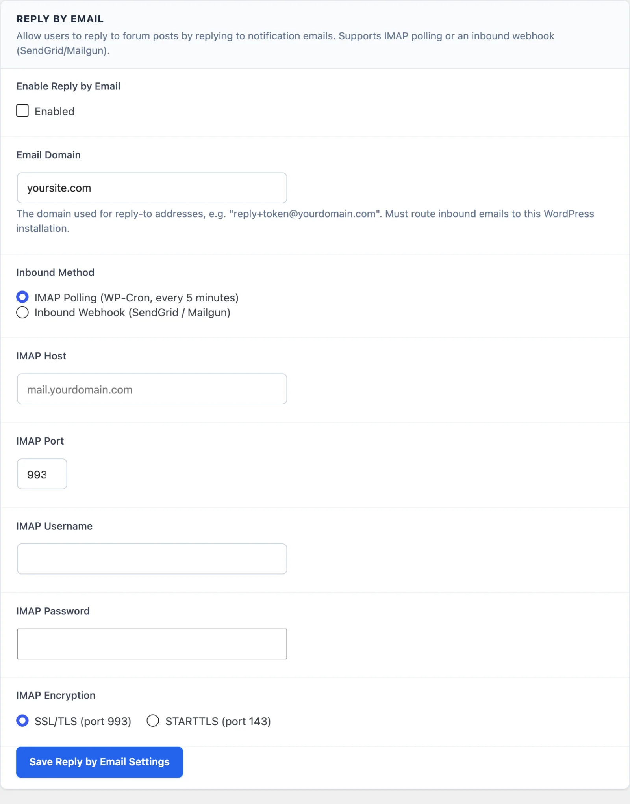

# Reply by Email

Let members reply to community discussions directly from their email client - no login required for that one reply.

> **PRO** - This feature requires [Jetonomy Pro](https://wbcomdesigns.com/downloads/jetonomy-pro/).

## What You Will Learn

- How Reply by Email works end to end
- How to choose and configure an inbound method (IMAP or webhook)
- How emails are parsed and turned into replies
- What limits and security checks apply

## Why Reply by Email Matters

Every step between "I got a notification" and "I posted a reply" loses members. Reply by Email removes all those steps. The member reads the notification in their inbox, types a reply directly, hits Send, and the reply appears in the community - without opening a browser or logging in. Removing that friction increases reply volume noticeably.

## How It Works

1. Jetonomy sends a notification email for a reply to a member's post or to a member's reply.
2. That email carries a unique Reply-To address like `reply+TOKEN@yourdomain.com`.
3. The member replies to that email.
4. The reply reaches Jetonomy, either because Jetonomy checks a mailbox (IMAP) or because your email provider forwards it to a webhook.
5. Jetonomy removes quoted text and creates a community reply attributed to that member.

Each Reply-To address is unique to the member and the topic. It encodes a signed token, so no login is required.

## Configuration

Reply by Email needs two things switched on: the extension itself and the feature setting.

1. Go to **Jetonomy → Extensions**, find **Reply by Email**, and switch its toggle on.
2. Go to **Jetonomy → Settings → Reply by Email**.
3. Tick **Enable Reply by Email** and fill in the fields below.
4. Click **Save Reply by Email Settings**.

| Field | Description |
|-------|-------------|
| **Enable Reply by Email** | Turns the feature on. Off by default. |
| **Email Domain** | The domain used in Reply-To addresses, for example `reply.yoursite.com`. Defaults to your site's domain. Mail sent to this domain must be delivered to the mailbox or provider you set up below. |
| **Inbound Method** | **IMAP Polling (WP-Cron, every 5 minutes)** or **Inbound Webhook (SendGrid / Mailgun)**. |

### Method 1: IMAP Polling

Jetonomy logs in to a mailbox that receives mail for your Email Domain and checks its unread messages every 5 minutes. Your server's PHP needs the IMAP extension. Ask your host if you are not sure.

| Field | Description |
|-------|-------------|
| **IMAP Host** | Your mail server, for example `mail.yourdomain.com` |
| **IMAP Port** | The mail server port |
| **IMAP Username** | The mailbox login |
| **IMAP Password** | The mailbox password. Leave it blank when saving to keep the current password. |
| **IMAP Encryption** | **SSL/TLS (port 993)** or **STARTTLS (port 143)** |

### Method 2: Inbound Webhook

Your email provider (SendGrid Inbound Parse or Mailgun Inbound Routes) receives the mail and forwards it to your site.

1. Choose **Inbound Webhook (SendGrid / Mailgun)** and save.
2. Copy the **Inbound Webhook URL**. It looks like `https://yoursite.com/wp-json/jetonomy/v1/reply-by-email/inbound`.
3. In your provider's account, point inbound parsing for your Email Domain at that URL.
4. Copy the **Webhook Secret** shown on the settings screen into your provider's signing setup.

Jetonomy rejects any webhook request that is not signed with the Webhook Secret, so the secret is required even though the screen calls it optional. Jetonomy creates the secret for you and never changes it when you save.

## Email Parsing

Jetonomy parses the incoming email using these rules:

1. **Quoted lines removed** - Lines that begin with `>` (standard email quoting) are dropped, so the reply contains only the new text the member typed.
2. **Signature removed** - Everything after a standard `-- ` signature separator line is dropped.
3. **Plain text only** - Jetonomy reads the plain text part of the email. Blank lines become paragraph breaks.
4. **Attachments ignored** - Images and files in reply emails are not processed.

The reply goes through the same `wp_kses_post` sanitization as any other reply before it is saved. An email with no text left after cleanup is rejected.

## Limits and Security

- Each Reply-To address holds a signed token tied to one member and one topic. Jetonomy checks the signature before creating any reply, so a guessed address cannot post as another member.
- Tokens expire after 7 days. Notification emails older than 7 days cannot be replied to by email.
- Each member can post at most 10 replies by email per hour.
- The webhook route is public, so its signature check is the only access control. Keep your Webhook Secret private.

## What's Next?

Rebrand the WordPress admin with your own name and icon.

[White Label →](12-white-label.md)
