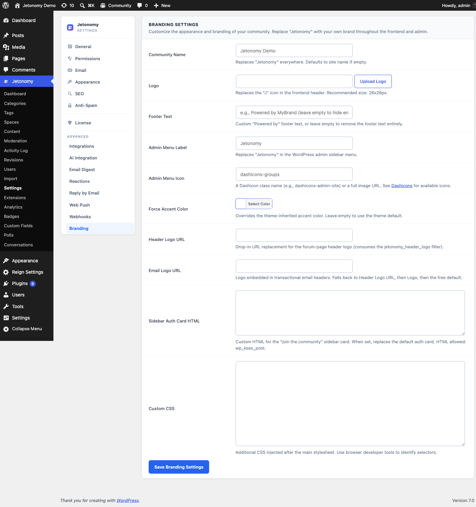

Remove all Jetonomy branding and present your community as entirely your own product.

> **PRO** - This feature requires [Jetonomy Pro](https://jetonomy.com/pro/).

## What You Will Learn

- How to enable White Label
- How to remove Jetonomy branding from the frontend and admin
- How to set a custom admin menu label and icon
- How to rebrand transactional emails and digests

## Why White Label Matters

You built your community. Your members know your brand - not the plugin powering it. White Label means your community looks like yours from every angle: the frontend pages, the admin sidebar, and the notification emails. This is especially important for agencies delivering client projects and for SaaS products embedding community features under their own brand.

## Enabling White Label

1. Go to **Jetonomy → Extensions** in your WordPress admin.
2. Find **White Label** and click **Enable**.
3. A **Branding** tab appears under **Jetonomy → Settings**.

## Removing Frontend Branding

Go to **Jetonomy → Settings → Branding**.

| Setting | Default | What it controls |
|---------|---------|-----------------|
| **"Powered by Jetonomy" footer** | Shown | Remove the attribution link from the community footer |
| **Jetonomy logo in community nav** | Shown | Replace with your own logo or hide entirely |
| **Custom CSS injection** | Empty | Add CSS that loads on every community page |

Upload your own logo (SVG or PNG, max 400×100 px) to replace the Jetonomy logo in the community navigation bar. Leave the logo field blank to show no logo at all.

> **Tip:** Use the Custom CSS injection field to apply brand-specific color overrides without editing any theme files. The CSS injects after Jetonomy's own stylesheet so your values always win.

## Admin Menu Customization

By default, the Jetonomy admin menu item is labeled "Jetonomy" with the Jetonomy logo icon.

In **Jetonomy → Settings → Branding → Admin Menu**:

- **Menu label** - Change to any string (e.g. "Community", "Forum", "My Community").
- **Menu icon** - Enter any [Dashicons](https://developer.wordpress.org/resource/dashicons/) class (e.g. `dashicons-groups`) or leave blank to use the default.

The label change applies to the top-level menu item and the browser window title on all Jetonomy admin pages.

## Email Branding

White Label also affects transactional emails and digests. In **Settings → Branding → Email**:

- **From name** - Defaults to your site name. Change to any value.
- **Email footer** - Replaces the default Jetonomy email footer with your own text or HTML.
- **Logo in emails** - Upload a logo displayed at the top of notification emails.

## Branding Settings Reference

White Label stores its configuration in the `jetonomy_pro_white_label` option. The settings worth calling out:

| Setting | What it does |
|---------|--------------|
| `header_logo_url` | The logo actually **displayed** in the community header. This is the image members see at the top of every community page. |
| `logo_url` | The **fallback / Open Graph** logo. Used for social share cards (OG image) and anywhere a logo is needed but no header logo is set. Keep this set even if you customize the header separately. |
| `accent_color` | A global accent colour override. Recolours Pro-rebranded surfaces - including email accents - in one place so your brand colour is consistent across the community and its emails. |
| `custom_css` | Freeform CSS injected on every community page. It loads **after** Jetonomy's own stylesheet, so your rules always win - use it for brand colour and spacing tweaks without touching theme files. |
| `sidebar_auth_card_html` | Custom HTML for the community sidebar's sign-in / call-to-action card. When set, it **replaces** Jetonomy's default auth card with your own markup; leave it empty to keep the default card. |
| `footer_text` | Replaces the "Powered by Jetonomy" footer text. |
| `email_logo_url` | Logo shown at the top of notification and digest emails. |

> **Tip:** `header_logo_url` and `logo_url` are deliberately separate. Set `header_logo_url` for the on-page logo and `logo_url` for the share-card / fallback image - they are often different sizes and aspect ratios.

## REST API

White Label exposes its settings under `jetonomy/v1`:

| Method | Endpoint | Description |
|--------|----------|-------------|
| `GET` | `/settings/white-label` | Read the current white-label settings |
| `PATCH` | `/settings/white-label` | Save white-label settings |

Both routes require `manage_options`. See the [REST API reference](../developer-guide/01-rest-api.md) for full payloads.

## Upgrading From Older Versions

On Jetonomy 1.4.1 and newer every White Label setting applies on every surface - the header logo, footer text, email accent colour, email logos, the sidebar sign-in card, and the admin footer all rebrand on each render and send. On older versions the Branding settings saved but did not always take effect; update both the free and Pro plugins together so all branding applies.

## What's Next?

Bring large language models into your community for smarter spam detection, auto-moderation, reply suggestions, and thread summaries.

[AI Integration →](13-ai.md)
