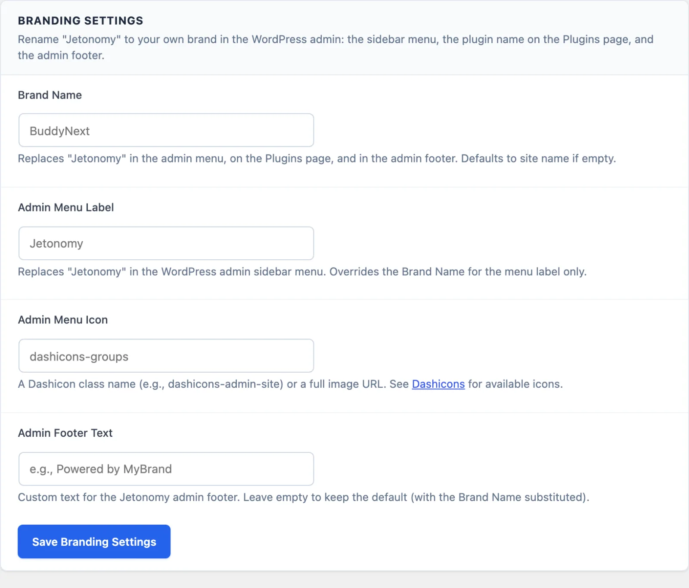

# White Label

Rename "Jetonomy" to your own brand across the WordPress admin.

> **PRO** - This feature requires [Jetonomy Pro](https://wbcomdesigns.com/downloads/jetonomy-pro/).

## What You Will Learn

- How to enable White Label
- How to set a brand name, admin menu label and icon
- How to change the admin footer text
- What White Label does not change

## What White Label Changes

White Label rebrands the **WordPress admin** only: the Jetonomy sidebar menu, the plugin name on the Plugins page, and the admin footer. It does not change anything your members see on the community pages, and it does not change notification emails. Community pages do not carry a "Powered by Jetonomy" line, so there is nothing to remove there.

This is useful for agencies who hand a site to a client and want the dashboard to carry the client's name.

## Enabling White Label

1. Go to **Jetonomy → Extensions** in your WordPress admin.
2. Find **White Label** and switch its toggle on.
3. A **Branding** tab appears under **Jetonomy → Settings**.

## Branding Settings

Go to **Jetonomy → Settings → Branding**. There are four fields:

| Field | What it does |
|-------|--------------|
| **Brand Name** | Replaces "Jetonomy" in the admin menu, on the Plugins page and in the admin footer. |
| **Admin Menu Label** | Replaces "Jetonomy" in the admin sidebar only. Overrides the Brand Name for the menu label. |
| **Admin Menu Icon** | A [Dashicons](https://developer.wordpress.org/resource/dashicons/) class (for example `dashicons-groups`) or a full image URL. Leave blank to keep the default icon. |
| **Admin Footer Text** | Custom text for the Jetonomy admin footer. Leave blank to keep the default footer, with the Brand Name swapped in. |

Leave a field blank to keep the standard Jetonomy wording for it. Click **Save Branding Settings** to apply your changes.

## Not Available

White Label has no setting for a header or navigation logo, a "Powered by" toggle, custom CSS, or email branding. To match your community pages to your brand colors and fonts, see [Match Your Brand](../how-to/10-match-your-brand.md).

## REST API

White Label exposes its settings under `jetonomy/v1`:

| Method | Endpoint | Description |
|--------|----------|-------------|
| `GET` | `/settings/white-label` | Read the current white-label settings |
| `PATCH` | `/settings/white-label` | Save white-label settings |

Both routes require `manage_options`. The fields are `community_name` (Brand Name), `admin_label`, `admin_icon` and `footer_text`. Settings are stored in the `jetonomy_pro_white_label` option. See the [REST API reference](../developer-guide/01-rest-api.md) for full payloads.

## What's Next?

Bring large language models into your community for smarter spam detection, auto-moderation, reply suggestions, and thread summaries.

[AI Integration →](13-ai.md)
