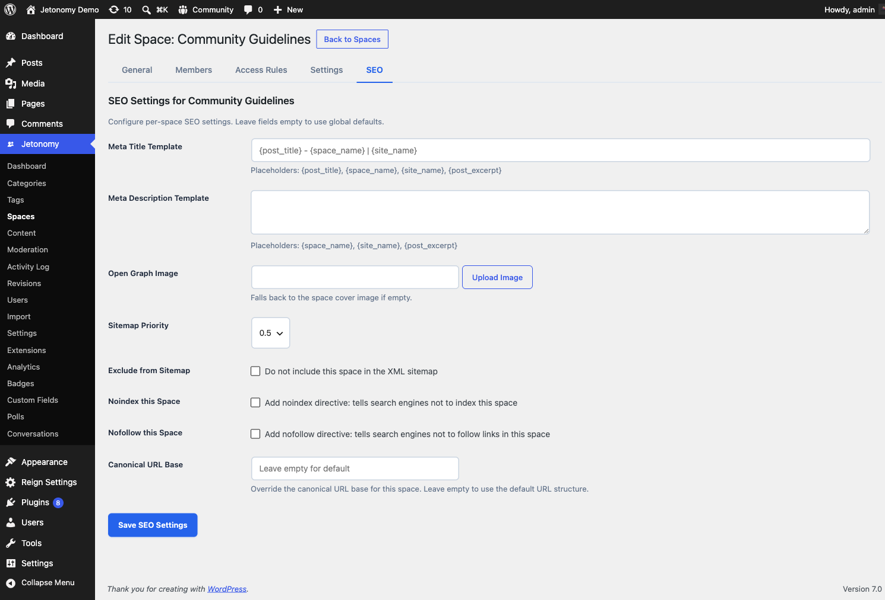

Give every space its own meta titles, Open Graph images, Twitter Cards, schema markup, and sitemap rules - without touching your site-wide SEO plugin.

> **PRO** - This feature requires [Jetonomy Pro](https://jetonomy.com/pro/).

## What You Will Learn

- Why community SEO is different from page/post SEO
- How to set per-space meta titles and descriptions
- How to control Open Graph and Twitter Card previews per space
- How Jetonomy outputs Schema.org structured data automatically
- How to include or exclude spaces from your sitemap
- How to customize robots directives and canonical URLs

## Why Community SEO Is Different

Your posts and pages have one author, one publish date, and one body. A forum topic has dozens of authors, evolves over time, and the most recent reply is often the most important part. A Q&A thread is really a `QAPage` with an `acceptedAnswer`, not a blog post. A sitemap that treats every reply as a top-level URL pollutes your search index.

The free Jetonomy plugin already outputs baseline SEO - canonical URLs, Open Graph tags, Schema.org, and a sitemap provider for spaces and posts. **SEO Pro is for when you need to override the defaults on a per-space basis**, because different spaces have different audiences, different goals, and different search intent.

## Per-Space Meta Title and Description

Every space gets a dedicated **SEO** tab in its settings panel. Inside that tab:

- **Meta Title** - defaults to the space name. Override for search engines only (the on-site title stays unchanged).
- **Meta Description** - defaults to the space description. Override with a keyword-rich summary written for search snippets.
- **Meta Keywords** - legacy field, not used by Google but some vertical engines still read it. Optional.

Both meta title and description support template tokens: `{space_name}`, `{site_name}`, `{space_count}`, `{post_count}`. For example, a meta title template of `{space_name} - {post_count} discussions | {site_name}` produces `Python Help - 2,481 discussions | MyForum` automatically.

## Open Graph and Twitter Cards

SEO Pro lets you upload a custom Open Graph image per space - a 1200x630 image used when the space URL is shared on Facebook, LinkedIn, and Slack. It also lets you override:

- Open Graph title (defaults to meta title)
- Open Graph description (defaults to meta description)
- Twitter Card type (summary or summary_large_image)
- Twitter Card image

If you skip these fields, Jetonomy falls back to the meta title/description and uses the default OG image from your main settings.

## Schema.org Structured Data

For every space and every post, Jetonomy Pro emits JSON-LD structured data:

- **Space pages** - `DiscussionForumPosting` with post count and date
- **Topic pages (Forum)** - `DiscussionForumPosting` with author, date, and answer count
- **Topic pages (Q&A)** - `QAPage` with `acceptedAnswer` (if marked) and `suggestedAnswer` entries
- **Topic pages (Ideas)** - `CreativeWork` with `about` (the idea)
- **User profiles** - `Person` with `memberOf` the space list
- **Breadcrumbs** - `BreadcrumbList` on every community page

You do not need to configure any of this. Enabling SEO Pro turns it on automatically. The free plugin emits a subset of these (basic `DiscussionForumPosting` and `BreadcrumbList`) - SEO Pro adds the richer types.

## Sitemap Controls

Jetonomy core registers a sitemap provider for spaces and posts. SEO Pro adds:

- **Include / exclude per space** - mark a private support space as excluded from the sitemap with one click
- **Priority per space** - boost your flagship space above others in the sitemap XML
- **Change frequency per space** - hint at how often a space updates (always, hourly, daily, weekly, monthly)
- **Maximum URLs per sitemap** - split large sitemaps into chunks that search engines can crawl without timing out

All sitemap changes take effect on the next request - no flush needed.

## Robots Directives and Canonical URLs

- **Robots meta per space** - set `noindex`, `nofollow`, `noarchive`, or any combination on a space-by-space basis. Useful for staff-only spaces that should not appear in search results.
- **Custom canonical URL** - override the default canonical URL on a space or topic. Useful when you syndicate content from an external blog and want Google to credit the original.
- **robots.txt directives** - add SEO Pro specific rules to your site's virtual `robots.txt` without touching a file.

## Enabling SEO Pro

1. Go to **Jetonomy → Extensions** and enable **SEO Pro**.
2. Open any space in **Jetonomy → Spaces**.
3. Click the **SEO** tab inside the space settings panel.
4. Fill in the fields you want to override. Leave the rest blank to inherit the site defaults.
5. Save.

No site-wide settings page - SEO Pro is intentionally per-space, so you do not accidentally change defaults that other spaces depend on.

## REST API

| Method | Endpoint | Description |
|--------|----------|-------------|
| `GET` | `/spaces/{id}/seo` | Get the current SEO settings for a space |
| `PATCH` | `/spaces/{id}/seo` | Update the SEO settings for a space |

Both endpoints require the `manage_jetonomy` capability or space-admin role.

## Compatibility With Site-Wide SEO Plugins

SEO Pro does not replace Yoast, Rank Math, or All in One SEO. It handles the community area only - URLs under `/community/` - and leaves your blog, pages, and WooCommerce products entirely alone. If a site-wide SEO plugin already writes `og:title` for a community URL, SEO Pro's tags take precedence on community pages.

## What's Next?

Feature an important post at the top of every space across your whole community.

[Site Announcements →](15-site-announcements.md)
